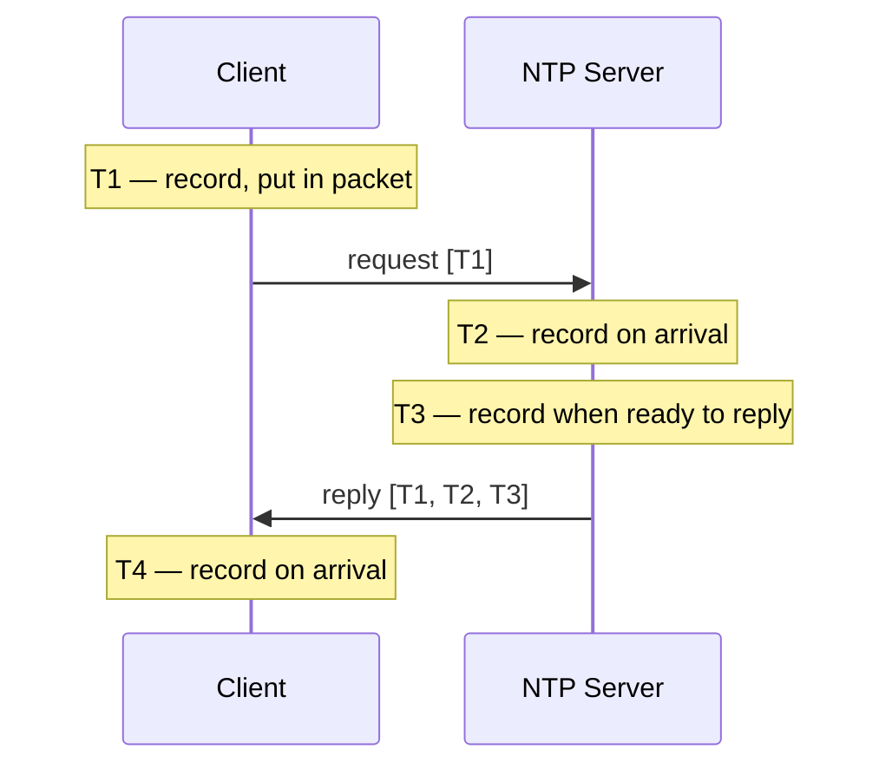
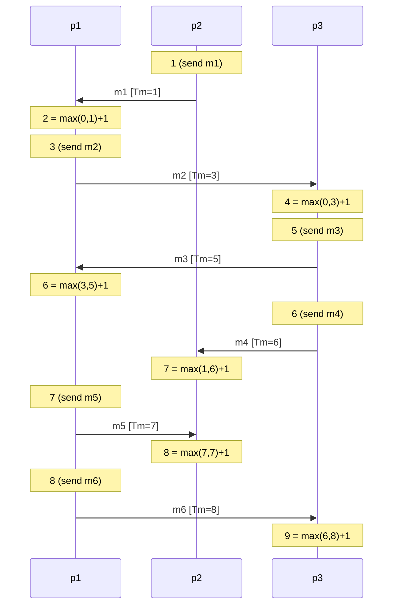
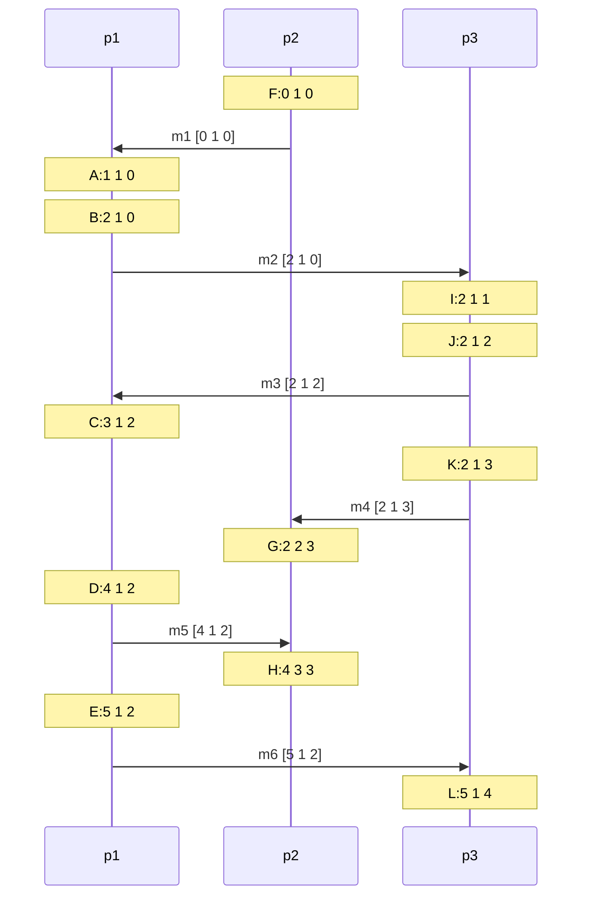
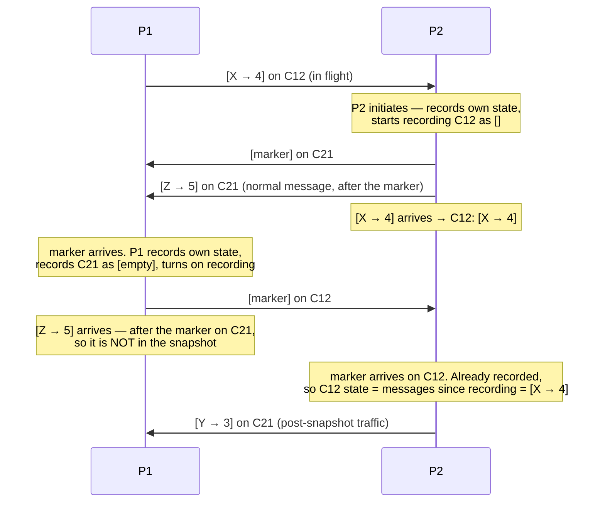
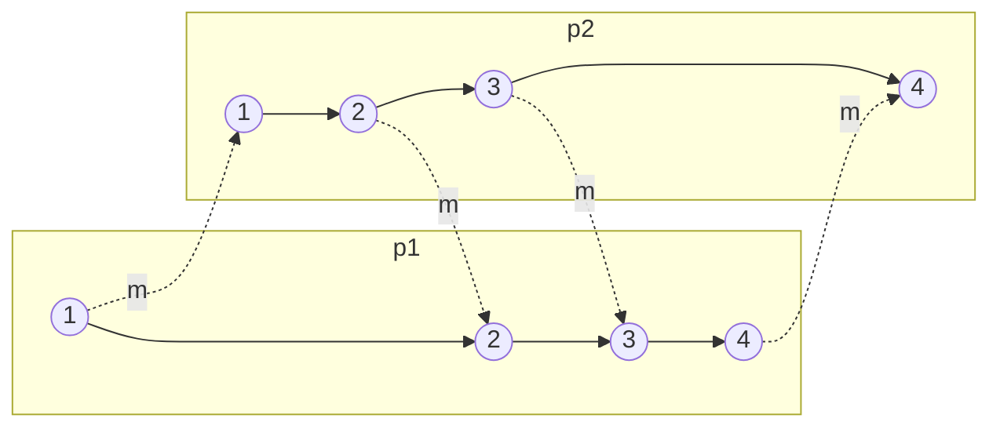
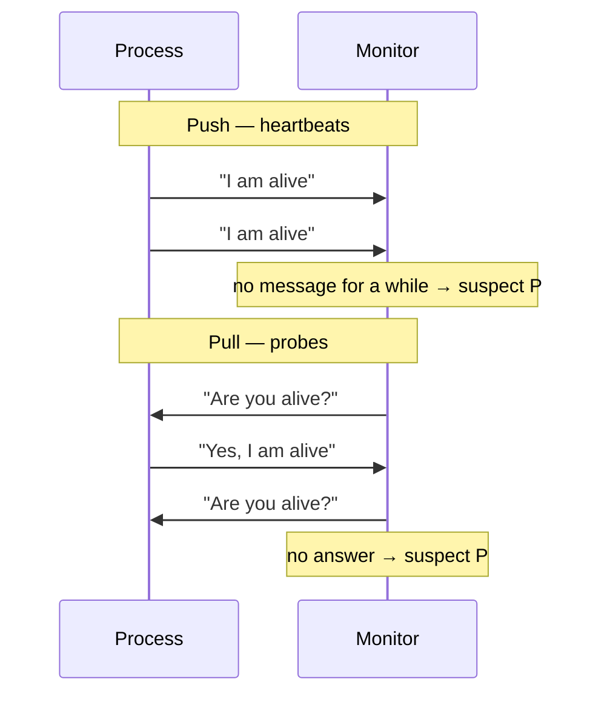

---
tags:
  - lecture
  - distributed-systems
  - northeastern
  - cs4730
  - time-global-states-failure-detectors
type: lecture
course: "[[Distributed Systems]]"
module: 3
week: 3
date: 2026-09-10
status: notes
---

# Week 03 — Time, Global States, and Failure Detectors

Lecture for [[Distributed Systems]].

> [!info] Time in distributed systems; Global states; Failure detectors. Meeting dates are derived — the course site's schedule is week-based with no calendar dates. Tue/Thu pattern anchored on the first class, Thu 2026-09-10.

## Meetings

- **Tue Sep 22**
- **Thu Sep 24**
- **Tue Sep 29** — spillover from the one-meeting slip

> [!note] Running one meeting behind
> The Tue Sep 15 lecture was cancelled (see [[Week 02 - Networking Primer]]), so from Week 03 on
> each topic lands one meeting later than the course site's week grid. Dates below include that slip.

## Assigned Material

- [ ] Slides: [Event Ordering](https://4730.network/slides/cs4730_ds_time_awj.pptx) (pptx)

## Notes

### The Two Challenges

**Challenge 1: Global State**

No host has global knowledge

Need to use network to exchange state information

- Network capacity is limited, it can't send everything

Information may be incorrect, out of date, etc

- New information takes time to propagate
- Other changes may happen in the meantime

Key issue: how can you detect and address inconsistencies?

**Challenge 2: Time**

Time cannot be measured perfectly

- Hosts have different clocks, skew
- Network can delay / duplicate messages

How do we determine what happened first?

- Who shot first in a game
- Who bought the last seat on a plane?

Need a more nuanced abstraction to represent time

### Ordering events

Message based:

- Send & receive

Time is essential for ordering events:

- Physical Time
	- Global time
	- Local time
- Logical time
	- Lamport clock
	- Vector clock

## 1: Physical Time

### Using real clocks to order events

- Each event carries a timestamp
- Global Clock:
	- Processes have access to a central global clock
	- Gives ordering of events
- Real-time clock: CMOS clock (counter) circuit driven by a quartz oscillator with battery backup to continue measuring time when power is off
- The OS generally programs a timer circuit to generate an interrupt peridodically
	- 50, 100, 250, 1000 interrupts per second
	- Programmable Interval Timer (PIT)
	- Interrupt service procedures adds 1 to a counter in memory
- Quartz oscillators oscillate at slightly different frequencies so they do not agree in general
- Relative to an ideal clock
	- Clock skew is magnitude
	- Clock drift is difference in rates
- Say clock is correct within p if
	- $(1-p)(t'-t){\leq}H(t')-H(t){\leq}(1+p)(t'-t)$
		- $(t'-t)$ True length of interval
		- H(t') - H(t) Measured length of interval
		- (1-p)(t'-t) Smallest acceptable measurement
		- (1+p)(t'-t) Largest acceptable measurement
	- Monotonic property: $t < t' \Rightarrow H(t) < H(t')$

**Clock hardware, for scale**

- Quartz: most oscillate at 32,768/sec, accurate within ~15 sec / 30 days ($6 \times 10^{-6}$), $10^{-7}$ in controlled conditions — not good enough for today's applications
- Atomic: count transitions between energy levels of cooled atoms, accurate to $10^{-9}$ sec/day (loses 1 second in 30 million years). The SI second *is* 9,192,631,770 transitions of a cesium-133 atom

**Time standards**

- **GMT**: mean solar time at 0º longitude. Not really "noon" because of the Earth's axial tilt
- **UT1**: modernized GMT, based on rotation of the Earth, ~86,400 seconds/day
- **TAI**: International Atomic Time. Average of ~200 atomic clocks corrected for time dilation; just a count of seconds since Jan 1 1958
- **UTC**: UT1 + leap seconds, i.e. TAI with an integer-second offset that changes only when a leap second is added. Minutes can have 59–61 seconds; 25 leap seconds since 1972

### Monotonicity

- If a clock is running "slow" relative to real time
	- We can simply re-set the clock to real time
	- It doesn't break monotonicity
- But, if a clock is running "fast"
	- Re-setting the clock back breaks monotonicity
	- We would be programming with the same time occurring twice
- We need to "slow down" the clock
	- This maintains montonicity

### Cristian's Algorithm

- Assumes a time server has the accurate time, and a client syncs with it
	- Client asks the time
	- Server sends it's time
	- Client estimates how long to receive an answer as RTT / 2 with RTT = $(T_{client\_receive}-T_{client\_send})$
	- Client adjusts clock
	![[Screenshot 2026-09-22 at 12.25.30 PM.png]]

**Accuracy**: assumes the network path is symmetric. If `min` is the minimum one-way transmission time, the server's message is received somewhere in $[min, RTT - min]$, so the true time at the client is in $[T_{server} + min,\ T_{server} + RTT - min]$ — accuracy is $\pm(RTT/2 - min)$.

### Berkeley Algorithm

- Assumes no machine has an accurate time source, elected leader is the sync point
- Leader coordinates
	- queries all clients for local time
	- Estimates clients' local time (Cristian's Algorithm)
	- Averages all time including it's own, excluding from a drift treshhold
	- Tells each client the offset they need to adjust
- Some systems use multiple time servers
- Time is more accurate, but still drifts

### GPS

- Fixed constellations of special orbiting satellites that carry
	- Stablizied atomic clock hardware
	- Advanced location tracking
	- Transmitters that broadcast position + clock time
- All the satellites are synch'd to the same time and have known locations due to their geosynchronous orbits
- GPS (US), Galileo (EU), GLONASS (Russia), BeiDou (China)

### Network Time Protocol (NTP)

- Distriuted service
	- Keeps machines synchronized to UTC
	- Deals with lengthly losses of connectivity
	- Enables client to synchronized frequently (scalable)
	- Avoids security attacks
- NTP deployed widely today
	- Uses 64-bit value, epoch is 1/1/1900 (rollover in 2036)
	- LANs: precision to 1ms
	- Internet: Precision to 10s of ms
	- NTP pool is a dynamic collection of computers that volunteer to provide time via the NTP, about 4000 servers

#### NTP Hierarchy

- Based on hierarchy of accuracy, called strata
	- Stratum 0: High-precision atmoic clocks
	- Stratum 1: Hosts directly connected to atomic clocks
	- Stratum 2: Hosts that run NTP with stratum 1 hosts
	- Stratum 3: Hosts that run NTP with stratum 2 hosts
	- ...
- Stratum x hosts sync with other stratum x hosts
	- Provides redundancy
	![[Screenshot 2026-09-22 at 12.37.36 PM.png]]

#### Reference clocks

- Many NTP servers synch directly to UTC using specialized equipment
	- Atomic clocks: Ultimately are the root source of time in NTP
	- Global Positioning System (GPS): synchronize with a satellite's atomic clock
	- Code Division Multiple Access (CDMA): Synchs with a local wireless providers, who likely synchs to GPS
	- Radio signals, synchs with time/frequency radio stations
	- NIST WWV: 10,000W on 5, 10, 15 MHz; 2500W on 2.5 and 20 MHz

#### On-the-wire protocol

Four timestamps, two taken by each side:



- Client calculates the offset between her clock and the server's, and updates her clock by that amount
- To synchronize exactly the client would need the one-way delay, which is hard to ascertain in practice — so NTP assumes the path is symmetric and one-way delay is half the RTT
- Offset $= \frac{1}{2}[(T_2 - T_1) + (T_3 - T_4)]$

#### NTP in practice

- Runs on UDP port 123, most Internet hosts support it
- ~10ms accuracy on the general Internet, up to 1ms on local networks in ideal conditions
- Many networks run local NTP servers, e.g. `time.ccs.neu.edu`
- NTP has been a vector for DDoS **amplification** attacks — best practice is for servers to filter requests from outside the local network

## 2: Logical Time

### From physical clocks to logical clocks

Synchronized clocks are great if we have them — but why do we need *the time* anyway? In distributed
systems we care about **what happened before what**, and in a message-based system there are only
two kinds of event: send and receive.

### "Happened before" ($\rightarrow$)

- If events a and b take place at the same process and a occurs before b (physical time), then $a \rightarrow b$
- If a is a send event of message m at $p_1$ and b is the deliver event of the same m at $p_2$, $p_1 \neq p_2$, then $a \rightarrow b$ (**causality**)
- If $a \rightarrow b$ and $b \rightarrow c$ then $a \rightarrow c$ (**transitive**)

### Lamport Clocks (1978)

Each process maintains its own clock $C_i$ (a counter).

**Clock Condition**: for any events a and b at process $p_i$, if $a \rightarrow b$ then $C_i(a) < C_i(b)$

Implementation, at each process $p_i$:

- increments $C_i$ between any successive events
- on **sending** a message m, attaches its local clock: $T_m = C_i(a)$
- on **receiving** message m from $p_k$, sets $C_i = \max(C_i, T_k) + 1$

#### Example



#### Total order

Logical clocks only give a **partial** order. Create a total order by breaking the ties, e.g. with
process identifiers, given an order on the identifiers. If a is an event in $p_i$ and b in $p_j$:

$$a \Rightarrow b \iff C_i(a) < C_j(b) \ \ \text{or} \ \ (C_i(a) = C_j(b) \ \text{and} \ p_i < p_j)$$

*Reminder*: a relation R over S is a **partial order** if for each a, b, c in S it is reflexive
($aRa$), antisymmetric ($aRb \wedge bRa \Rightarrow a = b$) and transitive
($aRb \wedge bRc \Rightarrow aRc$). It is a **total order** if for each distinct a and b it is
antisymmetric, transitive, and either $aRb$ or $bRa$ (**completeness**).

#### Concurrent events

If $a \not\rightarrow b$ and $b \not\rightarrow a$ then a and b are **concurrent**.

Lamport clocks assign an order to events that are causally independent — so independent events
*appear* as if they happened in a certain order. For some applications (e.g. debugging) it matters
to capture that independence, which is what vector clocks buy you.

### Vector Clocks

 Each process $p_i$ maintains a vector $C_i = [0, 0, ..., 0]$.

- When $p_i$ executes an event, it increments its own entry $C_i[i]$
- When $p_i$ sends a message m to $p_j$, it attaches its vector $C_i$ to m
- When $p_i$ receives a message m, it merges then increments:
	- $\forall j: 1 \leq j \leq n, j \neq i: C_i[j] = \max(C_i[j], m.C[j])$
	- $C_i[i] = C_i[i] + 1$

#### Example

Same message pattern as the Lamport example. Vectors are $[p_1, p_2, p_3]$:



| Process | Events (in order) |
| --- | --- |
| $p_1$ | A `1 1 0` → B `2 1 0` → C `3 1 2` → D `4 1 2` → E `5 1 2` |
| $p_2$ | F `0 1 0` → G `2 2 3` → H `4 3 3` |
| $p_3$ | I `2 1 1` → J `2 1 2` → K `2 1 3` → L `5 1 4` |

#### How to order with vector clocks

Given two events a and b, $a \rightarrow b$ **iff** V(a) is less than or equal to V(b) at every
index, and strictly smaller at at least one. Otherwise they are **concurrent / independent** ($||$).

- $a \rightarrow b \iff \forall i: V(a)[i] \leq V(b)[i] \ \wedge\ \exists i: V(a)[i] < V(b)[i]$
- $a\ ||\ b \iff \exists i: V(a)[i] < V(b)[i] \ \wedge\ \exists j: V(b)[j] < V(a)[j]$

Worked against the table above: $B\ ||\ F$? No — F `0 1 0` $\leq$ B `2 1 0` at every index and
strictly less at index 1, so $F \rightarrow B$. But $C$ `3 1 2` and $G$ `2 2 3` *are* concurrent:
C is bigger at index 1, G is bigger at indices 2 and 3.

## 3: Global States and the Chandy-Lamport Snapshot

### Why do we need global snapshots?

A global snapshot gives the "global view" of the system. Useful for:

- **Checkpointing**: save the state and restart the distributed application after a failure
- **Garbage collection**: objects at servers that don't have any other objects (at any server) pointing to them
- **Deadlock detection**: debugging for database transaction systems
- **Termination of computation**: useful for batch computing systems

### Recording global snapshots

If synchronized clocks *are* available, each process records its state at a known time t — but how
do you get the state of the messages **in transit** in the channels?

If synchronized clocks are **not** available:

- How does a process determine when to take its snapshot?
- How do you distinguish the messages that belong in the snapshot from those that don't?

### Chandy-Lamport: model

Records a consistent global state of an **asynchronous** system.

System model:

- No failures, and all messages arrive intact and exactly once
- Communication channels are **unidirectional** and **FIFO** ordered
- There is a communication path between any two processes

Other assumptions:

- Any process may initiate the snapshot algorithm
- The algorithm does not interfere with normal execution of the processes
- Each process records its local state *and* the state of its incoming channels

### The algorithm

A process needs to know: when to start recording (if it didn't initiate), what messages to include,
and when everyone else has recorded.

**Key design element: a control message, the *marker*.** It does three jobs at once:

- separates messages to be included in the snapshot from those not to be
- informs other processes that the sender has recorded its snapshot
- tells other processes to start recording — a process must record its snapshot **no later than**
  when it receives a marker on any incoming channel

**Marker-sending rule** for a process p:

- Saves its own local state
- Sends a marker to all other processes on their corresponding channels **before sending any other message**

**Marker-receiving rule** for a process q on channel c:

```
if q has not recorded its state then
    q records its state
    q records the state of incoming channel c as "empty"
    turn on recording of messages over all other incoming channels
    for each outgoing channel c', send a marker on c'
else
    q records the state of incoming channel c as all the messages
    received over c after q recorded its state and before the marker on c
```

The algorithm **terminates** once every process has received a marker on all of its incoming
channels. All local snapshots are then disseminated so every process can determine the global state.

### Two-process walkthrough

`C12` is the channel P1 → P2, `C21` is P2 → P1.



Final snapshot: P1's local state, P2's local state, `C12: [X → 4]`, `C21: [empty]`.

The asymmetry is the whole point — `[X → 4]` was in flight when P2 recorded, so it has to appear
*somewhere* in the global state or money goes missing; it is captured as channel state. `[Z → 5]`
was sent after P2's marker, so it belongs to the future and is excluded.

### Money example (three processes)

Three processes p, q, r with channels c1 (p→q), c2 (q→p), c3 (q→r), c4 (r→p). All start at $500
and all channels are empty. The **stable property** is that the total is always $1500.

- p sends $10 to q, then starts the snapshot algorithm: records its state as 490 and sends a marker on c1
- Meanwhile q sent $20 to p along c2 and $10 to r along c3

![[chandy-lamport-money-step-1.png]]

![[chandy-lamport-money-step-2.png]]

![[chandy-lamport-money-step-3.png]]

![[chandy-lamport-money-step-4.png]]

![[chandy-lamport-money-step-5.png]]

The recorded snapshot is p=490, q=480, r=485, c2={20}, c4={25}, everything else empty — which sums
to exactly $1500 even though **no instant in real time ever looked like that**. That's the
guarantee: not a photograph, but a *consistent* state.

### Correctness: histories, cuts, consistency

Given a process $p_i$:

- $e_{ij}$ is the j-th event at process i
- **History** $h_i$ is the sequence of events at $p_i$: $h_i = \langle e_{i0}, e_{i1}, ... \rangle$
- **Prefix history** $h_i^k$ is the history of $p_i$ up to the k-th event
- **State** $S_i^k$ is the state of $p_i$ immediately *before* the k-th event

Given a set of processes:

- **Global history**: the union of all processes' histories, $H = \bigcup_i h_i$
- **Global state**: the set of states at each process, $S = \bigcup_i S_i^{k_i}$
- **Cut**: a set of prefix histories, $C \subseteq H = h_1^{c_1} \cup h_2^{c_2} \cup ... \cup h_n^{c_n}$
- **Frontier of a cut**: the set of last events in each prefix history, $\{e_i^{c_i}, i = 1..n\}$

> [!important] A cut C is **consistent** if for any event e in the cut, if an event f happened
> before e then f is also in C.
> $\forall e \in C \ (\text{if } f \rightarrow e \text{ then } f \in C)$

In other words: **a cut that contains a receive must also contain its send.** A cut containing a
delivery whose send it excludes is *inconsistent* — it shows a message that was never sent.



- **Consistent cut** — frontier at p1:3, p2:3. Every receive in it (p1's events 2 and 3) has its
  matching send (p2's events 2 and 3) inside the cut too.
- **Inconsistent cut** — frontier at p1:3, p2:4. It includes p2's event 4, the *delivery* of the
  message p1 sends at its event 4, while excluding that send.

### Using global states

- **Consistent global state**: a global state that corresponds to a consistent cut
- **Run**: a total ordering of events in H consistent with each process history $h_i$'s ordering
- **Linearization**: a run consistent with the happens-before relation in H. Linearizations pass through consistent global states
- **Reachability**: $S_k$ is reachable from $S_i$ if there is a linearization L that passes through $S_i$ and then $S_k$

#### Global state predicates

A **global state predicate** is a function from the set of global states to {TRUE, FALSE}.

A **stable** global state predicate is one that, once true, remains true in all future reachable
states. Examples: "the system is deadlocked", "all tokens in a token ring have disappeared",
"the computation has finished".

#### Safety and liveness

- **Safety**: a condition that must hold in every finite prefix of a sequence — *"nothing bad happens"*
- **Liveness**: a condition that must hold a certain number of times — *"something good happens"*

Stated over global states, with $S_0$ the initial state:

- **Safety w.r.t. a bad thing BT** (e.g. deadlock): $\forall S$ reachable from $S_0$, $BT(S) = \text{FALSE}$
- **Liveness w.r.t. a good thing GT** (e.g. termination): for any linearization L starting at $S_0$, $\exists S_L$ reachable from $S_0$ such that $GT(S_L) = \text{TRUE}$

## 4: Detecting Failures

### Failure detectors as an abstraction

A **failure detector** is a distributed oracle that makes *guesses* about process failures. Two
properties:

- **Accuracy**: the failure detector makes no mistakes when labeling processes as faulty
- **Completeness**: the failure detector "eventually" (after some time) suspects every process that actually crashes

Detectors are classified by these properties, and different classes solve different distributed
systems problems.

#### Completeness

|            |                                                                                                  |
| ---------- | ------------------------------------------------------------------------------------------------ |
| **Strong** | There is a time after which every process that crashes is suspected by **every** correct process |
| **Weak**   | There is a time after which every process that crashes is suspected by **some** correct process  |

#### Accuracy

|                     |                                                                                            |
| ------------------- | ------------------------------------------------------------------------------------------ |
| **Strong**          | No process is suspected before it crashes                                                  |
| **Weak**            | Some correct process is never suspected (at least one)                                     |
| **Eventual Strong** | There is a time after which correct processes are not suspected by any correct process     |
| **Eventual Weak**   | There is a time after which some correct process is never suspected by any correct process |

### Perfect failure detector

A perfect failure detector has **strong accuracy and strong completeness**.

> [!warning] This is an abstraction. It is impossible to have a perfect failure detector.
> We have to live with unreliable failure detectors.

### Unreliable failure detectors

- Unreliable failure detectors can make mistakes
- A process is *suspected* of being faulty — that can be true or false; if false, the list of alive processes gets modified
- Detectors can add/remove processes from the suspect list, and **different processes have different lists**
- The assumption: after a while the network becomes stable and the detector stops making mistakes. During the unstable period it can be wrong

### Implementation: push vs. pull



Tradeoff to think through (this was a STOP-and-DISCUSS slide): push is one message per interval and needs no request traffic, but the monitor can't distinguish a dead process from a lost heartbeat and the timeout is fixed in advance. Pull doubles the message count but lets the monitor control *when* it checks and re-probe before deciding.

### Implementation: dissemination

Every process must know who failed — so how does the information spread, especially when not every
node can talk to every other node directly?

- **Centralized**
- **All-to-all**
- **Gossip based**: provides probabilistic guarantees

### Metrics for failure detectors

- Detection time
- Mistake recurrence time
- Mistake duration
- Average mistake rate
- Query accuracy probability
- Good period duration
- Network load

## Key Takeaways

- **Physical clocks can be synchronized but never agreed on.** Cristian's, Berkeley, and NTP all
  rest on the same unverifiable assumption — that the network path is symmetric, so one-way delay is
  RTT/2. Cristian's accuracy $\pm(RTT/2 - min)$ is the honest statement of what that buys you.
- **Monotonicity is the constraint that makes "just set the clock" wrong.** A slow clock can be
  jumped forward; a fast one must be *slowed*, because replaying a timestamp breaks every program
  that assumed time only moves one way.
- **Logical clocks replace "when" with "what happened before".** Lamport's condition is one-way:
  $a \rightarrow b \Rightarrow C(a) < C(b)$, but **not** the converse — a smaller timestamp does
  not prove causality. That's exactly the information vector clocks add back.
- **Vector clocks make concurrency detectable**: $a\ ||\ b$ iff each vector beats the other at some
  index. The cost is O(n) state and O(n) per message, which is why Lamport clocks survive.
- **A snapshot is not a photograph.** Chandy-Lamport never records a state that existed at any
  instant of real time — it records a *consistent* one, and the marker is what separates
  "before" from "after" without any clock at all. Channel state exists precisely to hold the
  messages that were in flight.
- **Consistency of a cut is a causality property, not a timing one**: contain the receive, contain
  the send. Everything about global states (linearizations, reachability, stable predicates) is
  built on that one rule.
- **Perfect failure detection is impossible**, so the design question isn't "is it up?" but
  "which combination of accuracy and completeness does my algorithm actually need?"

## Open Questions

- Chandy-Lamport requires **FIFO channels**. Project 3 builds this — over TCP that's free per
  connection, but what breaks if the channel reorders? Is the marker rule salvageable, or do you
  need a different algorithm?
- The algorithm assumes **no failures**. What is the snapshot's status if a process crashes
  mid-run — is the partial snapshot discarded, or usable?
- Lamport's total-order tiebreak by process ID is arbitrary. Does anything real depend on that
  order being *meaningful*, or is it purely to get determinism?
- Vector clocks are O(n) in the number of processes and that's assumed fixed. What happens when the
  membership changes — does everyone's vector get resized, and how do they agree on the indices?
- Which failure-detector class do the consensus algorithms in [[Week 04 - Consensus Algorithms]]
  actually require? Chandra-Toueg is on the reading list, so presumably eventual weak accuracy is
  the interesting boundary.

## Reading

- Mills, D.L. "Internet time synchronization: the Network Time Protocol." *IEEE Trans. Communications* 39, 10 (October 1991)
- Lamport, L. "Time, Clocks, and the Ordering of Events in a Distributed System." *CACM*, July 1978, 21(7):558-565. E.W. Dijkstra Prize 2000, SIGOPS Hall of Fame
- Mattern, F. "Virtual Time and Global States of Distributed Systems," Proc. Workshop on Parallel and Distributed Algorithms, 1988, pp. 215–226
- Chandy, K.M. and Lamport, L. "Distributed Snapshots: Determining Global States of Distributed Systems." *ACM TOCS* 3, 1 (February 1985), pp. 63-75. SIGOPS Hall of Fame
- Chandra, T. and Toueg, S. "Unreliable Failure Detectors for Reliable Distributed Systems," 1996

## Related

- [[Distributed Systems]]
- [[Project 2 - Time Agreement Protocol]] — Cristian's / Berkeley in practice
- [[Project 3 - Chandy-Lamport]] — the snapshot algorithm from this lecture
- [[Week 04 - Consensus Algorithms]] — what failure detectors get used for
