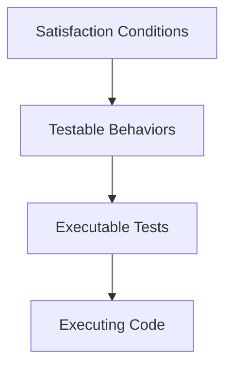

---
tags:
  - software-engineering
  - northeastern
  - cs4530
  - testing
  - tdd
  - requirements
  - module
type: lecture
course: "[[Fundamentals of Software Engineering]]"
module: 2
status: notes
---
# Module 02 — From Requirements to Tests

> [!info] Source
> <https://neu-se.github.io/CS4530-Fall-2026/modules/2-requirements-to-tests>

**Week 2** of [[Fundamentals of Software Engineering]] (Week 1 for Section 12) · Lesson: *Test-Driven Development*
**Slides**: `Module 02 Test-Driven Development` (pdf / pptx)

> [!danger] Important date
> [[Individual Project 1]] due **Wednesday Sep 23, 5:00pm ET**

## Learning Objectives

After this lecture you should be able to:

- [ ] Explain the basics of Test-Driven Development
- [ ] Explain the connection between conditions of satisfaction and testable behaviors
- [ ] Begin developing simple applications using TypeScript and Vitest

## Notes

> [!abstract] The one-sentence version
> [[Module 01 - Orientation and User Stories]] ended with conditions of satisfaction written in the
> client's words. This module is the machinery that turns those sentences into running code — and
> the claim is that the *test* is where the design actually happens, not the implementation.

### Why put tests first

TDD makes test specification **the critical design activity**. Three arguments for it, in
increasing order of how much they matter:

| Argument | What it buys you |
| --- | --- |
| Deployment is gated on tests passing | The finish line is mechanical, not a judgement call |
| Writing a test forces you to understand the problem | You can't assert on behavior you can't describe |
| Tests define what "done" means | No guesswork about whether a feature is complete |

The second one is the real payoff. Writing `expect(...)` requires you to name the inputs, name the
outputs, and commit to what the relationship between them is — which is the same work as designing
the interface. If you can't write the test, you don't yet understand the requirement.

There is also a design constraint that runs the other way: **design so that the code is easy to
test.** Testability isn't a property you add afterwards; it's a thing you give up if you make the
wrong structural choices early.

### The pipeline



Each arrow is a different kind of work, and it's worth keeping them separate in your head:

| Hop | What changes | Example |
| --- | --- | --- |
| COS → testable behavior | Client's language becomes a named operation on a named thing | "can add a student" → "`addStudent` should add a student and return their ID" |
| Testable behavior → executable test | Prose becomes an `it(...)` with real assertions | `expect(db.nameToIDs('blair')).toStrictEqual([id1])` |
| Executable test → executing code | Write the least code that makes it pass | `addStudent` pushes a transcript and returns the new ID |

Note that the first hop is where you discover the requirement is incomplete — see
[[#The gaps are the point]] below.

### Step 1 — Design the least fragment that could work

Design the smallest slice of the system that could possibly deliver the COS. This is **YAGNI**:
you are not designing the whole application, you are designing the part the client just described.

Three questions to run:

- What **data** would the system need?
- What **operations / functions** does that data need?
- Can you **name** the testable things? (If you can't name it, you can't assert on it.)

### Step 2 — Negotiate

Take your sketch back to the client before writing code. Four checks:

- Does the data include everything the client wants?
- Do the operations include enough to support the COS?
- Did the client forget anything?
- Are the COS realistic and achievable?

This step is cheap and the alternative is expensive — discovering a missing field after the schema
and its tests exist means redoing both.

### Worked example — the transcript service

Everything below is one continuous example: story → negotiation → interface → tests → code. The
code lives in [`transcript-service-m02`](https://github.com/neu-se/transcript-service-m02).

#### The user story

> As a **College Administrator**, I want to keep track of students, the courses they have taken,
> and the grades they received in those courses, so that I can advise them on their studies.

#### What the negotiation produced

Agreed with the client that for each student we need to store:

- a student ID
- the student's name
- a list of the student's courses and grades
- for each course taken, the course name and the student's grade

And explicitly agreed **out** of scope:

- **when** the student took the course — the client agreed we don't need to track it

> [!tip] The exclusion is the useful half
> "We don't have to keep track of when" is the line that keeps the model small. Negotiation isn't
> only about finding missing requirements — it's about getting permission to leave things out.

#### The testable interface

```typescript
import { StudentID, Student, Course, CourseGrade, Transcript } from './types.ts';

export interface TranscriptService {
  addStudent(studentName: string): StudentID;
  getTranscript(id: StudentID): Transcript;
  deleteStudent(id: StudentID): void; // hmm, what to do about errors??
  addGrade(id: StudentID, course: Course, courseGrade: CourseGrade): void;
  getGrade(id: StudentID, course: Course): CourseGrade;
  nameToIDs(studentName: string): StudentID[];
}
```

Note `nameToIDs` returns an **array**. That's a direct consequence of a COS — two students are
allowed to share a name, so name lookup can't return a single ID.

#### The supporting types

```typescript
// types.ts - types for the transcript service
export type StudentID = number;
export type Student = { studentID: number;
                         studentName: StudentName };

export type Course = string;
export type CourseGrade = { course: Course; grade: number };
export type Transcript = { student: Student; grades: CourseGrade[] };
export type StudentName = string;
```

#### COS → testable behaviors

One COS can produce several testable behaviors, which is why the left column has blank
continuation rows:

| CoS: The college administrator can...                          | Testable behaviors                                                                  |
| -------------------------------------------------------------- | ----------------------------------------------------------------------------------- |
| ...add a new student to the database                           | addStudent should add a student to the database and return their ID                 |
|                                                                | addStudent should return an ID distinct from any ID in the database                 |
| ...add a new student with the same name as an existing student | addStudent should permit adding a student with the same name as an existing student |
| ...retrieve the transcript for a student                       | getTranscript, given the ID of a student, should return the student's transcript.   |
|                                                                | getTranscript, given an ID that is not the ID of any student, should ...????...     |

#### The gaps are the point

Two places in the example are deliberately unresolved:

- `deleteStudent` carries the comment *"hmm, what to do about errors??"*
- the last table row trails off in `...????...` — what *should* `getTranscript` do with an ID that
  doesn't exist?

> [!warning] This is the hand-off to the activity
> Neither gap is an oversight in the slides. The conditions of satisfaction genuinely don't say
> what happens on bad input, and you can't write the test until someone decides. This is exactly
> what [[Activity 02 - Test-Driven Development]] asks you to do for `addGrade` — find at least two
> ways the COS fail to specify it. Carry that lens forward: **error behavior is almost never in
> the COS, and it's always in the tests.**
>
> [[Module 03 - Test Adequacy]] gives this a name — contracts — and a rule for which unspecified
> cases you're obliged to test.

### Writing the tests in Vitest

#### Start with the types

Before any behavior, check the data model does what you think. Cheap, and it catches a wrong field
name before it's wrong in ten places.

```typescript
// types.spec.ts
import { describe, expect, it } from 'vitest';
import { type Student } from './types.ts';

const alvin: Student = { studentID: 37, studentName: 'Alvin' };
const bryn: Student = { studentID: 38, studentName: 'Bronwyn' };

describe('the Student type', () => {
  it('should allow extraction of id', () => {
    expect(alvin.studentID).toEqual(37);
    expect(bryn.studentID).toEqual(38);
  });
  it('should allow extraction of name', () => {
    expect(alvin.studentName).toEqual('Alvin');
    expect(bryn.studentName).toEqual('Jazzhands'); // will fail
  });
});
```

> [!note] Running a single spec file
> `npx vitest --run src/types.spec.ts`
>
> The second spec above **is supposed to fail** — it's there so you can see what a failure looks
> like. Expect 1 passing, 1 failing.

#### Then behavior, in AAA order

```typescript
// transcript.service.spec.ts
import { beforeEach, describe, expect, it } from 'vitest';
import { TranscriptDB, type TranscriptService } from './transcript.service.ts';

let db: TranscriptService;
beforeEach(() => {
  db = new TranscriptDB();
});

describe('addStudent', () => {
  it('should add a student to the database and return their id', () => {
	// Assemble (& assert) the database is connected, and empty
    expect(db.nameToIDs('blair')).toStrictEqual([]);
	// Act upon the database
    const id1 = db.addStudent('blair');
	// Assess the transaction has gone through as expected
    expect(db.nameToIDs('blair')).toStrictEqual([id1]);
  });
});
```

> [!note] AAA
> **Assemble, Act, Assert** — the slides say *Assemble-Act-Assess*, same three steps. See
> [[Tutorial - Unit Testing with Vitest]].
>
> Note the assemble step here *also* asserts: it confirms the database starts empty. Without that
> line the final assertion can't distinguish "`addStudent` worked" from "blair was already there."

Notice the test name is a direct copy of the testable behavior from the table. That's the pipeline
working — if you have to invent a test name, you skipped a step.

#### The code the tests drive out

Only now does the implementation get written, and only as much as the tests demand:

```typescript
import { type StudentID, type Student, type Course, type CourseGrade,
         type Transcript } from './types.ts';

export interface TranscriptService { ... }

export class TranscriptDB implements TranscriptService {
  /** the list of transcripts in the database */
  private _transcripts: Transcript[] = [];

  /** the last assigned student ID
   * @note Assumes studentID is Number
   */
  private _lastID: number = 0;

  constructor() {}

  // etc
```

```typescript
  /** Adds a new student to the database
   * @param {string} newName - the name of the student
   * @returns {StudentID} - the newly-assigned ID for the new student
   */
  addStudent(newName: string): StudentID {
    const newID = this._lastID++;
    const newStudent: Student = { studentID: newID,
                                   studentName: newName };
    this._transcripts.push({
      student: newStudent, grades: []
    });
    return newID;
  }
```

The post-increment is what satisfies the second testable behavior — "should return an ID distinct
from any ID in the database" — without ever scanning the array for collisions.

### Fixture cleanup — pick one

Tests must not leak state into each other. Two ways to guarantee a clean database, and the choice
is about cost, not correctness:

**Option 1 — a brand new database per test.** Simplest, and the one used above. Nothing can
possibly survive between tests because the object doesn't.

```typescript
let db: TranscriptService;
beforeEach(() => {
  db = new TranscriptDB();
});
```

**Option 2 — construct once, clear before each test.** Use when construction is expensive (a real
connection, a container) and you don't want to pay for it per test.

```typescript
let db: TranscriptService;
beforeAll(() => {
  db = new TranscriptDB();
});

beforeEach(() => {
 db.clear([]);
});
```

Option 2 trades safety for speed: it only works if `clear()` really resets *everything*. Use
`afterEach()` where teardown is needed rather than setup.

## Key Takeaways

- TDD's real claim isn't "tests catch bugs" — it's that **writing the test is the design work**.
  Naming inputs, outputs, and their relationship is interface design.
- The pipeline is four stages, and each arrow is different work: **COS → testable behaviors →
  executable tests → executing code.**
- Design the **least fragment** that delivers the COS (YAGNI), then **negotiate** it before
  writing code. Getting permission to leave things out is as valuable as finding what's missing.
- A single COS usually yields **several** testable behaviors. "Two students can share a name" is
  why `nameToIDs` returns an array.
- **Conditions of satisfaction almost never specify error behavior.** The `deleteStudent`
  "what about errors??" and the `getTranscript` `...????...` are the lecture's deliberate cliff
  edge, and they're the entire subject of [[Activity 02 - Test-Driven Development]].
- Test names should be copied from your testable-behavior table, not invented at the keyboard.
- Every test starts from a known-clean fixture — new object per test by default, clear-before-each
  only when construction is expensive.

## Questions / Gaps

- **What *should* `getTranscript` do with an unknown ID?** Throw, return `undefined`, or return an
  empty transcript? The lecture leaves it open. Same question for `deleteStudent`. Resolved by
  contracts in [[Module 03 - Test Adequacy]] — decide, write it in the docstring, then test it.
- `_lastID` is documented as "the last assigned student ID" but the post-increment means it holds
  the **next** ID to assign (it's `0` before the first student exists). Harmless here, but the
  docstring and the code disagree.
- Option 2 cleanup calls `db.clear([])` — `clear` isn't on the `TranscriptService` interface as
  given, and the `[]` argument is unexplained. Check the starter repo.
- [x] Skim the Vitest tutorial → [[Tutorial - Unit Testing with Vitest]]

## Activity

[[Activity 02 - Test-Driven Development]] — starter repo [`transcript-service-m02`](https://github.com/neu-se/transcript-service-m02)

## Tutorials Assigned

- [[Tutorial - Development Environment Setup]]
- [[Tutorial - TypeScript Basics]]
- [[Tutorial - Unit Testing with Vitest]]

## Slides

| Deck | PDF | PPT |
| --- | --- | --- |
| Module 02 — Test-Driven Development | [PDF](https://neu-se.github.io/CS4530-Fall-2026/Slides/Module%2002%20Test-Driven%20Development.pdf) | [PPT](https://neu-se.github.io/CS4530-Fall-2026/Slides/Module%2002%20Test-Driven%20Development.pptx) |

Additional content: [modules/2-requirements-to-tests](https://neu-se.github.io/CS4530-Fall-2026/modules/2-requirements-to-tests)

## Resources

- [Examples from slides — `transcript-service-m02`](https://github.com/neu-se/transcript-service-m02)
- [Kent Beck on Software Engineering Daily](https://softwareengineeringdaily.com/2019/08/28/facebook-engineering-process-with-kent-beck/) — the creator of TDD on his time at Facebook and the relationship between Facebook and TDD
- [INVEST criteria for user stories](https://agileforall.com/new-to-agile-invest-in-good-user-stories/)
- [Value Sensitive Design](https://vsd.ccs.neu.edu/introduction/)
- [Domain Modeling Made Functional](https://onesearch.library.northeastern.edu/permalink/01NEU_INST/i2gqis/alma9952083043301401)
- [[Team Project Overview]]

## Related

- [[Module 01 - Orientation and User Stories]] — where the conditions of satisfaction come from
- [[Module 03 - Test Adequacy]] — how to know when you've written enough of these tests
- [[Tutorial - Unit Testing with Vitest]]
- [[CS4530 Course Schedule]]
