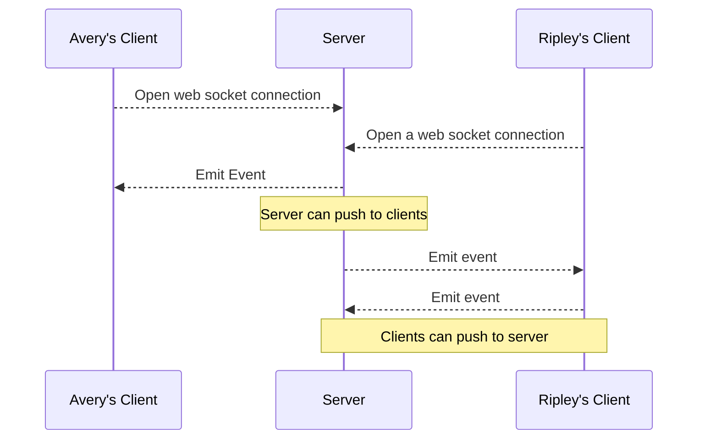
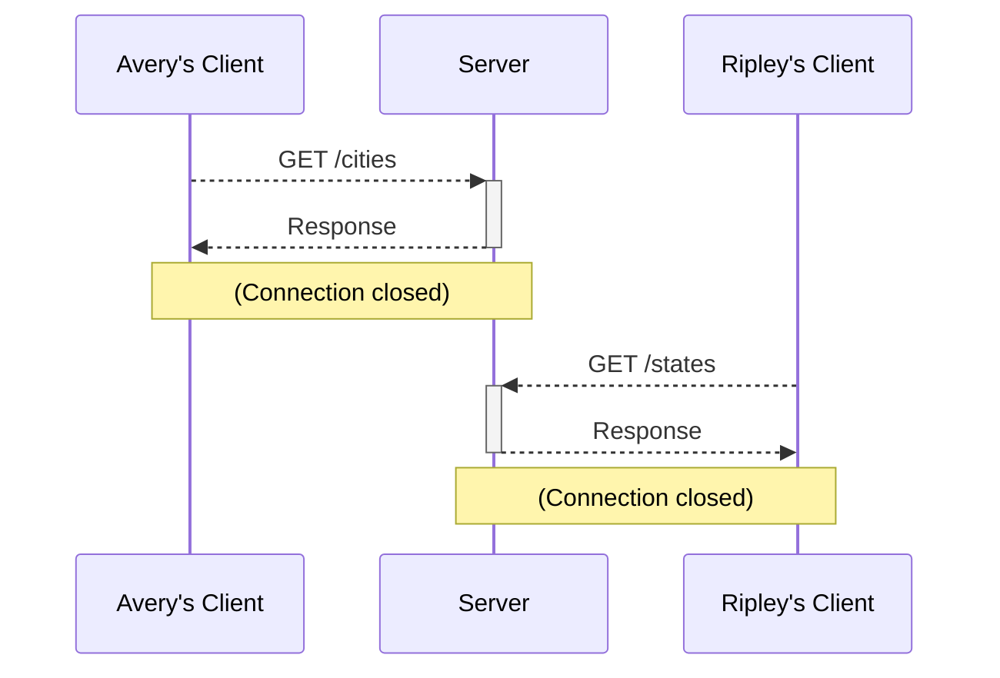

---
tags:
  - software-engineering
  - northeastern
  - cs4530
  - web
  - architecture
  - rest
  - async
  - module
type: lecture
course: "[[Fundamentals of Software Engineering]]"
module: 4
status: notes
---
# Module 04 — Design Patterns for Web Applications

> [!info] Source
> <https://neu-se.github.io/CS4530-Fall-2026/modules/4-web-apps>

**Week 3** of [[Fundamentals of Software Engineering]]
**Slides**: `Module 04 Web Application Architecture` (pdf / pptx)

> [!danger] Important date
> [[Individual Project 1]] due **Wednesday Sep 23, 5:00pm ET**

## Learning Objectives

After this lecture you should be able to:

- [ ] Explain the role of "client" and "server" in web application programming
- [ ] Describe the role of network protocols like HTTP and WebSockets in distributed systems
- [ ] Describe the fundamental differences between the controller, service, and repository layers in C-S-R architecture
- [ ] Use `async` and `await` to handle long-running procedures in a persistent repository

## Notes

> [!abstract] The one-sentence version
> A web app is a distributed system, and distributed systems are hard — so pick a well-understood
> shape and stick to it. This course's shape is **Controller → Service → Repository**, and the
> moment the repository touches a disk, everything above it becomes `async`.

### Web applications are distributed systems

A distributed system performs computation across different computers. Web apps are distributed
whether you like it or not, for two reasons:

1. **Users are literally in different places** — you don't live in a data center
2. **The app won't fit on one machine** — Netflix won't fit entirely on one computer

Distributed systems are hard, and the standard defence is to adopt **well-understood patterns**.
The simplest one is a **server** (a program in a data center) talking to one or more **clients**
(a browser on a consumer device) over the internet, using an agreed-upon **protocol**. The system
designer chooses the protocol, then builds programs on both ends to match.

> [!note] Scale caveat
> The designs in this lecture are deliberately simple. If you're Google, Netflix, or Amazon, they
> won't serve your purposes — more sophisticated applications need more sophisticated architecture.

### Two protocols, two shapes of conversation

| | WebSockets | HTTP |
| --- | --- | --- |
| Shape | Long-lived connection, either side can push | Request/response pairs: client sends, server responds |
| Who initiates | Server **or** client | Always the client |
| Good for | Event-driven apps (chat, live updates) | Function-call-like patterns (RPC, REST) |
| Connection | Stays open | Closed after each response |

#### WebSockets — event-driven

A server can communicate with many clients at once. A chat message is an **event** that the server
wants everyone to know about, so the server is the centralized point that lets distributed clients
talk to each other.

> [!tip] Centralization is a cheat code
> Routing everything through one server is what makes the distributed system manageable — clients
> never have to find or trust each other directly.



#### HTTP — function-call-like

HTTP gathers messages in pairs, which makes it a natural fit for two related patterns:

- **Remote Procedure Call (RPC)** — one computer calls a function on another computer
- **REpresentational State Transfer (REST)** — an RPC where the server **doesn't maintain a
  session** or remember specific clients. Every request is self-contained (stateless).

Most of the web apps in this course use a **REST-style** design.



An HTTP request carries a **route** and a **payload** — e.g. `POST /api/user/login` with
`{"username": "user1", "password": "..."}`. See [[Tutorial - API Requests]] for verbs and status
codes.

### Controller-Service-Repository (C-S-R)

The design used for **every web server in this course**. It's only one way to organize a server,
but it's good enough here, and it's built around one SE principle: **information hiding**. Each
layer knows only what it has to.

![[Screenshot 2026-09-21 at 12.19.25 PM.png]]

| Layer | Knows | Doesn't know |
| --- | --- | --- |
| **Controller** | How we talk to the client — routes, request validation, sending responses | How data is stored |
| **Service** | The business logic — as much of the interesting work as possible | How we connect to the client *or* store data |
| **Repository** | How to store information long-term | Anything about the client or the rules |

```
User ─ browser ─ Client ─ internet ─ Controller ─ API ─ Service ─ API ─ Repository
```

#### The controller

Communicates with the outside world, and knows which API calls are routed to which service-layer
methods. Two jobs in the example below:

1. **Validate** the payload — here with Zod. `zLogin` is the description of a valid payload, and
   `safeParse(...).data` hands back correctly typed fields.
2. **Delegate** to the service to assemble the answer, then send the response itself.

```ts
// loginController.ts
import express from "express";
import { type Request, type Response } from "express";
import { z } from "zod"
const app = express();
// NOTE: Service Layer Imports
import { isAuthorized, incrementLogins } from "./loginService.ts"
let numLogins = 0;

const zLogin = z.object({
  username: z.string().min(4),
  password: z.string().min(8)
})

app.post('/api/user/login', (request:Request, response:Response) => {
  const validatedRequest = zLogin.safeParse(request)
  if (validatedRequest.error) {response.send({error: "Bad Request"})}
  else {
    const username:string = validatedRequest.data.username
    const password:string = validatedRequest.data.password
    if (isAuthorized(username, password)) {
      const numLogins = incrementLogins()
      response.send({success:true, numLogins})
    } else {
      response.send({error: "Invalid username or password"})
    }
  }
})
```

#### The service layer

Provides the **business logic** — the boring-sounding name for most of the interesting stuff a
server does. Note it has no idea there's an HTTP request anywhere.

```ts
// loginService.ts
var numLogins = 0

export function isAuthorized(username:string, password:string):boolean {
  return ((username == "user1") && (password == "secret"))
}

export function incrementLogins(): number {
  numLogins++;
  return numLogins
}
```

> [!example] Looking back at the transcript server
> The `TranscriptDB` from [[Module 02 - From Requirements to Tests]] was mostly business logic,
> but it had **no clear repository layer** — `addStudent` pushes straight into the in-memory
> `_transcripts` array. That push is storage, not business logic, and it's exactly what this
> layer split pulls out.

#### The repository layer

The only part that stores information long-term. It exists because:

- Logins should be **cumulative even if the server restarts** (persistence)
- Adding users and changing passwords **shouldn't require updating code**

Lots of ways to get there — MongoDB, PostgreSQL, SQLite, or a file on the hard drive. They all
share one cost: persistent storage means I/O, which is **hundreds of times slower** than in-memory
work, and the CPU sits idle during the wait. JavaScript handles this with asynchronous
programming.

### Async programming

TypeScript uses the type system to mark long-running computations: they return **`Promise<T>`**
rather than `T`. Adding persistence therefore changes the interface — every method's return type
gets wrapped:

| Before (Module 02) | After (persistent) |
| --- | --- |
| `addStudent(name): StudentID` | `addStudent(name): Promise<StudentID>` |
| `nameToIDs(name): StudentID[]` | `nameToIDs(name): Promise<StudentID[]>` |
| `deleteStudent(id): void` | `deleteStudent(id): Promise<void>` — rejected if `id` is invalid |

A promise is only a promise to compute the value. To actually check the result, `await` it:

```ts
describe('addStudent', () => {
  it('should add a student to the database and return their id',
   async () => {
    expect(await service.nameToIDs('blair')).toStrictEqual([]);
    const id1 = await service.addStudent('blair');
    expect(await service.nameToIDs('blair')).toStrictEqual([id1]);
  });
```

> [!warning] Async is contagious
> Any function that calls a long-running function is itself long-running, so it must be `async`
> too — and so must anything that awaits *it*.
>
> ```ts
> async function numberOfSharedNames(name: string): Promise<number> {
>   const ids = await service.nameToIDs(name);
>   return ids.length
> }
> ```
>
> The chain does end: eventually you run out of functions waiting on an async one.

Single-threaded, this all works fine. Juggling multiple threads brings real dangers — that's
[[CS4530 Course Schedule|Module 08]], Concurrency Patterns.

## Key Takeaways

- Web apps are distributed systems by necessity. Use **well-understood patterns** rather than
  inventing your own.
- **WebSockets** for events either side can push; **HTTP** for request/response. **REST** is
  stateless RPC over HTTP, and it's the default style in this course.
- A central server is a **cheat code** — it keeps clients from having to coordinate directly.
- **C-S-R is information hiding.** Controller = talking to clients, Service = business logic,
  Repository = long-term storage. Each layer is ignorant of the others' concerns.
- Validation belongs in the **controller**, at the boundary — before the service ever sees data.
- Persistence makes reads/writes slow, so they return **`Promise<T>`**; `await` to get the value,
  and expect `async` to spread up the call chain.

## Questions / Gaps

- **`safeParse(request)` parses the whole request object, not the payload.** The earlier plain
  Express example destructures `request.body` (with `app.use(express.json())`). As written, the
  Zod schema would never find `username`/`password` at the top level. Should be
  `zLogin.safeParse(request.body)`.
- The controller declares `let numLogins = 0` at module scope and then shadows it with
  `const numLogins = incrementLogins()` inside the handler. The outer one is dead — the count lives
  in the service now.
- `isAuthorized` compares with loose equality. The course style guide pushes strict equality
  everywhere ([[CS4530 Code Style Guide]]).
- A failed login returns status **200** with an `error` field. Real REST would send 400/401 — see
  [[Tutorial - API Requests]].
- `numLogins` in the service is still in-memory, so it resets on restart — which is exactly the
  problem the repository layer is introduced to solve.

## Activity

[[Activity 04 - Modifying the Persistent Server]] — the persistent transcript service, async all
the way down.

## Slides

| Deck | PDF | PPT |
| --- | --- | --- |
| Module 04 — Web Application Architecture | [PDF](https://neu-se.github.io/CS4530-Fall-2026/Slides/Module%2004%20Web%20Application%20Architecture.pdf) | [PPT](https://neu-se.github.io/CS4530-Fall-2026/Slides/Module%2004%20Web%20Application%20Architecture.pptx) |

Additional content: [modules/4-web-apps](https://neu-se.github.io/CS4530-Fall-2026/modules/4-web-apps)

## Resources

- ["What is a REST API?"](https://www.sitepoint.com/rest-api/)
- ["What's the Difference Between RPC and REST?"](https://aws.amazon.com/compare/the-difference-between-rpc-and-rest/)

## Related

- [[Module 02 - From Requirements to Tests]] — the transcript service this module makes persistent
- [[Module 03 - Test Adequacy]]
- [[Module 05 - React Basics]] — the client side of the picture
- [[Tutorial - API Requests]]
- [[Individual Project 1]]
- [[CS4530 Course Schedule]]
