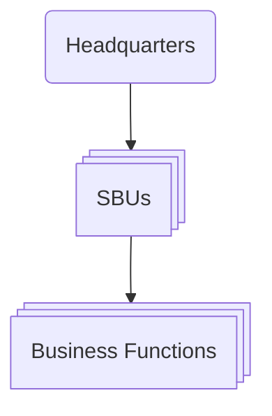

---
tags:
  - business
  - northeastern
  - strategy
  - competitive-advantage
  - strategic-positioning
  - industry-analysis
type: note
---

# What is Strategy? and Five Forces

**Definition**: Strategy is the set of **goal-directed actions** a firm takes to gain and sustain superior performance relative to its competitors — a _sustainable competitive advantage_.

## What Does Strategy Mean?

Every organization competes for scarce resources to achieve superior performance:

| Organization       | Competes for                     |
| ------------------ | -------------------------------- |
| New ventures       | Financial and human capital      |
| Existing companies | Profitable growth                |
| Charities          | Donations                        |
| Universities       | The best students and professors |
| Sports teams       | Championships                    |
| Celebrities        | Media attention                  |

At its core, strategy is the creation of a **unique and valuable position**, which requires **trade-offs** — deciding what _not_ to do.

- _Example - Walmart's "Everyday Low Prices"_: a deep supply chain and bulk purchasing allow items to be priced to undercut competitors while still earning a positive margin.
- **How do we allocate resources?** They are limited.
- **Which activities should we pursue?** We can't do it all.

### How to Achieve a Good Strategy

Three interlocking steps — **Analysis → Formulation → Implementation**:

1. **Diagnose** the competitive challenge (internal and external environments)
2. Craft a **guiding policy** to address the challenge
3. Take a set of **coherent actions** to implement the policy

> **Example — Tesla**
>
> - **Challenge**: Manufacture attractive, affordable vehicles using new tech and build the supporting infrastructure.
> - **Policy**: Build cost-competitive mass-market vehicles, investing in lithium-ion battery production.
> - **Actions**: Ramp up production volumes to achieve economies of scale — factories in Shanghai and the Mega Charger factory. Some tech is opened to the public.

## Competitive Advantage vs. Sustainable Competitive Advantage

|                   | Competitive Advantage                        | Sustainable Competitive Advantage (SCA)                       |
| ----------------- | -------------------------------------------- | ------------------------------------------------------------- |
| **Definition**    | Superior performance relative to competitors | Superior performance _sustained over time_                    |
| **Time horizon**  | Point in time                                | 2y · 5y · 10y · >10y                                          |
| **Key condition** | Outperform rivals or the industry average    | Value is **inimitable**, or too costly to justify duplicating |

Thinking about strategy means asking: _what actions lead to superior performance, and which lead to subpar performance?_

## What Strategy Is NOT

- **Grandiose statements** — "We will win," "We will be #1"
- **A failure to face the competitive challenge** — Blockbuster, Xerox, Kodak
- **Operational effectiveness, benchmarking, or tactical tools** — pricing strategy, operations strategy, brand strategy are good _policies_, but not strategy

> Doing the same activities better than rivals is valuable, but operational gains erode as competitors imitate them.

## AFI Framework — Analyze, Formulate, Implement

- **Analyze**
  - Diagnose competitive challenges
  - Run external and internal analysis
- **Formulate**
  - **Business strategy** — cost leadership, innovation, platforms
  - **Corporate strategy** — diversification, vertical integration, acquisitions, competing globally
- **Implement**
  - Organizational design, structure, culture, control systems, incentives, business ethics

## Stakeholder Strategy

| External Stakeholders | Internal Stakeholders |
| --------------------- | --------------------- |
| Customers             | Employees             |
| Suppliers             | Stockholders          |
| Alliance partners     | Board members         |
| Creditors             |                       |
| Unions                |                       |
| Communities           |                       |
| Governments           |                       |
| Media                 |                       |

> Does every actor have a voice? What about _equal_ voices? Is the role of a stakeholder changing?

## The Process

Formulation and implementation cascade across levels:

## Vision, Mission, Values

### Vision — _What do we want to accomplish?_

- Captures an organization's aspirations and long-term objectives
- Expressed as a forward-looking statement

> Vision statements relate to firm performance, and the relationship is strongest when the vision is customer-oriented, internally focused, and the structure aligns to the vision.

| Customer-oriented statements                 | Product-oriented statements                           |
| -------------------------------------------- | ----------------------------------------------------- |
| Allow adaptation to environmental change     | Focused on the product or service itself              |
| Focused on solving problems for the customer | Encourage a myopic managerial view                    |
|                                              | Can hinder understanding of the competitive landscape |

### Mission — _How do we accomplish our goals?_

Credible actions backing up the vision:

- The products / services it will provide
- The markets in which it competes

These commitments can be **costly**, **long-term**, and **difficult to reverse**.

### Values — _What commitments do we make?_

Organizational core values are ethical standards and norms that:

- Govern behavior and provide stability
- Act as guardrails for the company

They help employees understand company culture, deal with complexity, and resolve conflict.

## Three Approaches to Organizational Strategy

1. **Strategic planning (intended)** — formal, top-down, "militaristic"; assumes we can predict the future from the past
2. **Scenario planning (emergent)** — formal, top-down "contingency planning"
3. **Planned emergence (both)** — begins with a strategic plan, but less formal

### Top-Down Strategic Planning

A data-driven process where top management attempts to program future success by analyzing price, costs, margins, market demand, head count, production runs, five-year plans and budgets, and performance monitoring.

**Shortcomings**

- May not adapt to change
- Formulation is separated from implementation
- Information flows only one way
- The future vision can simply be wrong

### Scenario Planning

Ask _what-if_ questions, building optimistic and pessimistic future plans around new laws, demographic shifts, a changing economy, and technological advances.

**Questions to ask**

1. What resources and capabilities are needed to compete?
2. What strategic initiatives should we put in place?
3. How can we shape our expected future?

**Approach**: obtain input across levels and functions (R&D, manufacturing, marketing, sales), determine how to compete situationally, and attach probabilities to different future states (highly likely vs. unlikely).

> **Black Swan Events** — unpredictable, low-probability events with extreme impact: COVID-19, the 2008 financial crisis, IT security breaches.

## Types of Strategy

| Type         | Description                                                                             |
| ------------ | --------------------------------------------------------------------------------------- |
| **Intended** | Outcome of a rational, top-down plan                                                    |
| **Emergent** | Unplanned initiatives that bubble up from the bottom and can influence overall strategy |
| **Realized** | The combination of intended and emergent strategy                                       |

## Initiatives

An initiative is an activity a firm pursues — new products, processes, markets, or ventures. It can bubble up from deep within the firm:

- **Autonomous actions** — initiatives taken by employees in response to unexpected situations
- **Serendipity** — random events, surprises, and coincidences that affect strategic initiatives
- **Resource-allocation process (RAP)** — how firms allocate resources based on policy, shaping realized strategy (_e.g., Intel's shift from DRAM to microprocessors_)

## Decision Making

Managerial decisions are limited by cognitive bounds:

1. Managers settle for _good enough_ options rather than optimal solutions
2. Decision making carries biases and limitations
3. AI can augment the information at our fingertips

Managers improve when theories and frameworks help guide them through uncertainty.

## Porter's Five Forces

## Core Idea

- A strategist's real job is understanding competition — but "competition" is usually defined too narrowly (just today's rivals).
- Profitability is actually shaped by **five** forces: existing rivals, customers, suppliers, potential entrants, and substitutes.
- **Industry structure** — the underlying economic/competitive characteristics of an industry (as manifested in the five forces) — determines long-run average profitability, regardless of whether the industry is high-tech, regulated, emerging, or mature.
- Short-term factors (weather, business cycles) sway profits temporarily, but structure dominates over the medium-to-long run.

## The Five Forces

1. Threat of new entrants
2. Bargaining power of suppliers
3. Bargaining power of buyers
4. Threat of substitute products or services
5. Rivalry among existing competitors

## Key Analytical Principles

- Force mix is industry-specific (e.g., aircraft: rivalry & buyer power dominate; movie theaters: substitutes & supplier power dominate).
- Identify the **strongest** force(s) — that's what should drive strategy; it isn't always the obvious one (film industry example: a substitute — digital photography — hurt profits more than rivalry did).
- **Incumbent** — a company already operating in the industry. **Potential entrant** — a company (startup, foreign firm, or player from an adjacent industry) that could plausibly enter. Analysis is framed from the incumbent's perspective but applies equally when evaluating entry as a newcomer.

---

## Key Terms & Definitions (Quick Reference)

**Threat of new entrants / entry barriers**

- **Barriers to entry** — structural advantages incumbents hold over potential entrants that make entering harder or costlier.
- **Supply-side economies of scale** — cost advantages large-volume producers get by spreading fixed costs, using more efficient technology, or securing better supplier terms.
- **Demand-side benefits of scale (network effects)** — a product becomes more valuable to a buyer as more other buyers/users adopt it.
- **Customer switching costs** — the fixed costs a buyer incurs when changing suppliers (retraining, re-specifying products, migrating systems).
- **Capital requirements** — the amount of financial investment needed to compete (facilities, credit, inventory, absorbing startup losses).
- **Incumbency advantages independent of size** — cost/quality edges incumbents hold regardless of scale — from proprietary technology, preferential raw-material access, prime locations, brand identity, or experience-driven efficiency.
- **Unequal access to distribution channels** — a barrier arising when existing wholesale/retail channels are limited or already locked up by incumbents.
- **Restrictive government policy** — rules (licensing, foreign-investment limits, patents, safety regulation) that can raise _or_ lower entry barriers.
- **Expected retaliation** — a potential entrant's anticipation of how aggressively incumbents will fight back, which factors into the entry decision alongside barrier height.
- **Diversifying entrant** — a company entering a new industry by leveraging capabilities/cash flow built in a different market (e.g., Pepsi entering bottled water).

**Supplier power**

- **Supplier concentration** — whether a supplier group consists of few, large players relative to the more fragmented industry it sells into; higher concentration = more supplier power.
- **Forward integration (by suppliers)** — a supplier's credible ability to enter the industry it currently sells into itself, bypassing the need for industry participants as customers.
- **Product differentiation (supplier side)** — suppliers offering unique or patented products face less pushback on price, since buyers can't easily substitute a generic version.

**Buyer power**

- **Standardized/undifferentiated products** — products with no meaningful distinguishing features, letting buyers freely play vendors against each other.
- **Price sensitivity** — how much buyers focus on price in their purchasing decisions, typically higher when the product is a large share of the buyer's total costs.

**Threat of substitutes**

- **Substitute product/service** — a different product or service that meets a similar customer need, capping how much an industry can charge (e.g., digital photography vs. film; generic vs. branded drugs).

**Rivalry among existing competitors**

- **Exit barriers** — the flip side of entry barriers: structural factors (specialized assets, managerial commitment) that keep companies competing even while earning low or negative returns.
- **Fixed costs vs. marginal costs** — fixed costs don't change with output (e.g., plant costs); marginal cost is the cost of producing one additional unit. High-fixed/low-marginal-cost industries face strong pressure to discount in order to fill capacity.
- **Excess capacity** — production capability beyond current demand; pushes competitors toward price cuts to keep volume up.
- **Price competition** — rivalry based mainly on undercutting price; especially damaging because it transfers value directly to customers and is easy for rivals to match.
- **Non-price competition** — rivalry based on features, service, delivery time, or brand rather than price; less destructive to industry profitability.
- **Product innovation / new product introductions** — launching new or improved products as a competitive tactic — one of rivalry's "familiar forms," alongside price discounting, advertising campaigns, and service improvements.
- **Zero-sum competition** — rivalry where competitors chase the same customers/needs, so one firm's gain is directly another's loss.
- **Positive-sum competition** — rivalry where competitors serve different segments or needs, letting overall industry profitability (and sometimes the market itself) grow.

**Factors often mistaken for structure**

- **Industry growth rate** — how fast an industry is expanding; often wrongly equated with attractiveness.
- **Technology and innovation** — having advanced technology doesn't by itself make an industry structurally attractive.
- **Government (as an influence, not a "sixth force")** — affects profitability only indirectly, by shifting one or more of the five forces.
- **Complements (complementary products/services)** — products/services consumed together whose combined value to the customer exceeds their separate value (e.g., hardware + software, cars + gas stations); they shift the five forces rather than acting as a force themselves.

**Strategy implications**

- **Positioning** — choosing a spot within an industry's existing structure where the five forces are comparatively weak, then tailoring the value chain to defend it.
- **Profit pool** — the total economic value an industry generates, shared among industry participants, suppliers, and buyers.
- **Redividing profitability** — strategic moves aimed at capturing a larger share of an industry's _existing_ profit pool from suppliers, buyers, substitutes, or potential entrants.
- **Expanding the profit pool** — strategic moves that grow an industry's _total_ value (via more demand, higher quality, or lower costs), creating gains multiple participants can share.
- **Return on equity (ROE)** — a profitability measure (net income relative to shareholders' equity); used to show Paccar's sustained outperformance (>20% ROE).
- **Structural change vs. temporary/cyclical change** — a genuine shift in the forces that alters long-run profitability, as opposed to a short-lived blip; distinguishing the two is central to good industry analysis.

---

## 1. Threat of New Entrants

- New entrants add capacity and compete for share, pressuring prices, costs, and investment — especially diversifying entrants leveraging existing capabilities/cash flow (Pepsi into bottled water, Microsoft into browsers, Apple into music).
- It's the **threat** of entry — not whether entry actually happens — that caps profitability, since incumbents must preemptively invest or hold prices down.
- Threat level = f(entry barrier height, expected retaliation).

### Seven Barriers to Entry

| #   | Barrier                                         | Mechanism                                                                                                                                                                   | Example(s)                                                                           |
| --- | ----------------------------------------------- | --------------------------------------------------------------------------------------------------------------------------------------------------------------------------- | ------------------------------------------------------------------------------------ |
| 1   | Supply-side economies of scale                  | Larger volume → lower per-unit costs; forces entrants to enter big or accept a cost penalty                                                                                 | Intel (R&D/fabrication/marketing), Scotts Miracle-Gro, parcel delivery               |
| 2   | Demand-side benefits of scale (network effects) | Product value rises as more buyers adopt it                                                                                                                                 | eBay's larger trading network                                                        |
| 3   | Customer switching costs                        | Fixed costs of changing suppliers (retraining, system migration)                                                                                                            | SAP ERP systems                                                                      |
| 4   | Capital requirements                            | Large upfront investment deters entry, esp. for sunk costs (ads, R&D) — though efficient capital markets can offset this if returns look attractive                         | New airlines financing aircraft against high resale value                            |
| 5   | Incumbency advantages independent of size       | Cost/quality edges from proprietary tech, preferential raw-material access, prime locations, brand identity, or experience-driven efficiency                                | Target/Walmart entering via freestanding sites instead of contested shopping centers |
| 6   | Unequal access to distribution channels         | Limited/tied-up channels make entry harder; sometimes entrants must build new channels entirely                                                                             | Low-cost airlines bypassing travel agents, selling direct online                     |
| 7   | Restrictive government policy                   | Licensing, foreign-investment limits directly block entry; regulation can also _raise_ other barriers (patents, safety/scale rules) or _lower_ them (subsidies, public R&D) | Liquor retailing, taxis, airlines                                                    |

- Barriers must be judged relative to the specific capabilities of likely entrants (startups, foreign firms, adjacent-industry players), who may find creative ways around them.

### Expected Retaliation

Newcomers are more deterred when:

- Incumbents have a history of fighting entrants hard
- Incumbents have deep resources (cash, borrowing capacity, spare capacity, channel/customer clout)
- Incumbents are likely to cut prices (share-at-all-costs mentality, or high fixed costs pushing them to fill capacity)
- Industry growth is slow, so entrants can only grow by taking share from others

---

## 2. Power of Suppliers

- Powerful suppliers extract value via higher prices, reduced quality/service, or cost-shifting (e.g., Microsoft's OS pricing squeezing PC makers who can't easily raise their own prices).
- A supplier group is powerful when it:
  - Is more concentrated than the industry it sells into
  - Doesn't depend heavily on that industry for its own revenue
  - Faces industry participants who have high switching costs (specialized equipment, co-located facilities)
  - Offers a differentiated/patented product
  - Has no real substitute (e.g., pilots' unions)
  - Could credibly integrate forward into the industry itself

---

## 3. Power of Buyers

- Mirror image of supplier power — buyers force down prices or demand more for the same price, at the industry's expense.
- A buyer group has leverage when:
  - There are few buyers, or purchases are large relative to vendor size (amplified in high-fixed/low-marginal-cost industries — telecom equipment, offshore drilling, bulk chemicals)
  - Industry products are standardized/undifferentiated
  - Buyers face low switching costs

## Threat of Substitutes (related content)

- Buyers switching to a substitute at low cost intensifies pressure (e.g., branded-to-generic drug switching is cheap, driving fast, large price declines).
- Watch adjacent industries for emerging substitutes — technological shifts can flip price-performance comparisons (plastics substituting for steel in auto parts).
- The substitution threat can also move _in favor of_ an industry over time.

---

## 4. Rivalry Among Existing Competitors

Rivalry takes several **familiar forms** — each a distinct competitive tactic:

- **Price discounting** — cutting prices to win business.
- **Product innovation / new product introductions** — launching new or improved products to attract customers.
- **Advertising campaigns** — promotional spending to build demand or brand preference.
- **Service improvements** — enhancing support, delivery, or after-sale service.

**Intensity of rivalry is highest when:**

- Competitors are numerous or similarly matched (no leader to enforce industry norms)
- Industry growth is slow (fights over share)
- Exit barriers are high (specialized assets, managerial attachment) — keeps weak players in, dragging down healthy ones
- Rivals are highly committed / have non-economic goals (prestige, employment, ego)
- Firms read each other's signals poorly (unfamiliarity, differing approaches/goals)

**Basis of rivalry matters as much as intensity:**

- Price-based rivalry is most destructive — it transfers profit straight to customers and is easy to match, escalating.
- Price competition is likeliest when: products are near-identical with low switching costs; fixed costs are high/marginal costs low (paper, aluminum, fixed-route delivery); capacity must expand in large chunks (e.g., PVC); the product is perishable (broadly defined — includes obsolescence-prone tech or unsellable hotel-night capacity).
- Non-price rivalry (features, service, brand) is less corrosive to profitability and can even strengthen an industry's position vs. substitutes/entrants.
- **Zero-sum** rivalry occurs when rivals target the same customers/attributes; **positive-sum** rivalry (and higher average profitability) results when competitors serve distinct segments with different mixes of price/features/brand.

---

## Factors, Not Forces

Common visible attributes that are _often mistaken_ for structural attractiveness but aren't reliable on their own:

- **Industry growth rate** — fast growth can still coincide with low profitability if entry barriers are low, buyers are powerful, or substitutes are strong (PCs cited as a fast-growing but weak-margin industry).
- **Technology/innovation** — being high-tech doesn't guarantee attractiveness; "boring" industries with high switching costs or scale-based barriers can outperform flashy tech sectors.
- **Government** — not a sixth force; its influence works _through_ the five forces (patents raise entry barriers; pro-union policy raises supplier power; lenient bankruptcy rules can prolong excess capacity/rivalry).
- **Complements** — products used together (hardware/software, cars/gas stations); not inherently good or bad, but shift the five forces (e.g., Microsoft's dev tools lowered software entry barriers; Apple's iTunes hastened CD-to-digital substitution).

---

## Changes in Industry Structure

Structure is generally stable but shifts gradually — sometimes abruptly:

- **Shifting entry threat** — patent expiration (Zocor: 3 entrants same day it expired) vs. saturated distribution shelf space (ice cream/freezer space); scale-raising tech investments by leaders (Walmart/Kmart/Toys "R" Us adopting costly logistics systems) raised barriers against small retailers.
- **Changing supplier/buyer power** — retail-channel consolidation squeezed appliance makers (Electrolux, GE, Whirlpool); airlines selling direct online cut travel agents' bargaining power.
- **Shifting substitution threat** — tech advances create/upgrade substitutes over time (early microwaves too costly to compete; flash memory eventually rivaling low-capacity hard drives).
- **New bases of rivalry** — rivalry often intensifies as industries mature (TVs, snowmobiles, telecom equipment), but this isn't inevitable (US casino industry largely expanded into new niches rather than fighting head-to-head). M&A and tech shifts (e.g., internet lowering brokerage marginal costs) can also reshape rivalry. Consolidating to kill competition is risky — removing rivals can invite new entrants and backlash (NY banking consolidation in the '80s–90s didn't reduce long-run competitive diversity).

### How to Do Industry Analysis Well

- Use a time horizon matching the full **business cycle** (~3–5 years typically; longer for capital-intensive/long-lead industries like mining) — focus on average profitability over that window, not one year.
- Goal is understanding root causes, not just labeling an industry "attractive." Quantify where possible: buyer's % of total cost from this product, % of sales needed to fill a plant/network efficiently, buyer switching costs.
- Think systemically: which forces underpin today's profitability, and how might a shift in one force ripple into the others?

---

## Implications for Strategy

Three broad strategic uses of the framework:

**1. Positioning within current structure**

- Find or build a spot where the forces are weakest.
- _Paccar example:_ in the tough heavy-truck industry (powerful fleet buyers, standardized products, capital-intensive cyclical rivalry, strong unions), Paccar targeted owner-operators — less price-sensitive, emotionally invested buyers — with customizable, premium-featured trucks, strong resale value, and fast roadside support. Result: a ~10% price premium, 68 consecutive profitable years, >20% ROE.
- The framework also supports entry/exit decisions — spotting underpriced good structures early, or identifying that a company has unique means to overcome barriers others can't.

**2. Exploiting industry change**

- _Music industry example:_ internet distribution was predicted to flood the market with new labels by removing physical distribution as a barrier. In fact the real barriers were risk-pooling across many artists and promotional leverage with radio/retail — which internet distribution didn't remove. Major labels actually consolidated (6 → 4). However, unauthorized downloading created a real substitute, and Apple's iTunes became a powerful new gatekeeper — an example of structure shifting against an industry's incumbents.

**3. Shaping industry structure**
Two levers:

- **Redividing profitability** — capturing a larger share of existing value by weakening the constraining force(s): standardizing specs/cultivating more vendors to neutralize supplier power; raising buyers' switching costs; investing in differentiation to blunt price rivalry; raising fixed costs (R&D/marketing) to scare off entrants; improving product value/accessibility to beat substitutes (e.g., soft-drink vending/convenience placement).
  - _Sysco example:_ in the fragmented, low-margin food-service distribution industry, Sysco (as the scale leader) introduced private-label brands to curb supplier power and added value-added services to strengthen buyer relationships.
  - _Caution:_ moves to boost one's own position can backfire industry-wide — IBM's open PC architecture (to catch up faster) handed control of the OS and microprocessor to Microsoft and Intel, commoditizing PCs and locking IBM into a structurally weak position despite early dominance.
- **Expanding the profit pool** — growing total value via demand growth, quality gains, cost reduction, or waste elimination, benefiting multiple industry participants at once (e.g., soft-drink makers streamlining bottler networks; supply-chain collaboration cutting costs; shared quality standards raising sustainable prices industry-wide). Note: expanding the pie doesn't remove the importance of structure — the five forces still govern how the larger pie gets divided.

**4. Defining the industry**

- The five forces also help draw correct industry boundaries — the actual arena of competition — which clarifies both the causes of profitability and the right unit of analysis for setting strategy. Misjudging industry boundaries (a common competitor mistake) can be a source of strategic opportunity for others.

---

## Closing Point: Competition and Value

- Thinking in five-forces terms — for both managers and investors — surfaces real structural opportunities and threats rather than short-term financial noise.
- The five forces help distinguish temporary blips from lasting structural shifts, which Porter argues is a sounder basis for investment decisions than financial projections/trend extrapolation.
- Porter's overall argument: if executives and investors both focused on structural fundamentals rather than short-term performance ("pleasing the Street"), capital markets and company performance would both improve.

---

## Related Topics

- [[Intro to Strategy]] — Strategic positioning, trade-offs, and competitive advantage
- [[Strategy and Action]] — Course map and index

## See Also

- [[Strategy and Action]]

---

**Key Principle**: Strategy is goal-directed action toward a unique, defensible position — analyze the competitive environment, formulate a coherent policy, and implement it consistently to build advantage that rivals cannot cheaply copy.
