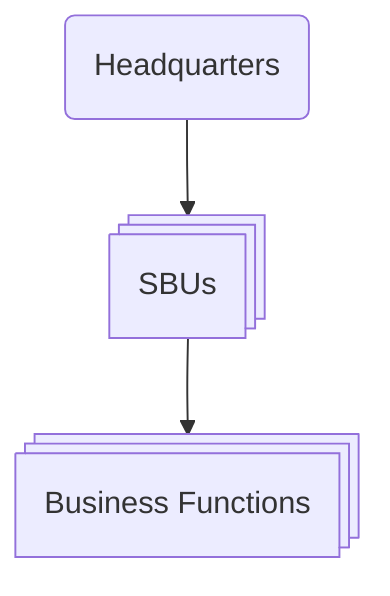

---
tags:
  - business
  - northeastern
  - strategy
  - competitive-advantage
  - strategic-positioning
  - industry-analysis
type: note
---

# What is Strategy? and Five Forces

**Definition**: Strategy is the set of **goal-directed actions** a firm takes to gain and sustain superior performance relative to its competitors — a _sustainable competitive advantage_.

## What Does Strategy Mean?

Every organization competes for scarce resources to achieve superior performance:

| Organization       | Competes for                     |
| ------------------ | -------------------------------- |
| New ventures       | Financial and human capital      |
| Existing companies | Profitable growth                |
| Charities          | Donations                        |
| Universities       | The best students and professors |
| Sports teams       | Championships                    |
| Celebrities        | Media attention                  |

At its core, strategy is the creation of a **unique and valuable position**, which requires **trade-offs** — deciding what _not_ to do.

- _Example - Walmart's "Everyday Low Prices"_: a deep supply chain and bulk purchasing allow items to be priced to undercut competitors while still earning a positive margin.
- **How do we allocate resources?** They are limited.
- **Which activities should we pursue?** We can't do it all.

### How to Achieve a Good Strategy

Three interlocking steps — **Analysis → Formulation → Implementation**:

1. **Diagnose** the competitive challenge (internal and external environments)
2. Craft a **guiding policy** to address the challenge
3. Take a set of **coherent actions** to implement the policy

> **Example — Tesla**
>
> - **Challenge**: Manufacture attractive, affordable vehicles using new tech and build the supporting infrastructure.
> - **Policy**: Build cost-competitive mass-market vehicles, investing in lithium-ion battery production.
> - **Actions**: Ramp up production volumes to achieve economies of scale — factories in Shanghai and the Mega Charger factory. Some tech is opened to the public.

## Competitive Advantage vs. Sustainable Competitive Advantage

|                   | Competitive Advantage                        | Sustainable Competitive Advantage (SCA)                       |
| ----------------- | -------------------------------------------- | ------------------------------------------------------------- |
| **Definition**    | Superior performance relative to competitors | Superior performance _sustained over time_                    |
| **Time horizon**  | Point in time                                | 2y · 5y · 10y · >10y                                          |
| **Key condition** | Outperform rivals or the industry average    | Value is **inimitable**, or too costly to justify duplicating |

Thinking about strategy means asking: _what actions lead to superior performance, and which lead to subpar performance?_

## What Strategy Is NOT

- **Grandiose statements** — "We will win," "We will be #1"
- **A failure to face the competitive challenge** — Blockbuster, Xerox, Kodak
- **Operational effectiveness, benchmarking, or tactical tools** — pricing strategy, operations strategy, brand strategy are good _policies_, but not strategy

> Doing the same activities better than rivals is valuable, but operational gains erode as competitors imitate them.

## AFI Framework — Analyze, Formulate, Implement

- **Analyze**
  - Diagnose competitive challenges
  - Run external and internal analysis
- **Formulate**
  - **Business strategy** — cost leadership, innovation, platforms
  - **Corporate strategy** — diversification, vertical integration, acquisitions, competing globally
- **Implement**
  - Organizational design, structure, culture, control systems, incentives, business ethics

## Stakeholder Strategy

| External Stakeholders | Internal Stakeholders |
| --------------------- | --------------------- |
| Customers             | Employees             |
| Suppliers             | Stockholders          |
| Alliance partners     | Board members         |
| Creditors             |                       |
| Unions                |                       |
| Communities           |                       |
| Governments           |                       |
| Media                 |                       |

> Does every actor have a voice? What about _equal_ voices? Is the role of a stakeholder changing?

## The Process

Formulation and implementation cascade across levels:

## Vision, Mission, Values

### Vision — _What do we want to accomplish?_

- Captures an organization's aspirations and long-term objectives
- Expressed as a forward-looking statement

> Vision statements relate to firm performance, and the relationship is strongest when the vision is customer-oriented, internally focused, and the structure aligns to the vision.

| Customer-oriented statements                 | Product-oriented statements                           |
| -------------------------------------------- | ----------------------------------------------------- |
| Allow adaptation to environmental change     | Focused on the product or service itself              |
| Focused on solving problems for the customer | Encourage a myopic managerial view                    |
|                                              | Can hinder understanding of the competitive landscape |

### Mission — _How do we accomplish our goals?_

Credible actions backing up the vision:

- The products / services it will provide
- The markets in which it competes

These commitments can be **costly**, **long-term**, and **difficult to reverse**.

### Values — _What commitments do we make?_

Organizational core values are ethical standards and norms that:

- Govern behavior and provide stability
- Act as guardrails for the company

They help employees understand company culture, deal with complexity, and resolve conflict.

## Three Approaches to Organizational Strategy

1. **Strategic planning (intended)** — formal, top-down, "militaristic"; assumes we can predict the future from the past
2. **Scenario planning (emergent)** — formal, top-down "contingency planning"
3. **Planned emergence (both)** — begins with a strategic plan, but less formal

### Top-Down Strategic Planning

A data-driven process where top management attempts to program future success by analyzing price, costs, margins, market demand, head count, production runs, five-year plans and budgets, and performance monitoring.

**Shortcomings**

- May not adapt to change
- Formulation is separated from implementation
- Information flows only one way
- The future vision can simply be wrong

### Scenario Planning

Ask _what-if_ questions, building optimistic and pessimistic future plans around new laws, demographic shifts, a changing economy, and technological advances.

**Questions to ask**

1. What resources and capabilities are needed to compete?
2. What strategic initiatives should we put in place?
3. How can we shape our expected future?

**Approach**: obtain input across levels and functions (R&D, manufacturing, marketing, sales), determine how to compete situationally, and attach probabilities to different future states (highly likely vs. unlikely).

> **Black Swan Events** — unpredictable, low-probability events with extreme impact: COVID-19, the 2008 financial crisis, IT security breaches.

## Types of Strategy

| Type         | Description                                                                             |
| ------------ | --------------------------------------------------------------------------------------- |
| **Intended** | Outcome of a rational, top-down plan                                                    |
| **Emergent** | Unplanned initiatives that bubble up from the bottom and can influence overall strategy |
| **Realized** | The combination of intended and emergent strategy                                       |

## Initiatives

An initiative is an activity a firm pursues — new products, processes, markets, or ventures. It can bubble up from deep within the firm:

- **Autonomous actions** — initiatives taken by employees in response to unexpected situations
- **Serendipity** — random events, surprises, and coincidences that affect strategic initiatives
- **Resource-allocation process (RAP)** — how firms allocate resources based on policy, shaping realized strategy (_e.g., Intel's shift from DRAM to microprocessors_)

## Decision Making

Managerial decisions are limited by cognitive bounds:

1. Managers settle for _good enough_ options rather than optimal solutions
2. Decision making carries biases and limitations
3. AI can augment the information at our fingertips

Managers improve when theories and frameworks help guide them through uncertainty.

## The Industry Life Cycle

The PS3 has a probable life cycle of six-seven years, but the electronic games industry goes back to the first Atari in 1977.
The life cycle comprises of four phases:

1. **Introduction** — New product or service is launched, and the firm invests in R&D and marketing to build awareness.
2. **Growth** — Sales and profits increase rapidly, and the firm invests in production capacity
3. **Maturity** — Sales growth slows, and the firm focuses on efficiency and cost control to maintain profitability.
4. **Decline** — Sales and profits decline, and the firm may exit the market

The industry has major driving forces, demand growth and creation and diffusion of knowledge.

### Demand Growth

- Sales are small and market penetration is low in the introduction stage. Small scale of production, lack of experience, and high costs.
- Accelerated market penetration marks the growth stage, shifting to mass market adoption.
- Growth slows in the maturity stage, demand shifts to replacement demand. Either new products or new customers.
- Decline stage sees the market being challenged, superior substitute products emerge

### Creation and Diffusion of Knowledge

New knowledge in product innovation creates an industry

- Competition forms a _dominant design_, architecture that creates look, functionality, and production method. Adopted by the industry in whole.
- Knowledge _rapidly advances_ in introduction, no dominant design
- A _dominant design_ does not set the standard per-say, the Boeing 707 was dominant, but did not set the Aerospace standard, and was outclassed.
- Standards are created when _network effects_ come into play. Every one needs to be compatible with the same design.

After a dominant design emerges, the industry moves from _radical innovation_ to _incremental product innovation_.
Firms will shift emphasis to _manufacturing_ to reduce costs and improve quality and reliability

As the life cycle accrues, the customers become more informed, and can make better decisions about rival products.

## Location and International Trade

The life cycle theory of trade and direct investment is based on two assumptions

1. Demand for new products emerge in advanced countries, and diffuses
2. With maturity, products require fewer units of technology and skills

The following pattern emerges:

1. New industries begin in high-income countries
2. As demand grows, they are services by exports initially
3. Continued demand leads to newly industrialized countries to begin importing
4. With maturity, commoditization, and de-skilling, production shifts to low-income countries with low labor cost

## Competition

Competition changes in two ways over the industry life cycle

1. A shift from non price to price competition
   - Gross margins may be high, but investment in infrastructure depress return on capital
   - As maturity hits, increased production standards and excess capacity stimulates price comeptition, which can be intense based on demand balance, extent of international competition

2. The intensity of competition grows, causing margins to narrow

## Key Factors for Success during Stages

1. Introductory Stage:
   - Product innovation is the main factor to start
   - With evolution, investment requirements grow, financial resources are more important
   - Capabilities in development need to be matched by capabilities in _manufacturing_, _marketing_, and _distribution_
2. Growth stage
   - Key challenge is scaling
   - Firms need to adapt product designs and manufacturing to be large scale
   - Investments in R&D, P&E, and sales tend to be high
   - Access to distribution is critical
3. Maturity Stage:
   - Competitive advantage is a quest for cost efficiency
   - Scale economies, low wages, low overheads are the factors
4. Decline phase:
   - Price competition in a destructive nature
   - Stable industry environment is critical

## Competitive Advantage in Mature Industries

- Mature industries (food, energy, construction, vehicles, financial services, restaurants) dominate GDP despite less attention than tech.
- Maturity reduces opportunities for competitive advantage and shifts focus from differentiation to cost.
- Doesn't eliminate opportunity — Zara/Inditex, Ryanair, Starbucks, Nucor show mature industries can be reshaped.

## Competitive Advantage in Mature Industries

- Maturity narrows differentiation (buyer sophistication, product standardization).
- Diffuses process technology, eroding cost advantages.
- Exposes firms to powerful distributors.
- **Buffett's "franchise vs. business" distinction:**
  - Franchise = high returns regardless of management
  - Business = profits only via low-cost ops or tight supply
  - Example: media companies slid from franchise → business status

### Cost Advantage

Three main drivers:

1. **Economies of scale** — stronger given standardization; ROI–market share correlation tighter than in emerging industries
2. **Low-cost inputs** — e.g., Valero Energy buying distressed refineries, undercutting legacy incumbents
3. **Low overheads** — Exxon vs. Mobil corporate cost structure; PE roll-ups in publishing

**Turnaround strategies** (Hambrick & Schecter):

- Asset/cost surgery
- Selective product/market pruning
- Piecemeal productivity moves

### Segment and Customer Selection

- Unattractive industries can still have profitable niches.
- Examples: Wal-Mart's small-town focus, auto "crossover" segments.
- CRM/data analytics enable disaggregation to individual customer level:
  - Capital One — lifetime profitability modeling
  - Amazon — personalized recommendations
- Goal: optimize the "value exchange" between investment in and return from each customer.

### The Quest for Differentiation

- Commoditization narrows differentiation payoff (tires, appliances, airline amenities — weak returns).
- Differentiation persists via:
  - **Complementary services** (financing, warranties)
  - **Image differentiation** (branding in near-identical products — cola, cigarettes)
- Retail contrast: struggling (Toys-R-Us, Circuit City) vs. thriving differentiated (Target, Zara, IKEA)
- Such advantages are often hard to sustain.

### Innovation

- Stereotype: mature industries lack R&D — true by spending %, but **false by output**.
- Patent data (McGahan & Silverman) shows mature industries just as innovative as emerging ones.
- Example: bra-technology patents.
- **Strategic innovation** — reconfiguring value chain / redefining markets:
  - Embracing new customer groups (Harley-Davidson, Sony)
  - Adding related products/services (Arco gas stations, Barnes & Noble; Pine & Gilmore's "experience economy")

**Baden-Fuller & Stopford's 5 conclusions on strategic innovation:**

1. Maturity is a mindset, not a market condition
2. The firm — not the industry — determines outcomes
3. Innovation reconciles opposing goals (e.g., quality at low cost)
4. Firms should pick defensible territory
5. Requires entrepreneurial freedom to experiment

- **Markides:** contrarian strategic positioning drives rejuvenation
  - Edward Jones — rejected scale/diversification norms
  - Enterprise Rent-A-Car — suburban vs. airport focus
  - Break from "industry recipes" (Spender's term for shared cognitive frameworks that trap incumbents)

## Strategies for Declining Industries (partial — Adjusting Capacity only)

- Decline causes: technological substitution, shifting preferences, demographics, foreign competition
- Effects: excess capacity, stagnant technology, aggressive price competition
- Exception: some declining industries stay profitable (vacuum tubes, cigars, leather tanning)

**Adjusting Capacity to Declining Demand** — the critical stabilizing factor:

- **Predictability of decline**
  - Foreseeable (e.g., digital imaging replacing film) → allows planning
  - Cyclical/volatile (e.g., steel) → obscures the trend
- **Barriers to exit**
  - Durable/specialized assets
  - Cash costs of closure
  - Managerial/emotional attachment
- **Strategies of surviving firms**
  - Early recognition → collective action (e.g., European gasoline retailers' bilateral station swaps)
  - Stronger firms acquire weaker rivals' assets
  - Private equity "roll-ups" consolidate fragmented, declining sectors

## Porter's Five Forces

> [!todo] WIP — Industry analysis with Porter's Five Forces to be added.
> The five forces that shape industry structure and profitability: **rivalry among existing competitors**, **threat of new entrants**, **threat of substitutes**, **bargaining power of suppliers**, and **bargaining power of buyers**.

## Related Topics

- [[Intro to Strategy]] — Strategic positioning, trade-offs, and competitive advantage
- [[Strategy and Action]] — Course map and index

## See Also

- [[Strategy and Action]]

---

**Key Principle**: Strategy is goal-directed action toward a unique, defensible position — analyze the competitive environment, formulate a coherent policy, and implement it consistently to build advantage that rivals cannot cheaply copy.
