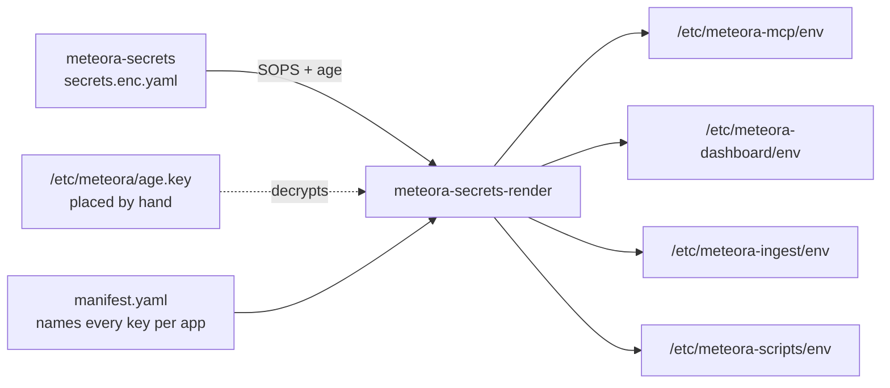

# Secrets

## What it is

`meteora-secrets` - a SOPS-encrypted store that **is** the environment for every
service on the box. A per-repo `.env` is a derived artifact, not a parallel
system.

The repo itself is outside this vault's `sources`, so treat the mechanism below
as the durable part and the specific keys as something to read off the manifest.

## Diagram

## How it works

### One store, rendered per app

`meteora-secrets-render` materializes the encrypted store into `/etc/<app>/env`,
mode `0640` owned by root with the app's group. Deploy with
`sudo meteora-secrets-render --pull --restart`.

**Anything edited directly on the box survives only until the next render.**
That is the property that makes the store authoritative rather than advisory.

### The manifest names the whole env file, not just the secrets

`manifest.yaml` lists every variable an app gets, including non-secret ones. So
**a key the manifest does not name is simply absent**, and the app falls back to
that setting's default. Adding a value to the store without adding it to the
manifest changes nothing.

The renderer refuses to run when the manifest names a key the store lacks, and
it checks **every app** - so a half-landed change does not just break the app
you were working on, it breaks all four. A manifest entry and its value belong
in one branch.

### Ansible installs the renderer and never the values

This is [[meteora-infra]]'s ADR-0005 and it is why the "Neither" column exists
in that repo's layer diagram. Three things sit outside both Terraform and
Ansible: the SOPS values, `/etc/meteora/age.key` placed by hand, and
`/srv/<app>` contents owned by each repo's own deploy.

So a from-scratch rebuild produces a correct machine with no secrets and no
application code on it. That is the intended shape, not a gap - it also means
the whole playbook can be run by anyone and read in a PR without any of it being
sensitive.

### Without the age key, nothing decrypts

`/etc/meteora/age.key` is placed by hand and is not in any repo, any Terraform
state, or any playbook. It is the single thing that turns the encrypted store
into an environment. In a disaster-recovery scenario it is the item to find
first.

## Why it's this way

One store rather than four `.env` files is what makes a shared credential
genuinely shared. `UPLOAD_TOKEN` is presented by meteora-mcp and checked by
meteora-dashboard - one key, two consumers, **one place to rotate**. Copying it
under a second name would mean a rotation that half-lands.

Manifest-refuses-on-missing-key is a deliberate choice to fail loudly and
broadly. A renderer that skipped unknown keys would let an app silently run on
defaults, which is the failure that surfaces weeks later as behaviour nobody can
explain.

Keeping the age key out of every automated system is the one place the estate
accepts a manual step on purpose. Anything that could place it automatically
would also be able to read everything.

## Traps

- **A blank JSON-typed variable takes meteora-mcp down, and rollback does not
  save it.** `EMAIL_ROSTER`, `BRIEF_TEST_RECIPIENTS`,
  `COGNITO_MACHINE_CLIENT_IDS`, `INTERNAL_DOMAINS` and
  `OAUTH_EXPECTED_REDIRECT_URIS` are parsed as JSON by pydantic-settings before
  pydantic sees them. `FOO=` and `FOO=a@b.com` are both a settings error raised
  while `config.py` is importing - before there is a socket or a log line.
  Because the env file is not in the repo, the deploy's rollback restarts the
  **old commit against the same bad file** and the box stays down until the
  value is corrected. **To leave one at its default, delete the line.**
- **Editing `/etc/<app>/env` on the box is temporary.** The next render
  overwrites it.
- **A manifest change without its value breaks all four apps**, not one.
- **`UPLOAD_TOKEN` and `UNIVERSE_UPLOAD_TOKEN` are different secrets** held in
  different places on purpose. See [[Auth]].
- **A dev checkout still needs a local file.** Derive it from the same store
  filtered to that app's manifest keys, rather than hand-maintaining one - a
  drifted key is invisible until something fails without naming it.
- **Never commit a plaintext env file**, and never add one to a repo tree.

## Where to start reading

| # | File | Why this rung |
| --- | ---------------------------------------------- | ---------------------------------------------- |
| 1 | `meteora-secrets/README.md` | The store, the renderer, and the rotation procedure. |
| 2 | `meteora-secrets/manifest.yaml` | What each app actually receives. |
| 3 | `meteora-infra/docs/adr/0005-ansible-never-writes-secrets.md` | Why this sits outside both infra tools. |
| 4 | `meteora-mcp/config.py` | What happens to a bad value, and why it happens at import. |

> **Read 1-3 to defend it. Add 4 before you change it.**

## Related

- [[Auth]] - the systems these values configure
- [[Deploys]] - the one thing a rollback cannot restore
- [[meteora-infra]] - installs the renderer, never the values
- [[The Box]]
- [[Meteora]]
- [[Glossary]] - meteora-secrets
