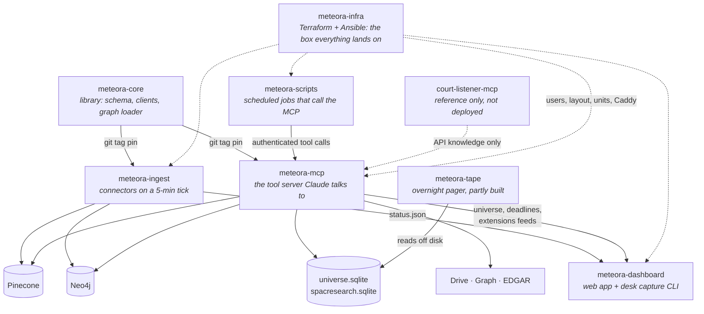
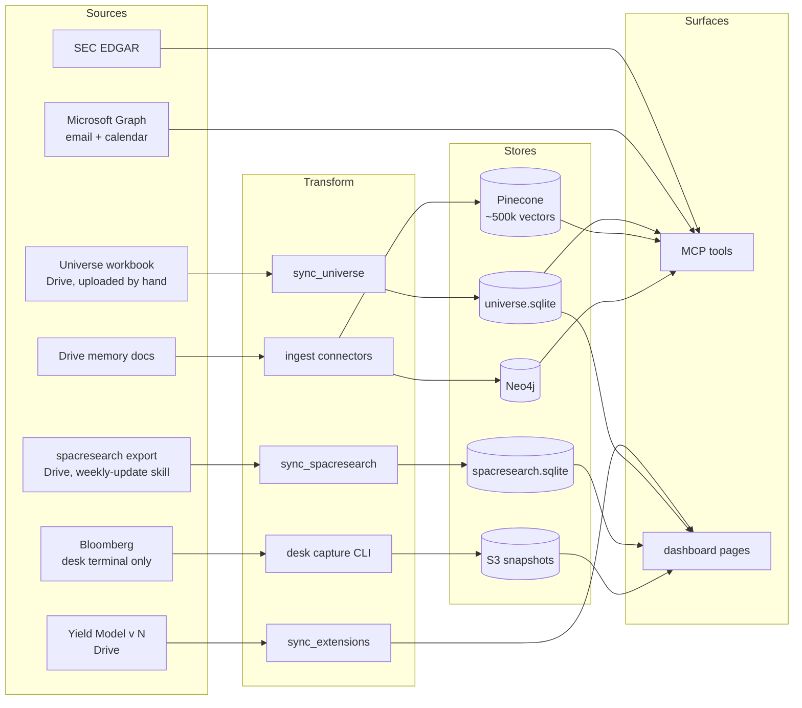
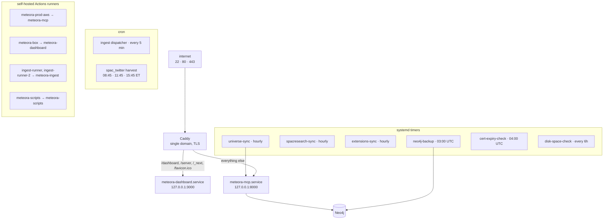

# Meteora

The estate: eight repos, one production box, and the data that moves between
them.

Three diagrams, deliberately coarse. They name layers, not variables, because a
diagram that names variables is wrong within a month. Depth lives one click
down, which is what makes coarseness affordable.

## 1. The estate

meteora-core reaches its consumers by **git tag pin**, not by import. Merging
there ships nothing.

## 2. Data lineage

Every node above has a note. Sources: [[Universe Workbook]],
[[SPACResearch Export]], [[SEC EDGAR]], [[Drive Memory Docs]], [[Graph Email]],
[[Bloomberg]]. Stores: [[universe.sqlite]], [[spacresearch.sqlite]],
[[Pinecone]], [[Neo4j]], [[S3]].

The two SQLite mirrors are **not the same thing** and are not interchangeable.
See [[Glossary#universe]] before writing a query against either.

## 3. The box

One `t3.xlarge` in `us-east-2`, account `309128776621`, behind an Elastic IP.

Every timer carries `OnFailure=alert-on-failure@%n.service`, so a broken sync
emails rather than failing quietly. The three Drive syncs stagger their
`RandomizedDelaySec` (300, 600, 900) so they do not contend for the same
credential on the hour.

## Systems

- [[meteora-mcp]] - the MCP server Claude connects to. EDGAR, research, graph,
  memory docs, email, SPAC sheets, behind Cognito.
- [[meteora-core]] - the shared library. Metadata schema, client factories, the
  Neo4j write path. Consumers pin it by git tag.
- [[meteora-ingest]] - five connectors on a five-minute tick, writing into
  Pinecone and Neo4j.
- [[meteora-dashboard]] - the Next.js app behind Google SSO, plus the desk
  capture CLI that feeds it.
- [[meteora-scripts]] - scheduled jobs that consume the MCP server. Today, the
  SPAC Twitter Brief harvest.
- [[meteora-infra]] - Terraform owns AWS, Ansible owns the box. One seam, one
  direction.
- [[meteora-tape]] - the overnight pager. Watchlist and rule engine built,
  collector and caller not yet.
- [[court-listener-mcp]] - a third-party reference implementation. The live
  CourtListener tools are inside meteora-mcp.

## Data

Where every number comes from. One note per source, one per store.

### Sources

- [[Universe Workbook]] - the vendor spreadsheet uploaded to Drive by hand.
  Mirrored to [[universe.sqlite]].
- [[SPACResearch Export]] - the spacresearch.com export. Mirrored to
  [[spacresearch.sqlite]]. Carries `warrant_strike`, `counsel` and the spec
  strings the workbook does not.
- [[SEC EDGAR]] - queried live, never mirrored. The reason its tool surface
  looks unlike every other source here.
- [[Drive Memory Docs]] - the knowledge base. Chunked into [[Pinecone]], loaded
  into [[Neo4j]], projected into [[S3]].
- [[Graph Email]] - Microsoft Graph. A source as much as a sink.
- [[Bloomberg]] - reachable only from a desk terminal. Almost none of its MCP
  surface is live.

### Stores

- [[universe.sqlite]] - built from the workbook, rebuilt whole on every change.
  Behind `universe-query` and `universe-schema`.
- [[spacresearch.sqlite]] - a byte-for-byte copy of the export. Behind
  `/dashboard/universe`.
- [[Pinecone]] - one index, ~500k vectors, two writer repos, one contract.
- [[Neo4j]] - the entity graph, joined to Pinecone on `file_id`.
- [[S3]] - two buckets: Neo4j dumps and dashboard snapshots.

## Surfaces

How it is served.

- [[MCP Tools]] - the per-caller catalog, the tiers, and the three ways a tool
  can silently not exist.
- [[Dashboard Pages]] - eleven pages, what feeds each, and the access table that
  defaults to admin.
- [[Skills API]] - `/skills-api/*`, the Drive-backed skill store. Not an MCP
  surface.

## Infra

The box, deploys, auth.

- [[The Box]] - one t3.xlarge, four tenants, Caddy, the timers and the runners.
- [[Deploys]] - six repos, six different shapes. Read before merging anywhere.
- [[Auth]] - five separate auth systems, and the two upload tokens people mix up.
- [[Secrets]] - `meteora-secrets` is the environment. A `.env` is derived.

## Why

- [[Raw Notes 2026-08]] - unprocessed asks, mined into this folder over time

## Reference

- [[Glossary]] - the words that mean two things

## Keeping this true

Structural integrity is a script. From `~/Repos/meteora`:

    python3 docs/tools/verify_vault.py

It checks frontmatter, that every `sources` path still exists, and that every
wikilink resolves. It says nothing about whether the prose is still right.

Drift needs judgment. For each note, `git log` its `sources` paths since its
`verified` date and decide whether anything invalidates the walkthrough. Bump
`verified` when you have looked, not when you have edited.
