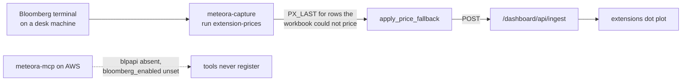

# Bloomberg

## What it is

Market data from a Bloomberg terminal, reachable only from a machine that has
one. It is the one source in this folder that **cannot** move to the box, and
almost none of its MCP surface is live.

## Read this before looking for Bloomberg data

Three separate things are true at once, and confusing them wastes an afternoon:

| Surface | State |
| ---------------------------------- | --------------------------------------------------------------------- |
| `emsx-blotter` (MCP tool) | **Archived.** In `registry.ARCHIVED_TOOLS`, so it registers nowhere - including on-prem where a terminal is present. |
| `get-intraday-bars` (MCP tool) | **Dormant on AWS.** Registers only where `bloomberg_enabled` is set and `blpapi` imports. Neither holds on the box. |
| `rlst-add` (MCP tool) | **Archived**, because its related-securities enrichment is the only RLST path that reaches Bloomberg. |
| `meteora-capture run extension-prices` | **The live path.** A desk-side CLI pass, not an MCP tool. |

So on the production box, **no MCP tool returns Bloomberg data**. What does work
is a scheduled pass on a desk machine.

## Diagram

## How it works

### The gate

`services/bloomberg/session.py` is the single place that owns the connection.
`available()` is true only when `bloomberg_enabled` is set **and** `blpapi`
actually imports, and it is the one gate the tool layer checks before
registering anything.

`blpapi` is imported lazily, so importing the module never fails on a host with
no Bloomberg native libraries. On a stock AWS box both conditions fail, the
tools stay dormant, and nothing in this subsystem is ever executed.

Archiving is a second, independent mechanism. `emsx-blotter` and `rlst-add` are
in `registry.ARCHIVED_TOOLS`, so they register nowhere at all - even on a
machine with a terminal. The handlers, schemas, services and tests stay live.
Un-archiving is deleting a line.

### The live path: the extensions price fallback

Roughly 15 rows of the Yield Model workbook carry a broken price cell -
`#VALUE!` from a formula that failed upstream - and every yield on those rows is
an Excel formula over that price, so all three horizons die with it. Recovering
them needs a live `PX_LAST` lookup, which only a terminal can do.

So the work is split. `extensions-sync` runs **on the box**, reads the workbook,
and publishes every row it can. `meteora-capture run extension-prices` runs **on
a Bloomberg desk**, prices the rows the workbook could not, and re-posts.

The desk half reads no Excel and needs no Drive mount. That is the point of the
split: after cutover a desk machine needs a Bloomberg terminal and nothing else.

The derivation stays in one place. The desk pass runs `apply_price_fallback`
from the capture app unchanged, rather than a second copy of
`(trust / price - 1) * 360 / days` on the box. A second implementation is a
second thing to get wrong, and `YEAR_DAYS = 360` is verified to zero error
against 953 real leg-observations - 365 would introduce about 7.5bp on every
derived row while still looking plausible.

The two jobs need no coordination. The box half publishes only when the workbook
checksum moves, so a desk patch survives until the workbook itself changes, and
when it does the desk re-patches on its next run. Self-healing, with no locking
and no ordering requirement - though the desk pass should be scheduled after the
box one, since the desk pass is idempotent and an early run costs nothing but a
log line.

## Why it's this way

Everything that can leave a desk machine has been leaving. Desk machines are
laptops that sleep, and one of them silently stopped publishing the universe on
2026-08-19 without anyone noticing for a week. What is left on a desk is the
part that genuinely cannot run anywhere else.

Gating on `available()` rather than on a boolean flag means the tools are absent
for a checkable reason. There is no configuration that makes them appear on a
host without the native libraries, which is the correct behaviour - a tool that
registers and then fails on every call is worse than one that is not there.

Archiving on top of that exists for the case where the dependency _is_ present
but the access decision has not been made. It gates exposure, not code, so the
tests keep running and the code does not rot while the question is open.

## Traps

- **Do not enable Bloomberg to make something pass.** `bloomberg_enabled` on a
  host without a terminal gets you an import failure instead of a clean absence.
- **A missing tool is usually correct here.** If `get-intraday-bars` is not in
  the tool list, that is the gate working. Check `ARCHIVED_TOOLS` and
  `available()` before debugging the registry.
- **`rlst-add` being archived means no MCP tool creates a restriction.** Rows go
  into the workbook by hand. See [[Glossary]].
- **The `formula check exceeded the tolerance` warning is not about the box
  half.** The published rows are the workbook's own numbers and stay correct
  regardless. What the check bounds is whether the desk pass can safely _derive_
  the missing ones - and the desk pass runs its own check and will refuse that
  vintage.

## Where to start reading

| # | File | Why this rung |
| --- | -------------------------------------- | --------------------------------------------------------- |
| 1 | `services/bloomberg/session.py` | The one gate, and why importing it is always safe. |
| 2 | `tools/bloomberg/handlers.py` | The module docstring states the whole gating story in ten lines. |
| 3 | `docs/operations/extensionsSync.md` | The split, and the live desk-side path. |
| 4 | `meteora-dashboard/capture/` | Where `apply_price_fallback` and the `extension-prices` command live. |

> **Read 1-3 to defend it. Add 4 before you change it.**

## Related

- [[meteora-mcp]] - the dormant tool surface
- [[meteora-dashboard]] - the capture CLI that is the live path
- [[Glossary]] - yield model, RLST, extension
