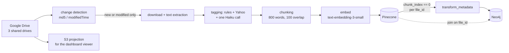

# Drive Memory Docs

## What it is

The firm's knowledge base: Google Drive documents that are chunked, tagged,
embedded into Pinecone, and loaded into the Neo4j entity graph. Semantic search
and entity traversal both answer out of the same corpus, joined on the Drive
file id.

Three shared drives feed it - **Private Companies**, **Interns**, and **External
Marketing**.

## Diagram

## How it works

### The pipeline

Scan the drives recursively, detect changes by md5 checksum and `modifiedTime`
so only new or modified files continue, download and extract text with a
three-tier PDF fallback, tag, chunk at 800 words with 100 words of overlap,
embed in batches of ten, and upsert to Pinecone in batches of fifty with the
full tag set carried on **every chunk**. A deletion pass removes vectors for
files that left Drive.

The design principle is low per-file cost. There are **no Sonnet calls anywhere
in the pipeline**: tagging is deterministic rules plus a free Yahoo Finance
lookup plus exactly one Claude Haiku call per file, with Haiku Vision OCR only
as a last-resort PDF extractor.

Vector ids are `md5(f"{file_id}_{chunk_index}")`, so re-syncing a file overwrites
the same ids rather than duplicating it.

### The two-store join, which is the mechanism to understand

Pinecone answers similarity. Neo4j answers structure - "what companies does
Goldman Sachs cover", "which analysts cover both ACME and XYZ", "every sellside
note about IONQ after 2025-01-01". Neither can answer the other's questions.

They are joined on **`file_id`**, the Google Drive file id. Pinecone carries it
on every vector. Neo4j `Document` nodes carry it as their unique property.

That single shared key is what makes a tool chain possible: resolve "which files
are about ticker X" by graph traversal, then pass those `file_id` values into
Pinecone as a metadata filter for a semantic search scoped to exactly those
documents. Graph traversal narrows, vector search ranks, and the two agree about
what a document _is_ because they are naming it the same way.

The graph loader is deliberately **LLM-free**. It lists vector ids from Pinecone,
fetches metadata in batches, selects the `chunk_index == 0` vector as each file's
canonical metadata, and writes nodes and edges in `MERGE` batches of 500 so
re-runs are idempotent. Institution names are canonicalized before writing, so
"Goldman Sachs Equity Research" and "Goldman Sachs" are one node.

### The join key had to be normalized

There are two producers and they disagreed. The bulk-sync pipeline writes
`file_id` directly. The MCP ingestion path historically wrote only
`gdrive_file_id`. A normalization step now mirrors `gdrive_file_id` to `file_id`
at write time, and a backfill script exists for older vectors - though an audit
confirmed 100% coverage on the production corpus, so it is a no-op against
current data.

This is the same class of problem `expand_filter` solves on the read side. See
[[Pinecone]].

### The S3 projection

Separately from the vector pipeline, the MCP server projects memory docs into
the dashboard's snapshot bucket so they can be read in the browser. It is off by
default and gated on one setting.

Push-on-write covers every mutation the server itself performs, but cannot see
two kinds of drift: a doc edited directly in the Google Docs UI, bypassing the
server entirely, and a publish queued but never finished because the process
restarted mid-flight. A reconcile loop started from `server.py`'s lifespan covers
both, reprojecting only docs whose Drive `modifiedTime` moved since the last
look - so a typical tick touches zero or one doc, and a tick that changes nothing
logs nothing.

It runs in-process rather than from cron or a systemd timer specifically so it
stays versioned with the code it depends on.

## Why it's this way

Chunking with overlap and carrying the full tag set on every chunk means a
retrieved chunk is self-describing. Nothing downstream has to join back to a
document record to know what it is looking at.

Deriving vector ids from `(file_id, chunk_index)` makes re-sync an overwrite
rather than a deduplication problem. It is also why chunk boundaries cannot move
casually - a change to how text splits shifts every id and orphans the existing
vectors.

Two stores rather than one because the questions are genuinely different. The
alternative - forcing structural queries through vector similarity - returns
plausible answers that are wrong in ways nobody can see.

## Traps

- **`delete-memory-doc` must remove the S3 projection too**, or a deleted doc
  stays readable on the dashboard forever. The IAM permission that makes that
  possible is easy to miss when scoping the role down.
- **With the reconcile loop disabled or not running, drift persists** until
  someone runs the reconcile by hand. A doc edited in the Google Docs UI is
  invisible to the write path.
- **`index.json` holds every doc's index rows in one object** - roughly 475 docs
  and 4MB - and the put is unconditional with no ETag check. If the server
  publishes while a backfill also writes it, the last write wins across _every_
  doc's rows, not just the ones either writer touched. The backfill therefore
  writes the index exactly once, at the end, and only with an explicit
  `--server-is-not-publishing` flag. That flag is a procedural guard, not a
  technical one - confirming there is no concurrent publisher is the operator's
  job.
- **Changing chunk boundaries silently rewrites the index.** See [[meteora-core]].
- **The tagging pipeline costs one Haiku call per file.** Adding a Sonnet call
  would change the cost model of the whole corpus, not one file.

## Where to start reading

| # | File | Why this rung |
| --- | ------------------------------------- | -------------------------------------------------------- |
| 1 | `docs/architecture/workflow.md` | The whole pipeline plus the V2 tagging system. Start here and read section 5 twice. |
| 2 | `docs/operations/memoryProjection.md` | The S3 projection, the reconcile loop, and the `index.json` hazard. |
| 3 | `services/memory/drive.py` | Drive auth, listing, caching - the I/O everything else sits on. |
| 4 | `services/memory/projection.py` and `publish.py` | What a projection is and when it is written. |
| 5 | `services/memory/reconcile.py` | The drift the write path cannot see, and the circuit breaker. |
| 6 | `meteora-ingest/src/meteora_ingest/sources/drive/` | The connector-side Drive layer: changes feed, classification, extraction. |

> **Read 1-3 to defend it. Add 4-6 before you change it.**

## Related

- [[Pinecone]] - where the vectors land
- [[Neo4j]] - the graph half of the join
- [[S3]] - where the dashboard projection lives
- [[meteora-ingest]] - the connectors that keep it current
- [[Glossary]] - memory doc
