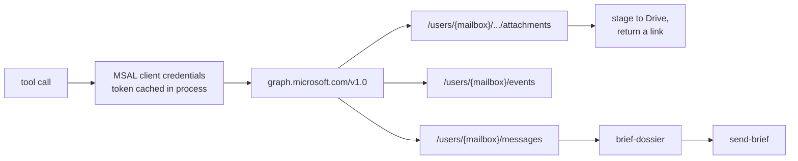

# Graph Email

## What it is

Microsoft Graph, giving the MCP server read and write access to firm mailboxes
and calendars. It is a **source** as much as a sink - inbound mail is research
input, not just something to reply to.

Nine tools: `list-emails`, `read-email`, `send-email`, `forward-email`,
`get-email-attachment`, plus `create-calendar-invite`, `list-calendar-events`,
`update-calendar-event` and `cancel-calendar-event`.

## Diagram

## How it works

### Auth is app-level, not per-user

The server authenticates to Graph with the **client credentials flow** - an
Azure app registration with a tenant id, client id and secret, requesting the
`.default` scope. There is no per-user consent and no delegated token. The
server holds application permissions and addresses mailboxes explicitly as
`/users/{mailbox}/...`.

The consequence worth internalizing: **the mailbox is a parameter, not an
identity**. Nothing about the caller's own Cognito login constrains which
mailbox a Graph call reaches. Access control for that lives in the MCP registry's
tier and compartment checks, not in the Graph credential.

Tokens last about an hour and are cached in process. A keepalive loop refreshes
with a larger margin than a tool call would, so the hourly refresh happens in the
background rather than landing on whichever user's email call hit the stale
cache. When performance mode is on, the same loop keeps the pooled TLS
connection hot, so neither the MSAL refresh nor a TCP and TLS handshake lands on
a user request.

MSAL uses `requests` internally with **no default timeout**, so a stale
connection to the Azure AD token endpoint would hang indefinitely. The transport
wraps it in a session that forces a 15 second connect-and-read timeout on every
call.

### Which mailbox

`EMAIL_ROSTER` maps a short key - `walter`, and others - to a full address, and
that mapping is what every send and read resolves through. A sender key with no
roster entry fails with the available keys listed rather than silently sending
from a default.

The roster is also how the server knows which addresses are **ours**, which
matters for classifying a thread's participants.

The calendar has its own key, `CALENDAR_MAILBOX_KEY`, resolved through the same
roster - so calendar operations fail loudly if the roster has no entry for it.

### Attachments

`get-email-attachment` does not push bytes through the model context. It stages
the file to Drive and returns a link. The destination is resolved by name at
runtime - the interns shared drive, under an auto-created "Outlook Attachments"
folder - and each staged file is shared read-only with the requesting user's
address.

This is the shape to copy for anything else that produces a large artifact: the
model gets a reference, the human gets the file.

### The brief flow

`brief-dossier` assembles the inputs for the SPAC Twitter Brief - mail among
them - and `send-brief` sends the result. The harvest half runs on the box from
[[meteora-scripts]] and writes a dossier to disk; the tools are the interactive
path over the same material.

## Why it's this way

Client credentials rather than delegated auth because the server acts on its
own behalf on a schedule, with no user present to consent. A brief that sends at
08:45 cannot depend on somebody having a live session.

The roster exists so that mailbox addresses are configuration in one place
rather than literals scattered through handlers. It also makes the blast radius
of a change visible: adding a mailbox is a config edit, and every tool inherits
it.

Staging attachments to Drive rather than returning bytes is a cost and context
decision that is also a safety one. A 20MB PDF in a tool result is a bad
outcome in every dimension.

## Traps

- **`EMAIL_ROSTER` is JSON-typed, and a blank value takes the box down.**
  pydantic-settings parses it as JSON before pydantic sees it, so `EMAIL_ROSTER=`
  raises while `config.py` is importing - before there is a socket or a log line.
  The deploy rollback restarts the old commit against the same bad env file, so
  the box stays down until the value is corrected. To leave it at its default,
  **delete the line**.
- **The Graph credential is not scoped to one mailbox.** Application permissions
  reach the tenant. The MCP registry's tier and compartment checks are what
  actually restrict who can ask.
- **A token failure and a permission failure look different.** `Graph auth
  failed` is the app registration or its secret. A 403 on a specific mailbox is
  the application permission grant.
- **Never log payloads.** Message bodies and addresses are exactly the kind of
  content that must not reach a log line. Log identifiers and timings.

## Where to start reading

| # | File | Why this rung |
| --- | ------------------------------------- | -------------------------------------------------------- |
| 1 | `tools/email/handlers.py` | The nine tools and their inputs. The surface in one file. |
| 2 | `services/email/graph/transport.py` | Auth, the token cache, the keepalive, the timeout wrapper. |
| 3 | `services/email/graph/addressing.py` | The roster, and how a sender key becomes an address. |
| 4 | `services/email/graph/messages.py` | Listing, reading, folders, and what "ours" means on a thread. |
| 5 | `services/email/graph/attachments.py` | The stage-to-Drive path. |
| 6 | `tools/brief/handlers.py` | `brief-dossier` and `send-brief` - the consumer this source feeds. |

> **Read 1-3 to defend it. Add 4-6 before you change it.**

## Related

Like [[SEC EDGAR]], this source is queried live and has no `Stores/` note -
nothing about a mailbox is mirrored onto the box.

- [[meteora-mcp]] - where the tools live
- [[meteora-scripts]] - the scheduled harvest half of the brief
- [[Meteora]]
- [[Glossary]]
