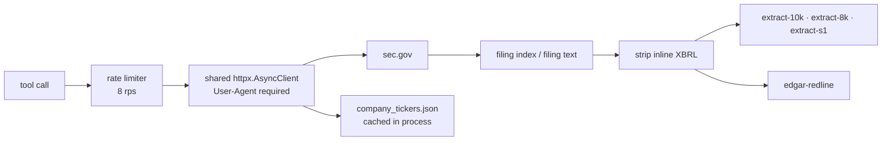

# SEC EDGAR

## What it is

The SEC's filing database, queried **live** on every call. Eight MCP tools cover
finding filings, pulling their text, extracting structured fields from three
form types, searching ownership, and diffing an amendment against its
predecessor.

## The contrast worth starting with

Every other source in this folder is **mirrored**. The Universe workbook and the
spacresearch export are copied onto the box on a timer and queried from local
SQLite. Memory docs are chunked into Pinecone.

EDGAR is not. There is no local copy of anything, and every tool call reaches
sec.gov.

That single difference explains why the tool surface looks nothing like the
others. There is no sync script, no promote, no `_meta.extracted_at`, no
staleness question - and instead there is a rate limiter, a retry policy, and an
in-process ticker cache, because the cost model moved from disk to network.

## Diagram

## How it works

### The client, and the two rules SEC enforces

`services/sec_edgar/client.py` holds one shared `httpx.AsyncClient` reused
across every EDGAR call, with two things SEC requires and one it does not.

**A User-Agent is mandatory.** SEC's fair-access policy requires a declared
identity, and requests without one are refused. It comes from
`SEC_EDGAR_USER_AGENT` in settings, so it is configuration rather than a
literal.

**The fair-access limit is 10 requests per second.** The limiter is set to 8, a
deliberate margin. It paces the *start* of every request, holding its lock only
long enough to reserve the next slot rather than for the whole HTTP call - so
requests still overlap in flight and it is safe to fan out with
`asyncio.gather` while staying under the ceiling.

Retries are three attempts with a backoff factor of 2.

### The ticker-to-CIK map

Most calls arrive with a ticker and EDGAR works in CIKs. The full
`company_tickers.json` map is roughly 1MB, so it is downloaded once and held in
a process-level dict.

The subtlety is a flag that records the map has been fully loaded. Without it an
**unknown** ticker - a fund, a typo, or a CIK passed where a ticker was expected
- would miss the cache and re-download the whole map on every call before
falling through to the full-text search lookup. The flag turns a repeated 1MB
download into a single dict miss.

### Filing text, and why XBRL is the problem

`filing_text.py` strips inline XBRL before anything reads the document. This is
not tidiness: inline XBRL wraps every number and text block in `<ix:*>` tags and
dumps thousands of context and unit definition blocks, so **a raw 10-K can be
4M+ characters of which 90% is boilerplate**. Passing that to a model is
expensive and worse than useless.

### The extractors

`extract-10k`, `extract-8k` and `extract-s1` pull structured fields out of a
filing rather than returning prose.

The 8-K extractor is the instructive one. It finds `Item X.XX` sections by two
strategies: scanning heading elements first, and falling back to a raw HTML text
scan when that finds nothing, which is what table-formatted items need. Each
result carries a **confidence** derived from which strategy found it - `high`
for a formatted heading, `medium` when the raw scan found it and EDGAR's own
metadata confirmed the item exists. The extractor reports how it knows, rather
than presenting both cases identically.

The S-1 extractor carries an Anthropic client as a **lazy fallback**, created
only when the deterministic path fails. So the common case costs no model call.

### The redline

`edgar-redline` diffs a filing against its predecessor - the S-1/A against the
S-1 - and returns only what changed. It is a real diff engine rather than a text
compare: it extracts tables separately, recognises and drops editorial-only
changes, parses numbers so a figure change reads as a figure change, and detects
moved blocks within a window so relocated text is not reported as a delete plus
an insert.

## Why it's this way

Live rather than mirrored because EDGAR is enormous, public, and continuously
updated. A mirror would be a large ongoing sync for data that is one HTTP call
away and never needs to be joined against anything locally.

The cost of that choice is that latency and rate limits are now the design
constraints, which is why the limiter, the retry policy and the ticker cache
exist. Every one of them is there to make "just call it" hold under fan-out.

Stripping XBRL at the boundary rather than in each extractor means one
implementation of a decision that is easy to get subtly wrong, and every
downstream consumer sees readable text.

## Traps

- **The rate limit is real and shared across the whole process.** Fanning out
  with `asyncio.gather` is safe by design, but the ceiling is 8 rps for
  everybody, so a wide fan-out slows every concurrent caller rather than failing.
- **A missing or generic User-Agent gets refused by SEC**, not rate-limited.
  If EDGAR calls fail wholesale on a new environment, check that setting first.
- **The ticker cache is per process and not persisted.** A restart re-downloads
  the map on the first lookup.
- **An unknown ticker is a slow path, not an error.** It falls through to a
  full-text search lookup after missing the map.
- **Extractor confidence is not decoration.** A `medium` 8-K item was found by
  the raw-HTML fallback. Treat it as located-but-less-certain about boundaries.
- **`extract-s1` can reach Anthropic.** The fallback is lazy, so it usually does
  not - but it is a model call in the path, with the cost and latency that
  implies.

## Where to start reading

| # | File | Why this rung |
| --- | ------------------------------------- | ---------------------------------------------------------- |
| 1 | `tools/sec_edgar/handlers.py` | The eight tools and what each one takes. The surface, in one file. |
| 2 | `services/sec_edgar/client.py` | The rate limiter, the retries, the User-Agent, the ticker map. |
| 3 | `services/sec_edgar/filing_text.py` | XBRL stripping, and why a 10-K is 4M characters before it. |
| 4 | `services/sec_edgar/form_8k_extractor.py` | The two-strategy section finder and the confidence it reports. |
| 5 | `services/sec_edgar/s1_extractor.py` | The deterministic path and its lazy model fallback. |
| 6 | `services/sec_edgar/redline.py` | Table extraction, editorial suppression, number parsing, move detection. |

> **Read 1-3 to defend it. Add 4-6 before you change it.**

## Related

**This source has no `Stores/` note, and that is the point.** Nothing about
EDGAR is mirrored, so there is nothing on the box to describe. Compare
[[Universe Workbook]] into [[universe.sqlite]].

- [[meteora-mcp]] - where the tools live
- [[Meteora]]
- [[Glossary]] - CIT, trust
