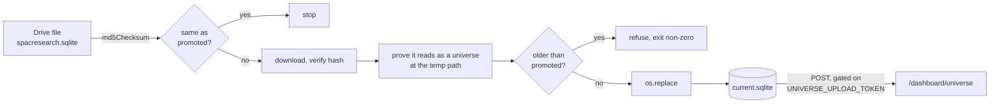

# SPACResearch Export

## What it is

A native export from spacresearch.com, kept on Google Drive as a `.sqlite` file,
mirrored onto the box and published to the dashboard's `/dashboard/universe`
page.

Drive id `1AzNfr7NaF_JdfneD4A-RrV_aUtRJHRtb`. Relational rather than flat -
`spacs`, `sponsors` and `_meta`. Refreshed when a human runs the weekly-update
skill.

**Not the same thing as the Universe workbook.** Both get called "the universe".
See below, [[Universe Workbook]], and [[Glossary]].

## Diagram

## The naming collision

This is the single most expensive confusion in the estate, so it is stated on
both notes.

| | `spacresearch.sqlite` (this note) | `Universe<M>.<D>.<YYYY>.xlsx` |
| ------------ | ---------------------------------------- | ------------------------------------------------ |
| Source | spacresearch.com native exports | a vendor workbook uploaded by hand |
| Shape | relational: `spacs`, `sponsors`, `_meta` | one sheet, ~52 columns, ~1885 rows |
| Refreshed by | a human running the weekly-update skill | a human uploading a new dated file |
| Feeds | `/dashboard/universe` | `universe-query`, `universe-schema`, the deadlines feed |
| Job | `scripts/sync_spacresearch.py` | `scripts/sync_universe.py` |

They carry overlapping but **not interchangeable** fields. Only this one has
`warrant_strike`, `counsel`, and the free-text `unit_specs` / `warrant_specs` /
`right_specs` the structural screens are built on. The workbook cannot
substitute for it, which is why both syncs exist.

The two are separate systemd units on purpose: a broken SPAC Research export
must not stop the desk's deadlines map from publishing.

## How it works

`scripts/sync_spacresearch.py` does the same seven-step shape as the workbook
sync - checksum gate, download, verify, refuse to go backwards, atomic promote -
with one extra step that is worth calling out.

**Step 4 proves the downloaded file reads as a universe at the temp path,
before the promote.** A blob can download cleanly, hash correctly, and still be
truncated or hold no live SPACs. Either would publish an empty universe -
making every saved basket unbuildable - while looking like a successful run. The
integrity check catches a broken transfer; this catches a valid file that is
useless.

The unchanged check hashes the promoted file directly rather than keeping a
recorded checksum beside it. The promoted bytes are the downloaded bytes
verbatim, so Drive's checksum is directly comparable and there is no second
piece of state to fall out of step.

### Why it moved off the desk

The `universe` module of the desk capture app used to read this file off a
mounted Shared Drive and POST the result. Desk machines are laptops that sleep,
and the one doing it stopped on 2026-08-19 without anyone noticing until the
page's `extracted_at` was queried a week later.

The reader moved verbatim - same SQL, same spec-string parsers, same ticker
candidate rules - and was verified against the live 2026-07-15 export before
cutover: 370 rows in, 370 rows out, and **zero field differences** across all 23
fields of all 370 rows.

### The ingest gate

`/api/ingest` does a **whole-record replace** on a `universe` post. Every desk
machine holds `UPLOAD_TOKEN`, so before this gate a desk running a stale config
could silently replace the server-published universe with a six-week-old one.

So the `universe` branch is gated on a separate `UNIVERSE_UPLOAD_TOKEN`, held
only in the dashboard's env on the box and never in a desk config. Gated rather
than refused outright, because this job still posts through that branch.

A rejected desk pull surfaces readably rather than as a silent no-op - the
capture app's error carries the response body into the run summary.

## Why it's this way

Proving the file is usable before promoting is the difference between a failure
that pages someone and a failure that quietly empties a page. Everything in this
sync is arranged so the worst outcome is "the data is a week old", never "the
data is gone".

Two tokens instead of one is a small amount of ceremony buying a real property:
the set of machines that can overwrite the whole universe is exactly one.

## Traps

- **Six weeks stale is normal.** This export refreshes only when a human runs
  the weekly-update skill. As of 2026-08-26 the file on Drive was dated
  2026-07-15. The hourly sync does not make the data fresh - it makes publishing
  automatic. A green timer says the box is carrying whatever a human last
  exported, nothing more.
- **The page's `extracted_at` is where the real age is visible**, and it is
  deliberately the only place age is asserted. There is no staleness alert,
  because a threshold on an irregular human process would be guessed.
- **This job presents `UNIVERSE_UPLOAD_TOKEN`, not `UPLOAD_TOKEN`.** Presenting
  the desk one is refused with a 409.
- **`universe join fanned out` in the journal is a shape bug, not a data
  issue** - a ticker appeared twice after the sponsor aggregation, and a saved
  basket would double-count it.
- **`unparsed` counts spec strings the parsers did not recognise.** It was `{}`
  on the 2026-07-15 export. A non-zero count is worth a look, not an action:
  those rows still publish, with the unreadable field as UNKNOWN rather than
  silently as "does not exist".

## Where to start reading

| # | File | Why this rung |
| --- | ------------------------------------ | ---------------------------------------------------------- |
| 1 | `docs/operations/spacresearchSync.md` | The complete picture, including the cutover order and every failure mode. |
| 2 | `scripts/sync_spacresearch.py` | The entry point. |
| 3 | `services/spacresearch/` | The reader: the SQL, the spec-string parsers, the ticker candidate rules. |
| 4 | the dashboard's `/api/ingest` handler | Why the whole-record replace forces a second token. |

> **Read 1-2 to defend it. Add 3-4 before you change it.**

## Related

- [[spacresearch.sqlite]] - what this becomes on the box
- [[Universe Workbook]] - the other thing called "the universe"
- [[meteora-mcp]] - owns the sync
- [[meteora-dashboard]] - serves the page this feeds
- [[Meteora]]
- [[Glossary]]
