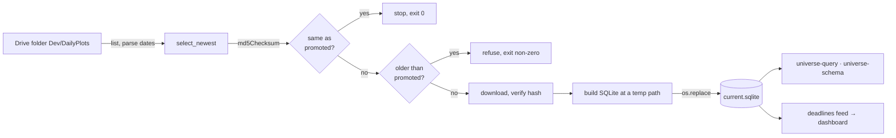

# Universe Workbook

## What it is

A vendor spreadsheet of the SPAC universe, uploaded to Google Drive by hand
every few weeks, mirrored into a queryable SQLite database on the box so it can
be asked questions in SQL.

`Universe<M>.<D>.<YYYY>.xlsx`, in the shared drive's `Dev/DailyPlots` folder,
id `1j3duNDn4uWJvZYpZVki346q87cIFCV_u`. One sheet, `Sheet1`, roughly 50 columns
and 1880 rows.

**Not the same thing as `spacresearch.sqlite`.** Both get called "the universe"
and they are not interchangeable. See [[Glossary]] and
[[SPACResearch Export]].

## Diagram



## How it works

`scripts/sync_universe.py` runs on a timer and does seven things:

1. Lists the folder and picks the newest export **by the date parsed out of the
   filename**, never by `modifiedTime`.
2. Fetches that file's `md5Checksum` from Drive.
3. Stops if the checksum matches what is already promoted. Nothing changed, so
   there is no download and no rebuild.
4. Refuses to go backwards if the chosen export predates the promoted one.
5. Downloads, and verifies the bytes hash to the checksum Drive reported.
6. Builds a SQLite database at a temp path.
7. `os.replace()`s it into place, which is atomic.

### The property everything else is arranged around

**Every failure leaves the previously promoted database serving, and exits
non-zero.** Stale weekly metadata is fine. A half-built database is not.

Two mechanisms carry that, and neither is negotiable:

- **Integrity without trusting the connection.** Drive publishes an md5 for
  every binary file. Hashing the downloaded bytes and comparing turns "as long
  as the connection does not drop" from an assumption into a check. It is md5
  because that is what Drive publishes - an integrity check against a truncated
  transfer, not a security control.
- **No reader ever observes a partial database.** The build lands on a temp path
  and moves into place with `os.replace`, which is atomic within a filesystem.

```python
    tmp = dest.with_suffix(".sqlite.tmp")
    try:
        count = build_sqlite(raw, tmp, {...})
        os.replace(tmp, dest)
    except Exception:
        tmp.unlink(missing_ok=True)
        raise
```

A query already holding the old inode completes against a consistent file. The
next open sees the new one. Nothing in between is observable.

The non-zero exit is the other half. The systemd unit carries
`OnFailure=alert-on-failure@%n.service`, so a failure emails while the MCP keeps
answering from the last good data. The top-level `except` in the script is broad
on purpose: this is a timer with no operator watching, and the difference
between a Drive outage, a bad export and a disk error is not worth three code
paths.

### Selection

`select_newest` parses the date out of each filename and takes the maximum.
Ties fall back to `modifiedTime`, which is the right tie-break precisely because
a same-date pair means a corrected re-export.

The pattern is anchored, and deliberately so - a loose one would let
`Universe Model.xlsx` or `Universe8.24.2026 draft.xlsx` win the selection. It
does accept Drive's own ` (N)` duplicate-upload suffix. A filename that parses
to an impossible date, like `Universe13.40.2026.xlsx`, returns None rather than
being coerced: silently guessing would pick a wrong vintage.

### The database

`/var/lib/meteora-mcp/universe/current.sqlite`, three tables - `universe_rows`
(one row and column per sheet row and column), `universe_columns` (the vendor's
exact header beside each lexed name), and `universe_meta` (source name, file id,
md5, export date, built at, row count).

Column **types are inferred from the data**, not from a maintained list, so a
column the vendor adds is immediately usable in a numeric filter with no code
change. That matters more than it sounds: SQLite orders storage classes
NULL < REAL/INTEGER < TEXT, so a numeric column left as TEXT makes every value
compare *greater* than every number. `WHERE pipe_size_mm > 100` would return the
whole table when the values are `'75.5'`. Wrong, and silent.

Every promote rebuilds the whole database from scratch, so there is no migration
and no old schema to reconcile against.

Full detail on the schema, the querying tools and the read-only enforcement:
`meteora-mcp/docs/operations/universeSync.md`.

### The deadlines feed

Every run also POSTs a `(ticker, deadline)` feed to the dashboard, published on
every run rather than only when the export changed. The payload is ~1550 rows
and 71KB, so a re-POST costs nothing, and a POST that failed once heals on the
next tick instead of waiting for the vendor to ship a new workbook.

Pairs go out raw and unselected - 82 of 1449 tickers carry more than one
deadline, and `AAC` has three. The consumer picks the earliest still in the
future relative to _its own_ today, because resolving here would pin the answer
to the hour the sync ran.

## Why it's this way

A sync rather than a live read because parsing a 400KB workbook takes 5 to 30
seconds. Converting once a night makes the data queryable with SQL instead of
only reachable through a bespoke index.

It also removes a filename from every config file that used to hold one. Nothing
points at `Universe8.24.2026.xlsx`. The folder is configured and the sync picks
the newest export itself.

Parsing the date rather than sorting the name is not a preference. See the first
trap.

## Traps

- **`Universe12.1.2026.xlsx` sorts _before_ `Universe8.24.2026.xlsx` as a
  string.** The convention is `M.D.YYYY`, neither zero-padded nor big-endian, so
  the date is parsed and a Drive-side `orderBy=name desc` would silently select
  a nine-month-old export. `modifiedTime` is only ever a tie-break between two
  exports carrying the same date.
- **Files not matching the pattern exactly are ignored**, which matters because
  the folder holds 40-plus plot scripts and subfolders.
- **Not the same thing as `spacresearch.sqlite`.** Only that one carries
  `warrant_strike`, `counsel` and the free-text spec strings. See
  [[SPACResearch Export]].
- **It is uploaded by hand every few weeks.** There is no automated producer, so
  "stale" is the normal state rather than a fault, and there is deliberately no
  staleness alert - a guessed threshold on an irregular human process cries wolf
  until people mute it. To ask how current the data is:
  `SELECT value FROM universe_meta WHERE key = 'export_date'`.
- **The MCP server needs `UNIVERSE_DB_PATH` set too.** Without it,
  `universe-query` reports the sync has never run while the file sits there
  promoted, because `config.py` falls back to a cache path nothing writes.
- **Two in-repo sources disagree about the schedule.** `sync_universe.py`'s
  docstring says `OnCalendar=*-*-* 03:00:00 America/New_York`;
  `universeSync.md` says `OnCalendar=hourly` with `RandomizedDelaySec=300` and
  argues the case for hourly at length. The ops doc is the more recent and more
  detailed of the two. Check the box before trusting either.

## Where to start reading

| # | File | Why this rung |
| --- | ---------------------------------- | ------------------------------------------------------------ |
| 1 | `docs/operations/universeSync.md` | The complete picture: units, failure modes, the querying tools. |
| 2 | `scripts/sync_universe.py` | The entry point. Sixty lines, and the whole job is visible. |
| 3 | `services/universe/naming.py` | Where the sorting trap lives, and why the pattern is anchored. |
| 4 | `services/universe/sync.py` | The checksum gate and the atomic promote. |
| 5 | `services/universe/build.py` and `schema.py` | Column lexing and type inference from the data. |
| 6 | `services/universe/deadlines.py` | Downstream of everything else - the feed the desk consumes. |

> **Read 1-3 to defend it. Add 4-6 before you change it.**

## Related

- [[SPACResearch Export]] - the other thing called "the universe"
- [[meteora-mcp]] - owns the sync and the query tools
- [[Glossary]]
