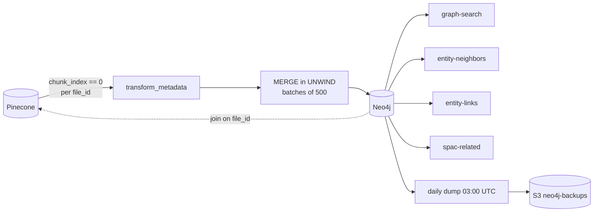

# Neo4j

## What it is

The entity graph. One node per unique entity - document, ticker, company,
analyst, institution, sector, industry, theme - with edges between them,
answering the structural questions vector similarity cannot.

Runs on the box, bolt bound to loopback only.

## Diagram

## How it works

### What it is for

Pinecone answers "what is similar to this". Neo4j answers "what companies does
Goldman Sachs cover", "which analysts cover both ACME and XYZ", "every sellside
note about IONQ published after 2025-01-01". Those are traversals, not
similarity, and forcing them through a vector search returns plausible answers
that are wrong in ways nobody can see.

### The join on file_id

`Document` nodes are keyed on `file_id`, the Google Drive file id, which every
Pinecone vector also carries. That shared key is the whole architecture: resolve
"which files are about ticker X" by traversal, then pass those `file_id` values
into Pinecone as a metadata filter for a semantic search scoped to exactly those
documents. Graph narrows, vectors rank.

The two producers disagreed about this key. The bulk-sync pipeline wrote
`file_id`; the MCP ingestion path historically wrote only `gdrive_file_id`. A
normalization step now mirrors one to the other at write time, and an audit
confirmed 100% coverage on the production corpus. See [[Pinecone]].

### The loader

Deterministic and **LLM-free**. It creates eight uniqueness constraints, lists
vector ids from Pinecone and fetches metadata in batches, selects the
`chunk_index == 0` vector as each file's canonical metadata, transforms that into
a description of nodes and edges, and writes in `UNWIND` batches of 500.

Every write is a `MERGE` keyed on the node's key, so re-running is idempotent by
construction rather than by a guard.

Ordering inside a batch is deliberate. The `Document` MERGE runs first because
every edge write MATCHes it, and the six edge groups then run one at a time -
they MERGE overlapping nodes and are not mutually independent.

Nine node labels and nine relationship types are written at this stage:
`ABOUT`, `MENTIONS`, `HAS_TICKER`, `IN_SECTOR`, `IN_INDUSTRY`, `PRODUCED`,
`AUTHORED`, `WORKS_AT`, `COVERS_THEME`. The full table is in
`meteora-mcp/docs/architecture/workflow.md` section 5.

### Institution aliasing

Institution names are canonicalized before writing, so "Goldman Sachs Equity
Research" and "Goldman Sachs" become one node rather than two.

**The keyword table is hand-maintained and its order matters** - `"jp morgan"`
must stay ahead of `"morgan stanley"`, because a substring match would otherwise
misfile. It is also a copy: the docstring names another script as the source of
truth, and the two must be kept in sync.

### Configuration that is load-bearing

Four settings in `/etc/neo4j/neo4j.conf` must not be removed. Bolt listens on
`127.0.0.1` only, never a public interface. And the memory caps - 2g heap, 1g
pagecache - are there because **without them the JVM claims whatever RAM is
available and starves the MCP server**. At those values the JVM footprint is
about 4-5 GiB, leaving roughly 10 GiB for everything else on the 16 GiB box.

Java is pinned to 21 through a systemd drop-in.

## Why it's this way

Cypher is always parameterized - `run_cypher(query, params)`, never an f-string.
That is not defence against a hostile caller so much as against a company name
with an apostrophe in it.

`MERGE` everywhere rather than `CREATE` means the loader has no notion of a
first run. Re-running after a partial failure, after a schema change, or just
because you are not sure, is always safe, which is what makes the recovery story
below possible.

## Backup posture, honestly

A daily dump runs on the box - `neo4j-backup.timer` fires the backup script at
03:00 UTC, which dumps the database and uploads it to S3 with a **seven-day
expiry**. Seven days of dumps is the whole recovery window.

The floor beneath that is stronger than the backup. **Stage-1 data is fully
reconstructible from Pinecone metadata**: even with no backup at all, a lost
graph is rebuilt in minutes by re-running the Stage-1 loader.

What the dump actually covers is Stage-2 and Stage-3 LLM-derived edges, which
**cannot** be reconstructed from Pinecone. That is the part with a real recovery
window, and it is seven days.

What is **not** covered: the install steps themselves - apt repo, the Java 21
pin, the initial password, first start - are not kept in the repo. They live
with the box rebuild runbook outside it. In a disaster-recovery scenario that is
a document you have to go and find.

## Traps

- **The memory cap is not tuning, it is a dependency.** Removing it starves
  `meteora-mcp` on the same box.
- **The institution keyword table is order-sensitive and duplicated.** Reordering
  it silently remaps documents to a different institution node.
- **Rebuilding Stage-1 is cheap; losing Stage-2/3 is not.** Do not reason about
  the two together.
- **Never build Cypher with an f-string.**
- **A major-version upgrade needs the migration guide and a snapshot test
  first.** The routine `apt-get install neo4j` path only moves within 5.x.

## Where to start reading

| # | File | Why this rung |
| --- | ---------------------------------------------- | --------------------------------------------- |
| 1 | `meteora-mcp/docs/architecture/workflow.md` §5 | The two-store architecture, the node and edge tables, the join. |
| 2 | `meteora-mcp/docs/operations/neo4j.md` | The runbook: config, credentials, password change, backups, rebuild. |
| 3 | `meteora-core/src/meteora_core/graph/loader.py` | `transform_metadata` and the ordered MERGE. |
| 4 | `meteora-core/src/meteora_core/graph/aliases.py` | `canonical_institution` and the order-sensitive table. |
| 5 | `meteora-mcp/services/graph/` | The read side: traversal, neighbours, entity links. |

> **Read 1-2 to defend it. Add 3-5 before you change it.**

## Related

- [[Pinecone]] - the other half of the `file_id` join
- [[meteora-core]] - owns the loader and the aliasing
- [[S3]] - where the daily dump lands
- [[Drive Memory Docs]] - the corpus both stores describe
- [[meteora-mcp]] - the traversal tools, and the box this runs on
- [[meteora-infra]] - provisions the backup timer and the bucket
- [[Meteora]]
