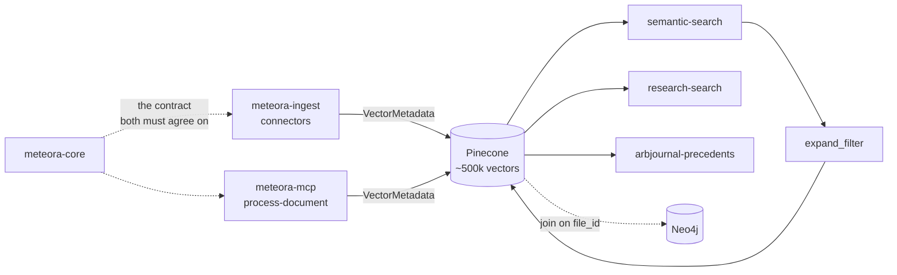

# Pinecone

## What it is

One vector index holding roughly 500k vectors - the firm's document corpus,
chunked and embedded - written by two repos and read by the MCP server's search
tools.

`investment-team-v3`, serverless, AWS `us-east-1`, cosine metric, namespace
`default`. Embeddings are OpenAI `text-embedding-3-small` at 1536 dimensions.

## Diagram



## How it works

### Two writers, one index, one contract

The reason [[meteora-core]] exists at all is visible here. Two repos write to
this index, and if they disagree about what a field is called, the disagreement
is invisible until search results are quietly wrong.

So the metadata model lives in one library that both pin by git tag.
`VectorMetadata` carries the canonical field names and the constrained
vocabularies - `DOCUMENT_TYPES`, `SECTORS`, `INDUSTRIES` - and is declared
`extra="allow"`, so a source-specific field rides through untouched rather than
being dropped at the boundary. The contract constrains what everybody must agree
on and stays out of the way of what only one producer knows.

`to_metadata()` drops empty values on purpose: Pinecone rejects nulls and empty
collections, and an epoch-0 timestamp would make an undated note look ancient to
a date-range filter. Boolean `False` and numeric `0` are preserved.

### Read-side aliasing, which is the mechanism to understand

The index was written over time by several producers using different names for
the same concept: `author` against `analyst_name` against `author_institution`,
`gdrive_created` against `gdrive_created_date`.

**Those vectors are never rewritten.** New writes use the canonical names, and
every query filter passes through `expand_filter`, which rewrites a filter on a
canonical field into an `$or` across every legacy name that field was ever
stored under:

```python
expand_filter({"institution": {"$eq": "Goldman"}})
# -> {"$or": [{"institution":        {"$eq": "Goldman"}},
#             {"author_institution": {"$eq": "Goldman"}}]}
```

It recurses through `$and` and `$or` nodes, and a filter touching no aliased
field comes back structurally unchanged.

This is what lets the schema evolve without a backfill. A field rename becomes a
line in `FIELD_ALIASES` rather than a migration over 500k vectors - a migration
that would be expensive, irreversible, and would fail in a way that corrupts
search silently.

**It is invisible from the query side.** A caller filters on `institution` and
matches both new vectors and old ones without knowing there was ever a second
name. That is the property worth protecting: the alias table is the only place
that has to know the history.

### Vector identity

Ids are `md5(f"{file_id}_{chunk_index}")`. Re-syncing a file overwrites the same
ids rather than duplicating the document, and old vectors are deleted by a
`file_id` metadata filter when a file is replaced.

The consequence is that **chunk boundaries are part of the identity**. A change
to how text splits shifts every downstream id and orphans everything already
stored, which is why within-limit chunks are deliberately appended unchanged so
ordinary documents stay byte-identical.

### The join to the graph

Every vector carries `file_id`, and Neo4j `Document` nodes use it as their unique
property. That shared key is what lets a tool chain resolve documents by graph
traversal and then rank them by vector similarity. See [[Neo4j]].

## Why it's this way

Aliasing at read time rather than migrating at write time is the central bet of
this store, and it is a bet about failure modes rather than about elegance. An
`$or` at query time costs a little latency and is a one-line revert. A backfill
over half a million vectors is a one-way door with a silent failure mode.

`extra="allow"` rather than a strict model is the same instinct applied to
producers. Rejecting an unrecognised field would force every schema addition
through the shared library and a tag cut before either producer could ship.

## Traps

- **`EMBEDDING_MODEL` must not change.** `text-embedding-3-small` and
  `text-embedding-ada-002` are both 1536-dimensional, so mixing them in one index
  corrupts similarity **with no error anywhere**. There is nothing to catch it.
- **A new field name needs an alias entry, not a migration.** Adding one to
  `FIELD_ALIASES` in `meteora-core` and cutting a tag is the whole change.
- **`meteora-core` governs new writes only.** It never mutates the existing
  index.
- **Changing chunk boundaries silently rewrites the index.** See
  [[meteora-core]].
- **Two consumers pin different tags at different times**, so a contract change
  is live for one repo before the other. That is by design - the pin is the
  adoption decision - but it means "the schema changed" is never a single moment.

## Where to start reading

| # | File | Why this rung |
| --- | ---------------------------------------- | ------------------------------------------------------ |
| 1 | `meteora-core/src/meteora_core/aliases.py` | `expand_filter` and the module docstring. The highest-value read in this store. |
| 2 | `meteora-core/src/meteora_core/schema.py` | The write contract and the extra-fields policy. |
| 3 | `meteora-mcp/docs/architecture/workflow.md` | How documents get here, and section 5 on the two-store join. |
| 4 | `meteora-core/src/meteora_core/constants.py` | Chunking, the caps, and vector id derivation. |
| 5 | `meteora-mcp/services/pinecone/client.py` | The query side, and where `expand_filter` is applied. |

> **Read 1-3 to defend it. Add 4-5 before you change it.**

## Related

- [[meteora-core]] - the contract, and why it is a separate repo
- [[Neo4j]] - the other half of the `file_id` join
- [[Drive Memory Docs]] - the producer
- [[meteora-ingest]] - the connectors that write here
