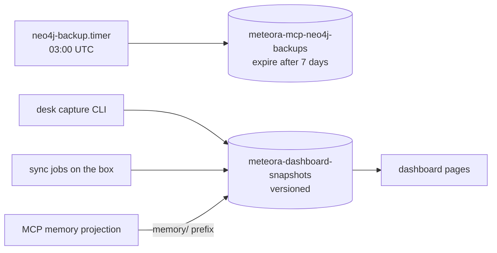

# S3

## What it is

Two buckets, both Terraform-managed in account `309128776621`, region
`us-east-2`. One holds Neo4j dumps, the other holds everything the dashboard
serves that is not live-queried.

| Bucket | Holds | Written by | Read by |
| ------------------------------ | ---------------------------- | ------------------------------ | ------------------------ |
| `meteora-mcp-neo4j-backups` | nightly graph dumps | `neo4j-backup.timer` on the box | a human, during recovery |
| `meteora-dashboard-snapshots` | snapshots, memory projections | desk capture, sync jobs, the MCP server | the dashboard app |

## Diagram

## How it works

### Both buckets, the shared posture

Public access is blocked on both, all four block settings on. Both carry
`prevent_destroy`, so Terraform refuses to delete them even if the resource is
removed from the configuration - a bucket is not something to lose to a
refactor.

### neo4j-backups

A lifecycle rule expires objects after **seven days**. That is deliberate and it
is the whole recovery window: Stage-1 graph data is reconstructible from Pinecone
in minutes, so what these dumps actually protect is the Stage-2 and Stage-3
LLM-derived edges. Seven days of dumps is judged enough for that, and the bucket
is not versioned because the expiry rule is the retention policy. See [[Neo4j]].

### dashboard-snapshots

**Versioned**, which is the asymmetry worth noticing. Snapshots are written
whole - the ingest endpoint replaces a key rather than merging into it - so
versioning is what makes a bad publish recoverable. The Neo4j bucket does not
need it because a bad dump is simply superseded tomorrow.

Two kinds of thing live here. Dashboard snapshots, keyed by module and `as_of`,
posted by the desk capture CLI and by the sync jobs on the box. And memory-doc
projections under the `memory/` prefix, written by the MCP server so docs can be
read in the browser.

### Credentials

The box's instance role picks up S3 access through boto3's default credential
chain, with no configuration and no long-lived access key.

**The account has no IAM users at all.** Nothing here depends on a long-lived
key, and adding one would introduce a secret to store, rotate and leak where
none currently exists. Do not create an IAM user for a new S3 consumer on the
box.

The role is currently broader than it should be - AWS-managed full-S3 policies
are attached and silently override the carefully scoped inline policy beside
them. When that is tightened, the memory projection needs exactly `GetObject`,
`PutObject` and **`DeleteObject`** on `meteora-dashboard-snapshots/memory/*`.
`DeleteObject` is the easy one to miss, and without it a deleted memory doc stays
readable on the dashboard forever.

## Why it's this way

Versioning one bucket and expiring the other is a decision about what each
failure looks like. A wrong snapshot is served to people immediately and needs to
be rolled back; a wrong dump sits unread until someone needs it, by which point
a newer one exists.

`prevent_destroy` on both is cheap insurance against the failure mode Terraform
makes uniquely easy - a resource removed from configuration and applied without
reading the plan.

## Traps

- **`index.json` in the memory prefix is a single object holding every doc's
  index rows** - roughly 475 docs and 4MB - and the put is unconditional with no
  ETag check. Two concurrent writers means the last one wins across every doc's
  rows, not just the ones either touched. This is why the backfill writes it once
  at the end and only behind an explicit flag.
- **`DeleteObject` is load-bearing.** Scoping the role down without it leaves
  deleted docs readable.
- **Seven days is the entire Neo4j recovery window** for anything not
  reconstructible from Pinecone.
- **The dashboard bucket is versioned, so deleting an object does not free the
  storage.** Old versions persist.

## Where to start reading

| # | File | Why this rung |
| --- | ------------------------------------------- | -------------------------------------------------- |
| 1 | `meteora-infra/terraform/modules/storage/main.tf` | Both buckets, the access block, the versioning asymmetry, the expiry. |
| 2 | `meteora-mcp/docs/operations/memoryProjection.md` | The IAM shape, the reconcile loop, and the `index.json` hazard. |
| 3 | `meteora-mcp/services/memory/projection.py` | What a projection object actually is. |

> **Read 1-2 to defend it. Add 3 before you change it.**

## Related

- [[Neo4j]] - what the backup bucket protects, and what it does not
- [[Drive Memory Docs]] - the producer of the memory projections
- [[meteora-dashboard]] - reads the snapshot bucket
- [[meteora-infra]] - owns both buckets
