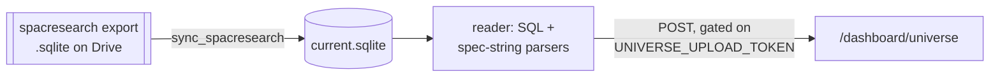

# spacresearch.sqlite

## What it is

The SPAC Research export, kept on the box as a byte-for-byte copy of the file on
Drive, read to publish the `/dashboard/universe` page.
`/var/lib/meteora-mcp/spacresearch/current.sqlite`.

**Not `universe.sqlite`.** See [[universe.sqlite]] and [[Glossary]].

## Diagram

## How it works

### It is a copy, not a build

This is the structural difference from [[universe.sqlite]], and it changes
several things downstream. That one is *built* from a workbook, so it has a
schema this repo chose. This one is *copied*, so the schema is spacresearch's -
relational, with `spacs`, `sponsors` and a `_meta` table.

Because the promoted bytes are the downloaded bytes verbatim, Drive's own
`md5Checksum` is directly comparable to a hash of the file on disk. The
unchanged check therefore hashes the promoted file rather than keeping a
recorded checksum beside it, which removes a second piece of state that could
fall out of step.

`_meta.extracted_at` carries the export's own vintage. A download with no
`_meta.extracted_at` is refused, because the page could not then show its age.

### What it carries that the workbook does not

`warrant_strike`, `counsel`, and the free-text `unit_specs`, `warrant_specs` and
`right_specs` that the structural screens are built on. The workbook cannot
substitute for it, which is the entire reason two syncs exist rather than one.

The reader parses those spec strings into structured fields. A string the parsers
do not recognise is counted as `unparsed` in the journal and the row still
publishes, with the unreadable field as UNKNOWN rather than silently as "does
not exist". That distinction is the point: absent and unknown are different
answers.

### Proving it before promoting

The sync writes to a temp path and **proves the file reads as a universe there**
before the atomic replace. A blob can download cleanly, hash correctly, and hold
no live SPACs - which would publish an empty universe, making every saved basket
unbuildable, while looking like a successful run.

## Why it's this way

Copying rather than transforming means there is no place for this repo to be
wrong about spacresearch's schema. The tradeoff is that a vendor schema change
lands directly in the reader instead of being absorbed by a rebuild.

The row count is small - 370 as of the 2026-07-15 export - so there was never a
performance argument for reshaping it. The argument for `universe.sqlite` being
built is that its source is a spreadsheet with no schema at all.

## Traps

- **Six weeks stale is the normal state.** It refreshes only when a human runs
  the weekly-update skill. The hourly sync makes publishing automatic, not the
  data fresh.
- **`extracted_at` on the page is the real age**, and `generated_at` is only
  when the sync last ran. A moving `generated_at` with a frozen `extracted_at`
  means everything is working and nobody has exported.
- **`universe join fanned out`** means a ticker appeared twice after the sponsor
  aggregation. That is a shape bug, not a data issue - a saved basket would
  double-count it.
- **`no rows` is a refusal, not a failure of the sync.** The export parsed and
  held no live SPACs, so it was not promoted.
- **The publish presents `UNIVERSE_UPLOAD_TOKEN`, not `UPLOAD_TOKEN`.** The
  ingest endpoint does a whole-record replace on a `universe` post, so the desk
  token is deliberately refused here with a 409.

## Where to start reading

| # | File | Why this rung |
| --- | -------------------------------------- | ------------------------------------------------------- |
| 1 | `docs/operations/spacresearchSync.md` | The complete picture, including the comparison table with the workbook. |
| 2 | `scripts/sync_spacresearch.py` | The seven steps, including the readability proof at step 4. |
| 3 | `services/spacresearch/` | The SQL, the spec-string parsers, the ticker candidate rules. |

> **Read 1-2 to defend it. Add 3 before you change it.**

## Related

- [[SPACResearch Export]] - the producer
- [[universe.sqlite]] - the other thing called "the universe"
- [[meteora-dashboard]] - serves the page this feeds
- [[Glossary]]
