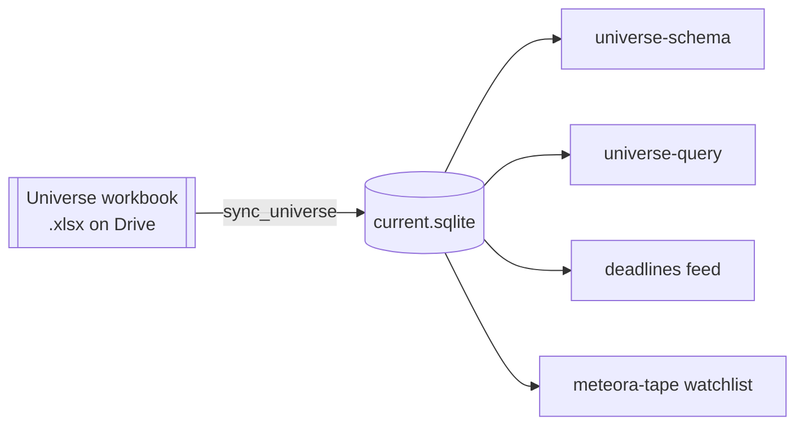

# universe.sqlite

## What it is

A SQLite mirror of the Universe workbook, rebuilt from scratch on every change
and promoted atomically. `/var/lib/meteora-mcp/universe/current.sqlite` on the
box.

**Not `spacresearch.sqlite`.** See [[spacresearch.sqlite]] and [[Glossary]].

## Diagram

## How it works

### Three tables

| Table | What |
| ------------------ | ------------------------------------------------------------ |
| `universe_rows` | one row per sheet row, one column per sheet column |
| `universe_columns` | `ordinal`, `original_header`, `column_name`, `sql_type` |
| `universe_meta` | source name, file id, md5, modified time, export date, built at, row count |

**The column list is deliberately not written down here.** It is roughly 50
columns, set by a vendor, and it moves. `services/universe/schema.py` is how
names are derived and `universe-schema` is the live answer to what they are
today. A transcription in this note would be wrong within a month and would look
authoritative while being wrong.

What is durable is the *shape* and why it holds:

`universe_columns` keeps the vendor's exact header beside each lexed name, which
is how "verbatim" and "queryable" hold at the same time - `Target Company
(Normalized)` really does carry two spaces, and that fact survives into the
database rather than being normalized away.

Names are lexed from the headers: lowercase snake_case, `%` becomes `pct`, `$mm`
becomes a trailing `_mm`, and a name starting with a digit gets a `c_` prefix.

### Types are inferred from the data

Not from a maintained list. A column whose every present value reads as a number
is REAL, anything else is TEXT. A column the vendor adds is therefore usable in
a numeric filter immediately, with no code change and no migration.

That matters more than it sounds. **SQLite orders storage classes
NULL < REAL/INTEGER < TEXT**, so a numeric column left as TEXT makes every value
compare *greater* than every number. `WHERE pipe_size_mm > 100` returns the whole
table when the values are `'75.5'`. Wrong, and completely silent.

Two deliberate exceptions keep that from over-reaching. A value with a leading
zero is treated as an identifier rather than a quantity, which is what keeps
`cik` (`'0001895582'`) TEXT and protects any future zero-padded column without
anyone naming it. And dates stay TEXT, ISO-8601 and date-only, which sorts
correctly as a string - the time component is dropped because the vendor exports
local midnight as a UTC timestamp, so every date value arrives on `04:00:00` or
`05:00:00` depending on the DST boundary, and keeping it would make
`WHERE ipo_date = '2026-08-18'` silently match nothing.

### Reading it

Two tools. `universe-schema` returns every column's name, the vendor's original
header, its type, and - for columns with 25 or fewer distinct values - the values
actually present, which is what lets a caller write `spac_status = 'Searching'`
without guessing the vendor's spelling. `universe-query` runs a caller-supplied
SELECT, so any question can be asked without somebody adding a handler first.

**Read-only is enforced by the engine, not by inspecting the SQL.** The
connection opens `mode=ro` with `PRAGMA query_only`, so INSERT, UPDATE, DELETE,
CREATE and DROP all fail inside SQLite. Keyword filtering would be weaker -
string checks can be talked around with comments, casing and nesting, while a
connection that physically cannot write is not a matter of interpretation.
`ATTACH` is the one gap `mode=ro` leaves and an authorizer denies it. Queries
carry a 5s deadline and a row cap that reports truncation rather than silently
dropping rows.

Errors come back carrying SQLite's own wording, because "no such column:
ipo_proceeds" is exactly what a caller needs to correct itself on the next call.

## Why it's this way

**Why SQLite rather than reading the workbook live:** parsing a 400KB workbook
takes 5 to 30 seconds. Converting once per sync makes the data queryable with SQL
instead of only reachable through a bespoke index, and it removes a filename from
every config file that used to hold one.

**Why a full rebuild rather than an incremental update:** there is no migration
to write and no old schema to reconcile against. A vendor column added, removed
or renamed is absorbed by the next promote. The cost is a rebuild that takes
seconds and happens rarely.

**Why type inference rather than a schema file:** a maintained list is a second
place to update and a silent failure when nobody does. Inference is wrong in one
direction only - a column whose values happen to all be numeric this export -
and that direction is recoverable.

## Traps

- **A numeric column stored as TEXT breaks comparisons silently.** This is the
  reason type inference exists, and it is worth knowing about even now that it
  is handled, because a hand-written query against a TEXT date or a padded id
  hits the same ordering.
- **`cik` is TEXT and always will be.** Leading zeros are significant.
- **Dates are date-only strings.** Comparing against a timestamp will not match.
- **`universe-query` says the sync has never run, but the file exists**: the MCP
  server is missing `UNIVERSE_DB_PATH` and is looking at a cache path nothing
  writes.
- **A `universe columns drifted` warning is not a failure.** The vendor added or
  removed a column, the run still published, and the new column is typed and
  queryable immediately. Worth a look, not an action.
- **The build refuses on `missing load-bearing column(s)`** - `cik`,
  `spac_share_symbol` or `spac_status`. Everything downstream filters on those,
  so a rename aborts the build rather than publishing a table that quietly
  returns nothing.

## Where to start reading

| # | File | Why this rung |
| --- | ----------------------------------- | ----------------------------------------------------------- |
| 1 | `docs/operations/universeSync.md` | The database section, the failure table, and the querying tools. |
| 2 | `services/universe/schema.py` | Header lexing and type inference. The live answer to "what are the columns". |
| 3 | `services/universe/query.py` | The read-only enforcement and the ATTACH authorizer. |
| 4 | `services/universe/build.py` | How a workbook becomes three tables. |
| 5 | `tools/universe/handlers.py` | What a caller actually sees. |

> **Read 1-3 to defend it. Add 4-5 before you change it.**

## Related

- [[Universe Workbook]] - the producer
- [[spacresearch.sqlite]] - the other thing called "the universe"
- [[meteora-mcp]] - owns both the sync and the query tools
- [[meteora-tape]] - reads this file directly off disk
- [[Glossary]]
