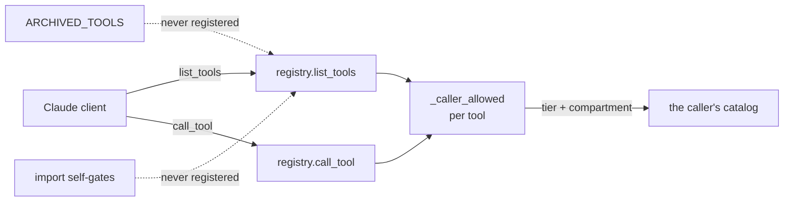

# MCP Tools

## What it is

The surface Claude actually sees - one flat namespace of tool names, filtered
per caller, reached over `/mcp`. Fifteen tool areas in the source, grouped into
about a dozen labels on the dashboard, and a tool list that is **different for
different people**.

For how a tool is built and dispatched, see [[meteora-mcp]]. This note is about
what is exposed and to whom.

## Diagram

## How it works

### The catalog is per-caller, not global

`list_tools` filters by the caller's Cognito groups, and `call_tool` re-checks
at dispatch. So a hidden tool cannot be reached by guessing its name, and two
people connected to the same server legitimately see different catalogs.

This has a failure mode worth knowing. A caller whose groups resolve **empty**
silently drops to the lowest tier and receives a truncated list, which the
client still reports as a successful connection - "connected, but nothing
works". The server logs every listing with the groups seen and the tools
withheld, and warns specifically when the list was filtered, because that log
line is the only way to tell this apart from a broken tool.

### Two ladders, and they are not the same ladder

- **Tier** is ordered: `intern` then `analyst`. A tier is satisfied by its own
  Cognito group or any higher one. `intern` is the floor and means "any
  authenticated user", so only `analyst` actually gates anything today.
- **Compartment** is exact membership in a named group, and it is
  **orthogonal**. A high tier does not grant one.

Most tools declare neither and are open to any authenticated user. The
`analyst` tier is on the write-shaped surfaces - the RLST tools, the
memory-doc mutations, and one email tool.

### Three ways a tool can not exist

This is the thing that costs an afternoon if you do not know it. A tool you
expect to see can be absent for three unrelated reasons, and the registry looks
identical in all three:

| Mechanism | Where | Effect |
| ------------------- | ------------------------------ | ---------------------------------------------------- |
| Not imported | `tools/__init__.py` | Registration is an import side effect. A module nobody imports silently does not exist. |
| Archived | `registry.ARCHIVED_TOOLS` | Validated like any tool, then not registered. Absent from `list_tools`, rejected by `call_tool`. Holds `rlst-add` and `emsx-blotter`. |
| Self-gated on import | the area's own module | Registers nothing without its prerequisite. Bloomberg needs a terminal, RLST needs the workbook, CourtListener needs its API key. |

None of these is a bug, and none of them logs an error. Check all three before
debugging the registry.

### Grouping on the dashboard

The `/dashboard/tools` page and the operational `/server` panels both label
tools by group, derived from keyword rules over the tool name rather than from
the source directory.

The rule order is load-bearing and carries its reasoning inline. `legal` must
precede `documents` and the `search` catch-all, or `docket-search` would be
claimed by `search`. `data-science` must precede `market-data`, or the `spac`
keyword would claim the universe SQL tools - which are not a market-data feed,
they answer population questions over a SQL mirror. `search` is deliberately
last so it only catches names no earlier group wanted.

Both consumers call the same helper, which is how the group on the dashboard's
own API and the group in the `registry.json` dump stay in agreement. They
drifted once when the dashboard kept its own hand-maintained copy.

## Why it's this way

Re-checking authorization at dispatch rather than only when listing is the
difference between hiding a tool and denying it. Filtering the list alone would
be security by obscurity.

Compartments being orthogonal to tiers is a deliberate refusal of the usual
admin-sees-everything shape. Some data should be reachable by exactly the
people named, regardless of seniority.

Archiving exists so a tool whose dependency is unavailable or whose access is
undecided can be parked without deleting working code. The handler, schema and
tests stay live, so the code does not rot while the question is open.
Un-archiving is deleting one line.

## Traps

- **A missing tool is usually a gate working, not a fault.** Three mechanisms,
  none of them noisy.
- **"Connected but nothing works" is an empty-groups problem**, not a broken
  server. Read the tool-listing log line.
- **Registering a duplicate name raises at import and takes the whole server
  down.** A test that registers a throwaway tool must remove it from the
  registry table in a fixture.
- **Every input field's `description` is prompt text.** Claude reads it to
  decide whether to call the tool. Write it for the model, not for a reviewer.
- **The group rules are order-sensitive**, and a new tool name can be silently
  claimed by an earlier rule.

## Where to start reading

| # | File | Why this rung |
| --- | ------------------------------- | ------------------------------------------------------ |
| 1 | `registry.py` | `list_tools`, `call_tool`, `_caller_allowed`, and the archive set. |
| 2 | `tools/__init__.py` | The import list that decides what exists at all. |
| 3 | `tools/ping.py` | The smallest complete tool, in one screen. |
| 4 | `dashboard/log_parser.py` | The group rules and their ordering comments. |
| 5 | `docs/architecture/MCPRemoteServer.md` | The full catalog and how to add a tool. |

> **Read 1-3 to defend it. Add 4-5 before you change it.**

## Related

- [[meteora-mcp]] - how a tool is built, validated and dispatched
- [[Dashboard Pages]] - where these tools are listed for humans
- [[Auth]] - Cognito, and what a group actually is
- [[Skills API]] - the other HTTP surface on the same server
- [[Meteora]]
- [[Glossary]]
