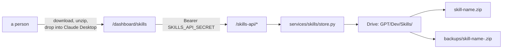

# Skills API

## What it is

`/skills-api/*` on the MCP server - list skills, upload a new version, download
a skill's zip, list and download its backups. It is **not** part of the MCP tool
surface. It exists for the dashboard to call server-to-server.

Skills are Claude Desktop skills stored as zips in Drive. See [[Glossary]] for
why "skill" means two unrelated things in this estate.

## Diagram



## How it works

### A third auth system, deliberately

Two settings gate it, and **neither has a default that grants access**.

`SKILLS_API_SECRET` is checked by a fail-closed helper: unset or empty means
every request is rejected with 401 regardless of the header sent. There is no
flag to allow unauthenticated access. The comparison uses `hmac.compare_digest`
rather than `==`, so a wrong guess leaks no timing information about how many
leading characters matched.

It is deliberately **separate from `DASHBOARD_SECRET`**. That one gates the
read-only `/server` operational dashboard. This one gates a surface that
**writes to Drive**, and the two should be independently rotatable.

`SKILLS_FOLDER_ID` names the Drive folder. It is empty by default, and every
handler checks for that and returns `503 skills_folder_not_configured` **before
making any Drive call** - rather than letting Drive reject a malformed
empty-string query and surface as something confusing.

### One zip per skill

A real Claude skill is a folder: `SKILL.md` plus optional `references/`,
`scripts/` and `assets/`. Mirroring that tree in Drive would need recursive
folder sync and diffing, and an answer to "what does deleting a file from
`references/` in a new version mean" with no atomic way to apply it.

So each skill is **one Drive object**. The same backup-before-overwrite sequence
then works whether the skill is one file or twelve.

```
GPT/Dev/Skills/
  skill-name.zip
  backups/
    skill-name-2026-08-21-1437.zip
```

Backup filenames are date-first so they sort chronologically as plain text -
day-first sorts wrong, because `"21-08"` lexically precedes `"05-09"`.

### The prefix trap, solved by a regex

Confirming a backup belongs to a given skill is not `startswith(f"{name}-")`.
That check would also match `s1-filing-handler-old-....zip` for
`s1-filing-handler`, leaking one skill's backups into another's whenever one
name is a prefix of another's.

The store instead requires that what remains after stripping the `<name>-`
prefix is a timestamp **and nothing else**. Those two skill names really do
exist side by side, which is how the bug was found rather than imagined.

### Nothing loads a skill automatically

Skills are consumed entirely by hand - someone downloads a zip and drops it into
Claude Desktop. That constraint shapes the whole design: there is no
live-loading path to keep in sync and no runtime coupling to protect. The only
things that have to be right are that the downloaded file is byte-identical to
what was uploaded, and that a bad upload is recoverable.

## Why it's this way

The backup-before-overwrite sequence is the entire point of the system. Skills
previously lived wherever whoever wrote them last saved them, with no shared
version history - `s1-filing-handler` and `s1-filing-handler-old` sitting side
by side is the shape of the problem. Someone overwrites the working version with
a bad edit and the old one is gone.

Storing zips rather than trees trades a little opacity for atomicity. You cannot
diff a version in Drive, but you also cannot half-apply one.

A separate secret from the dashboard's is a two-line cost that buys independent
rotation on the only surface here that writes.

## Traps

- **It is not an MCP tool surface.** It will never appear in `list_tools`, and
  Claude cannot call it. Only the dashboard does, server-to-server.
- **Both settings fail closed, and they fail differently.** No secret is a 401;
  no folder id is a 503 with an explicit error name.
- **The `Skills` folder does not exist until someone creates it** in the `GPT`
  shared drive under `Dev`, and copies its id out of the URL.
- **These are not the git skills.** `~/.claude/skills` is a separate
  distribution for a different audience with a different consumption model. The
  two are deliberately unconnected.
- **A skill name that is a prefix of another skill's name is a real case here**,
  not a hypothetical.

## Where to start reading

| # | File | Why this rung |
| --- | ----------------------------------- | ------------------------------------------------------ |
| 1 | `docs/operations/skillsApi.md` | Both settings, the one-time Drive setup, how to authenticate. |
| 2 | `skills_api/routes.py` | The endpoints and the fail-closed checks. |
| 3 | `services/skills/store.py` | Zip handling, the backup sequence, and the prefix regex. |
| 4 | `services/skills/frontmatter.py` | How a skill's description is read out of `SKILL.md`. |

> **Read 1-2 to defend it. Add 3-4 before you change it.**

## Related

- [[meteora-mcp]] - the server this is mounted on
- [[Dashboard Pages]] - the only caller
- [[Auth]] - where this sits among the other auth systems
- [[Meteora]]
- [[Glossary]] - skill
