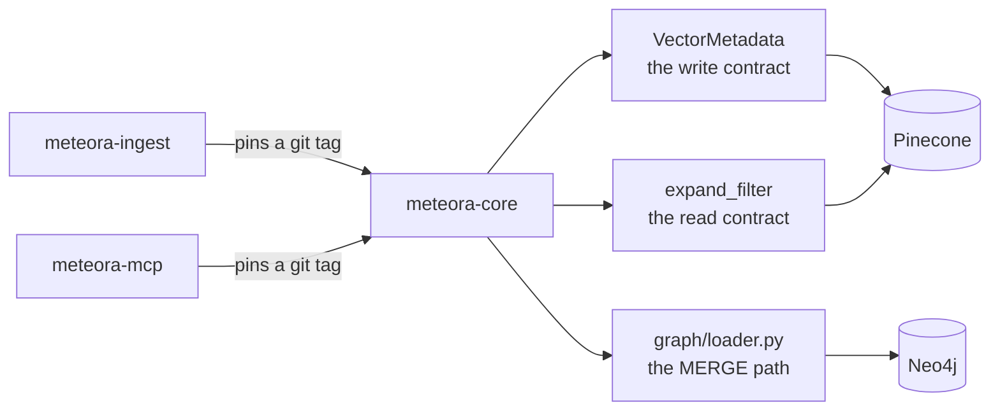

# meteora-core

## What it is

The shared contracts for the vector pipeline - the metadata schema, the client
factories, and the Neo4j write path - packaged as a library so the two repos
writing to one Pinecone index cannot drift apart.

## Diagram



## How it works

### It is a library, and merging ships nothing

There is no entrypoint and nothing here runs on its own. Consumers install it
from a **git tag** over SSH, not from a package index, and pin independently. At
time of writing both meteora-ingest and meteora-mcp are on `v0.4.2`, and the
repo's own version is `0.4.2` - but those move, so read the consumers'
`pyproject.toml` rather than trusting this line.

The consequence is the thing to internalize. Merging to `main` reaches nobody.
**Cutting a tag and bumping a consumer's pin is the shipping action**, and it is
a separate, deliberate step in a different repo.

### The write contract

`schema.py` holds `VectorMetadata`, the canonical Pinecone metadata model, plus
the constrained vocabularies - `DOCUMENT_TYPES`, `SECTORS`, `INDUSTRIES`. It is
declared `extra="allow"`, so a source-specific field rides through untouched
rather than being dropped at the boundary. The model constrains what everybody
must agree on and stays out of the way of what only one producer knows.

`to_metadata()` drops empty values on purpose, because Pinecone rejects nulls
and empty collections, and an epoch-0 timestamp would make an undated note look
ancient to a date-range filter. Boolean `False` and numeric `0` are preserved -
the filter is deliberately not a truthiness check.

### The read contract, and the highest-value mechanism here

The production index holds roughly 500k vectors written by several producers
that used different names for the same concept: `author` against `analyst_name`
against `author_institution`, `gdrive_created` against `gdrive_created_date`.

Those vectors are never rewritten. Instead `aliases.py` holds `FIELD_ALIASES`,
canonical name to every legacy name it was ever stored under, and `expand_filter`
rewrites a query filter into an `$or` across all of them:

```python
expand_filter({"institution": {"$eq": "Goldman"}})
# -> {"$or": [{"institution":        {"$eq": "Goldman"}},
#             {"author_institution": {"$eq": "Goldman"}}]}
```

It recurses through `$and` and `$or` nodes, and a filter that touches no aliased
field comes back structurally unchanged.

This is what makes a 500k-vector index survive a rename with no migration. A
field-name change is a line in `FIELD_ALIASES`, not a backfill job.

### Lazy clients

`clients.py` exposes `pinecone_client`, `get_index`, `openai_client` and
`neo4j_driver` as `@lru_cache` factories. The three SDKs are **optional extras**
and are imported _inside_ the functions that need them, so `import meteora_core`
works with only pydantic and tiktoken installed.

That is not tidiness - a consumer that installs no extras depends on it, and CI
runs a two-leg matrix specifically to hold the property (see below).

### The graph write path

`graph/loader.py` turns Pinecone metadata into Neo4j nodes and edges. Every write
is a Cypher `MERGE` keyed on the node's key, so re-running the loader is
idempotent by construction rather than by a guard. It handles both metadata
schemas - the bulk-sync shape and the MCP shape - and batches 500 documents per
`UNWIND`.

Ordering inside a batch is deliberate. The `Document` MERGE runs first because
every edge write below MATCHes it, and the six edge groups then run one at a time
because they MERGE overlapping nodes and are not mutually independent.

Cypher is always parameterized. Never build a query with an f-string.

## Why it's this way

Two repos writing one index is the whole problem. Anything they must agree on
lives here, so disagreement becomes a version mismatch you can see rather than a
silent metadata divergence you find months later in bad search results.

Pinning by tag rather than tracking `main` is what makes that safe to change. A
consumer adopts a new contract when it chooses to, and a regression in `main`
cannot reach production by accident.

Read-side aliasing over migration is the same instinct applied to data. A
migration over 500k vectors is expensive, irreversible and has a failure mode
that corrupts search silently. An `$or` at query time costs a little latency and
is a one-line revert.

## Traps

- **The repo's own docs say there is no CI. There is.**
  `meteora-core/CLAUDE.md` lists "no CI (`.github/` does not exist)" under
  notable absences, and `.github/workflows/ci.yml` is present and runs a pytest
  matrix on every PR and push to `main`. Believe the workflow file. This is a
  worked example of the drift this folder exists to surface.
- **The version number lives in three places and a test asserts it.**
  `pyproject.toml`, `__init__.py`'s `__version__`, and
  `tests/test_graph_exports.py` - where the test _name_ encodes it too. Bumping
  two of three turns the suite red. Do not bump unless the work is explicitly a
  release.
- **Changing chunk boundaries silently rewrites the index.**
  `generate_vector_id` is `md5(f"{file_id}_{chunk_index}")`, so a change to how
  `chunk_text` splits shifts every downstream vector id and orphans the existing
  ones. Within-limit chunks are appended unchanged specifically so ordinary
  documents stay byte-identical. Preserve that.
- **`EMBEDDING_MODEL` must not change.** `text-embedding-3-small` and
  `text-embedding-ada-002` are both 1536-dimensional, so mixing them in one index
  corrupts similarity with no error anywhere.
- **`graph/aliases.py` is a hand-maintained copy** of an institution-keyword
  table whose source of truth lives in another script. Keyword order matters -
  `"jp morgan"` must stay ahead of `"morgan stanley"`.
- **`uv sync` writes an untracked, un-ignored `uv.lock`** into the worktree. It
  shows up as noise in `git status`. Leave it alone.

## Where to start reading

| # | File | Why this rung |
| --- | -------------------------------- | ----------------------------------------------------------------- |
| 1 | `README.md` | Usage, the pin instructions, the migration stance, and the changelog - there is no separate CHANGELOG. |
| 2 | `src/meteora_core/schema.py` | The write contract, and the module docstring's extra-fields policy. |
| 3 | `src/meteora_core/aliases.py` | The read contract. The single highest-value mechanism in the repo. |
| 4 | `src/meteora_core/clients.py` | Why the SDK imports are inside the functions. |
| 5 | `src/meteora_core/constants.py` | Chunking, vector ids, and the two caps that must not move. |
| 6 | `src/meteora_core/graph/loader.py` | `transform_metadata` and the incremental MERGE, including its ordering. |

> **Read 1-3 to defend it. Add 4-6 before you change it.**

## Making changes

### The gate

```bash
uv sync --extra dev
uv run --extra dev pytest -q
```

Eight files, eighty tests, all pure unit tests with no I/O. There is no linter,
no formatter, no `Makefile` and no `.python-version` - `pyproject.toml` is the
only build config.

### Test structure

One file per source module, plain functions, no classes and no `conftest.py`.
External systems are faked with hand-written fake objects plus `monkeypatch` -
no `unittest.mock`, no `pytest-asyncio` (async code is driven with
`asyncio.run`), no markers or skips. Many tests carry `# arrange` / `# act` /
`# assert` comments.

**No credentials are needed to work on this repo.** Nothing in the suite opens a
socket, and nothing constructs `Settings` with real keys.

### CI

`ci.yml` on every PR and on push to `main`. It runs pytest twice, as a matrix
over install variants:

- **base** (`--extra dev`) proves the package imports without the heavy SDKs.
- **clients** (`--extra dev --extra clients`) proves the imports stay lazy once
  they are present.

Neither leg alone covers both, which is the point. It gates on Python 3.10, the
floor `requires-python` declares, because developers run newer locally and the
floor is what breaks unnoticed. The tiktoken vocab is cached in the workspace so
a transient download outage is not a red build.

### Deploy

There isn't one. Releasing is cutting a git tag and then bumping the pin in a
consumer's `pyproject.toml`, in that consumer's own repo, through its own PR.
A release commit also updates the README changelog and the version in its
install snippet.

### Manual QA

`uv run --extra dev python -c "import meteora_core"` is the whole smoke test -
there is nothing to run. Real verification happens in the consumer: point one at
a local checkout with `uv pip install -e ../meteora-core` overlaid on the synced
venv, which touches neither `pyproject.toml` nor `uv.lock`, and exercise the
path there.

### Traps

- `main` is the default branch and nothing protects it. Branch and open a PR.
  Consumers are pinned to tags so a bad merge does not reach them, but there is
  no build on the branch to catch you either.
- A test run that fails only in `test_chunking.py` on a cold machine is a missing
  tiktoken download, not a code bug. The `cl100k_base` vocab is fetched on first
  use and cached in the system temp dir, which macOS purges.
- A new public export is a two-line change plus a line in
  `tests/test_graph_exports.py`. Everything else stays private.

## Related

- [[meteora-mcp]] - one of the two consumers, on the read side
- [[meteora-ingest]] - the other consumer, on the write side
- [[Pinecone]] - the index the contract exists to protect
- [[Neo4j]] - written by this library's graph loader
- [[Meteora]]
- [[Glossary]]
