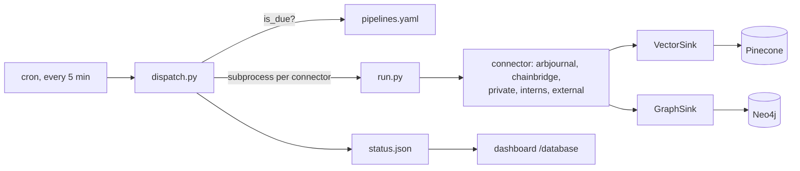

# meteora-ingest

## What it is

The write side of the vector pipeline. A dispatcher on a five-minute cron tick
fires five connectors when their schedules come due, each pulling documents from
a source and pushing them into Pinecone and Neo4j.

## Diagram



## How it works

### The dispatcher

Cron runs the dispatcher every five minutes. It reads `pipelines.yaml`, asks
`is_due(schedule, last_dispatch, now)` for each enabled connector, and spawns the
due ones. That is the whole scheduling model: **the cron string is compared
against when the connector last dispatched, not against the wall clock**, so a
tick that was missed does not silently skip a window.

`pipelines.yaml` is the entire connector registry, and it is short enough to
read whole:

```yaml
connectors:
  arbjournal:
    schedule: "*/5 * * * *"
    enabled: true
  chainbridge:
    schedule: "*/30 * * * *"   # Drive full-walk is heavier than arbjournal
    enabled: true
  private:
    schedule: "*/5 * * * *"
    enabled: true
  interns:
    schedule: "*/5 * * * *"
    enabled: true
  external:
    schedule: "*/5 * * * *"
    enabled: true
```

`chainbridge` is on `*/30` while the rest are on `*/5` because its Drive full
walk is heavy, and running it six times as often would spend the Drive quota
without finding six times the work.

Each due connector runs as an **isolated subprocess** under a per-connector
`flock`, with a one-hour timeout. The exit codes carry meaning: 124 on timeout,
75 when the lock is already held by a still-running prior tick, 70 on a setup or
spawn failure. 75 in particular is a harmless skip, not an incident - it means
the last run has not finished and the dispatcher declined to start a second.

The lock is per connector, so a slow `chainbridge` never blocks `arbjournal`.

### A connector run

`run.py` resolves the connector by name, opens its `Cursor` - a per-connector
SQLite file under `data/` holding what has already been ingested - builds the
sinks it declares, and hands all of it to `run_connector`.

Sink order matters and is enforced by the order of the names, not by a comment:
the vector sink is authoritative and runs first, the graph sink second. An
unrecognized sink name raises immediately rather than being skipped.

Token spend is metered per run. The OpenAI client is wrapped in `MeteredOpenAI`
so embedding usage is attributable to the connector that caused it.

### The Drive layer

`sources/drive/` is the shared machinery three of the connectors sit on: OAuth
(`auth.py`), the Drive client, the changes feed (`changes.py`) for incremental
walks, plus classification, tagging, text extraction and zip handling. A
connector over a Drive folder is mostly configuration on top of this layer
rather than new I/O.

### status.json

At the end of every tick the dispatcher writes `status.json` - best-effort, so a
failure there never affects ingestion. The dashboard's `/database` page reads it.

`STATUS_OUTPUT_PATH` says where it lands, defaulting to `<repo>/status/`.
`STATUS_INDEX_NAMES` lists the Pinecone indexes to report vector counts for; with
it unset the file still populates everything else and logs a warning.

## Why it's this way

Subprocess-per-connector with a lock and a timeout is the cheap version of
isolation. One connector that hangs on a slow Drive call, or dies on a malformed
document, costs exactly its own tick. Nothing shared is left half-written,
because the cursor only advances on a completed run.

Comparing the cron string against `last_dispatch` rather than the clock means the
schedule survives an outage. A box that was down for two hours resumes and each
connector fires once, rather than either stampeding or silently losing the
window.

`status.json` is written last and best-effort because observability must never be
able to break the thing it observes. A dashboard page that goes blank is a
smaller problem than an ingestion run that aborts on a failed status write.

## Traps

- **The status file is written by `ubuntu` and read by `waehner`.** The grant is
  `chmod o+rx` on the **status directory only**, never on `data/` or `logs/`. The
  dispatcher chmods `status.json` itself to `0644` on every write. Getting this
  wrong silently blanks a dashboard page - no error anywhere, just an empty
  panel.
- **`uv.lock` is committed and `--locked` is used everywhere.** A
  `pyproject.toml` edit without its re-lock is a red build, deliberately: the
  alternative is silently installing something the lock never saw.
- **The private meteora-core dependency needs SSH.** CI writes a deploy key
  before syncing, and that step is what breaks when the key rotates. A sync
  failure there is credentials, not the lockfile.
- **A `75` exit in the logs is not a failure.** It is an overlapping run being
  skipped by the flock.

## Where to start reading

| # | File | Why this rung |
| --- | --------------------------------------- | ---------------------------------------------------------------- |
| 1 | `pipelines.yaml` | The whole connector registry, in twenty lines. |
| 2 | `src/meteora_ingest/dispatch.py` | Due-selection, the flock, the timeout, and the exit-code vocabulary. |
| 3 | `src/meteora_ingest/run.py` | What one connector run actually is: resolve, cursor, sinks, meter. |
| 4 | `src/meteora_ingest/lifecycle.py` | `run_connector` - the loop every connector is driven through. |
| 5 | `src/meteora_ingest/sources/drive/` | The shared Drive layer three connectors sit on. Start at `connector.py`. |
| 6 | `docs/status.md` | The dashboard feed and its permission grant. |

> **Read 1-3 to defend it. Add 4-6 before you change it.**

## Making changes

### The gate

```bash
bash scripts/smoke_test.sh
```

Two things, both offline. It imports `dispatch`, `run`, `lifecycle` and
`registry` to catch a missing-dependency regression that would only otherwise
surface on a live tick, then runs the unit suite with `pytest -q`. No network, no
credentials.

Install with `uv sync --locked --extra dev`, the same command CI and the box use.

### Test structure

Unit tests only, no network and no credentials. `connectors/_fake.py` is a fake
connector used to drive the dispatcher and lifecycle paths without touching a
real source.

### CI

`ci.yml` on every PR and push to `main`, four steps beyond the gate:

- A **blocking** TruffleHog secret scan over the commit range.
- An SSH config step that writes the meteora-core deploy key.
- `uv sync --locked --extra dev`, which fails on a stale lock.
- `pip-audit` for known CVEs.

Then the smoke test itself.

### Deploy

`deploy.yml` on push to `main`, on a self-hosted runner on the box. It
fast-forwards the checkout, installs from the lockfile, and runs the smoke test.
Any failure hard-resets to the previous commit.

**There is no service to restart.** The dispatcher is a cron job, so the next
tick simply picks up the new code. That also means a deploy never interrupts a
run in flight - the flock does the rest.

### Manual QA

Run a single connector by hand rather than waiting for a tick:

```bash
python -m meteora_ingest.run arbjournal
```

It uses the same cursor as the scheduled run, so it is a real ingestion, not a
dry run - it will advance state and write vectors. Watch `logs/<connector>.log`.

For the dashboard feed:

```bash
STATUS_INDEX_NAMES=meteora python -m meteora_ingest.status
cat status/status.json | python -m json.tool
```

### Traps

- Running a connector by hand while its scheduled tick is due means the
  dispatcher's spawn hits the flock and logs a skip. Expected, not a fault.
- Editing `pipelines.yaml` needs no deploy of anything else - the dispatcher
  reads it every tick. Disabling a connector is `enabled: false`, and it takes
  effect within five minutes.

## Related

- [[meteora-core]] - the pinned library holding the write contract and the graph
  loader this repo calls
- [[Drive Memory Docs]] - what the connectors actually ingest
- [[Pinecone]] and [[Neo4j]] - where the connectors write
- [[meteora-dashboard]] - reads the `status.json` this writes
- [[Meteora]]
- [[Glossary]]
