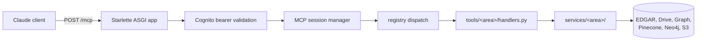

# meteora-mcp

## What it is

The remote MCP server that gives Claude the firm's tools - EDGAR, the research
index, the entity graph, memory docs, email and calendar, the SPAC sheets - over
one authenticated HTTPS endpoint.

## Diagram



## How it works

### Transport and lifespan

`server.py` is a Starlette ASGI app served by uvicorn. The MCP surface is one
route, `/mcp`, wrapped as a raw ASGI endpoint so Starlette hands it the naked
`(scope, receive, send)` rather than trying to build a response object for it.
Everything else on the app is small: `/health`, the two OAuth discovery
documents, the `/server` operational dashboard, and `/skills-api/*`.

Behind the route sits a `StreamableHTTPSessionManager`. It runs in **stateless**
mode, which means no session IDs are issued and a restart is invisible to
connected clients. Stateful was the original setting and it was wrong here:
sessions lived only in this process's memory, so every deploy silently
invalidated every client, which then kept presenting a dead session ID and 404ing
while its UI still read "connected".

The lifespan is where the process warms up. It widens the default thread-pool
executor, because every `asyncio.to_thread()` call in the process shares one pool
and Python's default under-provisions I/O-bound work on a small box. Then it
warms the caches whose cold load a user would otherwise pay for: the SPAC
workbooks, the Pinecone and OpenAI clients, and the Microsoft Graph token and its
pooled TLS connection. It also starts two background loops - a Drive credential
keepalive, and the memory-doc reconcile loop when projection is enabled - and
dumps `registry.json` for the dashboard to read. That dump is best-effort and
wrapped, because a schema error on one tool must not stop the server booting.

### Auth

Every `/mcp` request carries a Cognito bearer token, verified before the session
manager sees it. A failure is a 401 at the door.

The server also serves two OAuth discovery documents at `/.well-known/`, which
is what lets claude.ai run a normal login flow against Cognito and come back
with a token. That facade is the whole reason a person can add this as a custom
connector without anybody handing them a credential.

Authorization is two orthogonal checks, both re-run at dispatch rather than only
when listing tools, so a hidden tool cannot be called by guessing its name:

- **Tier.** An ordered ladder, `intern` then `analyst`, where the tier name is
  also the Cognito group name. A tier is satisfied by its own group or any
  higher one. `intern` is the floor and means "any authenticated user".
- **Compartment.** Exact membership in a named group. Being high-tier does
  **not** grant one.

`AUTH_ENABLED=false` turns all of this off, which is what the dev server does.

### The registry

This is the core concept, and the thing to understand first. A tool is a
pydantic input schema plus an `async` handler returning `str`, registered by a
decorator:

```python
def tool(
    name: str,
    description: str,
    input_schema: type[BaseModel],
    *,
    min_tier: str | None = None,
    required_groups: frozenset[str] | None = None,
) -> Callable[[Handler], Handler]:
```

The decorator writes a `ToolSpecs` into `REGISTRY_TABLE`, keyed by name. From
there the registry owns the whole request: it looks the name up, validates the
caller's arguments against the schema, checks tier and compartment, calls the
handler, and shapes the result. A duplicate name raises at import, which takes
the server down rather than letting two tools quietly share a name.

Registration happens as an **import side effect**. `tools/__init__.py` imports
every area, and that import is what fires the decorators. A new tool module that
nobody added to that file silently does not exist.

`registry.ARCHIVED_TOOLS` is the deliberate version of the same disappearance. A
name in that frozenset is validated like any other tool and then not registered,
so it is absent from `list_tools` and `call_tool` rejects it as unknown, while
its handler, schema and tests stay live. It gates exposure, not code. It
currently holds `rlst-add` and `emsx-blotter`, both parked on Bloomberg access.

A handler signals a client-visible failure by raising `SoftError`, which comes
back as a structured message inside a successful MCP call. Anything else becomes
a dispatch-level error.

### Tools against services

Handlers are thin and services are thick. `tools/<area>/handlers.py` declares the
input schema, validates, and calls into `services/<area>/`, which owns every
piece of external I/O. Sixteen tool areas today, seventeen service areas -
`extensions`, `skills` and `spacresearch` have services with no tool surface,
because they are driven by sync scripts and the skills API rather than by Claude.

The split is what makes the suite fast: `tests/unit/` mocks at the service
boundary, so a handler test never touches a network.

Every input field carries a `Field(..., description=...)`, and that description
is what Claude reads when deciding whether to call the tool. It is prompt text,
not a code comment.

### Configuration

`config.py` builds its `Settings` object **at import time**, and the required
fields have no defaults. So `import server` fails outright without a real `.env`
and a `credentials/` folder, both of which live only on the box and on a
maintainer's machine. There is no fake-auth mode.

The values themselves come from `meteora-secrets`, the SOPS-encrypted store that
_is_ the environment for every service on the box. A per-repo `.env` is a derived
artifact.

## Why it's this way

The registry exists so a tool cannot be added without declaring its schema. The
schema is simultaneously the argument validator, the JSON Schema Claude reads,
and the documentation, which is why there is no path that skips it.

The tools-against-services split exists so handlers stay mockable. Push the I/O
down one layer and a tool's logic is testable with no credentials at all, which
is what lets a fresh worktree run the entire suite.

Config-at-import trades a friendly failure mode for a guarantee. A
half-configured server never starts serving. The cost is real - a blank
JSON-typed env var kills the process before there is a socket or a log line -
and it is accepted deliberately.

## Traps

- **No `src/` package and no root `__init__.py`.** `server`, `config`,
  `registry`, `tools` and `services` are imported as top-level modules from the
  repo root, and `pyproject.toml` sets `package = false`.
- **A green local gate does not mean green CI.** CI additionally runs a blocking
  TruffleHog secret scan over the commit range, which `scripts/check.py` cannot
  reproduce.
- **`main` is what deploys.** There is no branch protection - the org is on
  GitHub's free plan, so the no-direct-push rule is convention held by the
  committer and nothing else.
- **A blank JSON-typed env var takes the box down and rollback does not save
  it.** `EMAIL_ROSTER`, `BRIEF_TEST_RECIPIENTS`, `COGNITO_MACHINE_CLIENT_IDS`,
  `INTERNAL_DOMAINS` and `OAUTH_EXPECTED_REDIRECT_URIS` are parsed as JSON before
  pydantic sees them, so `FOO=` raises while `config.py` is importing. The env
  file is not in the repo, so the deploy rollback restarts the old commit against
  the same bad file. To leave one at its default, delete the line.
- **A new required setting with no default kills the whole suite at collection**
  unless a dummy lands in `tests/conftest.py` in the same commit.
- **Three areas self-gate on import** and register nothing without their
  prerequisite: `services/bloomberg/` and `services/rlst/` need a co-located
  terminal or the on-prem workbook, and `tools/courtlistener/` needs its API key
  to be present. Do not enable any of them to make something pass.

## Where to start reading

| # | File | Why this rung |
| --- | ------------------------------------- | ------------------------------------------------------------------------ |
| 1 | `docs/architecture/MCPRemoteServer.md` | The map. Request flow, the tool catalog, the full config reference. |
| 2 | `registry.py` | The one concept everything else is arranged around. Read `tool()` and `call_tool()`. |
| 3 | `tools/ping.py` | The smallest complete tool. The whole pattern in one screen. |
| 4 | `server.py` | Routes, auth gating, and what the lifespan starts. |
| 5 | `services/memory/drive.py` | A representative thick service - Drive auth, caching, the I/O the handlers do not do. |
| 6 | `config.py` | Every knob, and why import-time construction is load-bearing. |

> **Read 1-3 to defend it. Add 4-6 before you change it.**

## Making changes

### The gate

```bash
uv run python scripts/check.py
```

Runs pytest, ruff and the pyright baseline, in CI's order, and runs all three
even when an earlier one fails so one invocation gives the full picture. Narrow
it while iterating with `check.py test`, `lint` or `typecheck`.

It does not cover the two CI-only steps below.

### Test structure

`tests/unit/` is roughly 95 files, one per tool or service area, with every
external call mocked through `monkeypatch` or `AsyncMock`. Assert both the
returned shape and that the service was called with the right arguments.

`tests/integration/` boots the real ASGI app and drives it over HTTP like an MCP
client. Touch it whenever you change server wiring, routing, auth gating or the
registry surface.

pytest-asyncio runs in `asyncio_mode = "auto"`, so an `async def test_...` needs
no marker. The integration app is a process-level singleton whose `.run()` may be
called once, so one `live_server` on an ephemeral port serves the whole package -
toggle `settings.auth_enabled` per test rather than starting a second one.

### CI

`ci.yml` on every PR and on push to `main`. Two steps the local gate cannot
reproduce, **both blocking**:

- A TruffleHog secret scan over the commit range. Checkout is `fetch-depth: 0`
  because the scan diffs arbitrary base and head commits.
- `pip-audit` for known CVEs in the pinned dependency set.

### Deploy

`deploy.yml`, on push to `main`, running on a self-hosted runner on the box
itself. It fast-forwards `/srv/meteora-mcp` to `origin/main`, re-syncs deps and
re-runs the suite **in place** against the exact checkout systemd serves from,
restarts the unit only if that passes, then health-checks `/health` on loopback
for up to twenty seconds. Any failure hard-resets the tree to the previous commit
and restarts it.

The live process keeps last-known-good code in memory right up until the restart
step, so a bad commit that fails the box-level suite never reaches production at
all.

### Manual QA

```bash
uv run python dev_tools/start_dev_server.py
```

Runs the real server behind a public cloudflared tunnel and prints the URL. Add
that URL to Claude as a custom connector and you can drive your tool from a real
conversation and watch its **real** data come back. It forces `DEBUG_ENABLED=true`
and `AUTH_ENABLED=false` and points `MCP_PUBLIC_URL` at the tunnel, so no `.env`
editing is needed - but it does need the dev `.env` and `credentials/`.

This is the only way to see a tool's output shape against a live external system.
The suite mocks all of it, so a green gate says the code is right about a fake.
Full setup in `docs/setup/devServer.md`.

### Traps

- The secret scan has a known false-positive shape: TruffleHog's Lob detector
  matches `test_` followed by a long token, which is an ordinary pytest function
  name. `--exclude-detectors=lob` is pinned for that reason. Other detectors keep
  full reach, so a long identifier can still trip one. If CI fails here, run
  TruffleHog locally over the range rather than guessing, and never fix it by
  weakening the scan.
- Pyright is a **baseline comparison**, not a clean run. It records the
  pre-existing findings by (file, rule, message) with a count, and fails when a
  count goes up - so a new error fails even in a file that was already dirty.
  Never regenerate the baseline to go green.
- Dependencies go through `uv` only. `pyproject.toml` pins are exact and matched
  to the box, and `uv.lock` moves in the same commit. `meteora-core` is a private
  git dependency over SSH, so a sync failure there is credentials, not the
  lockfile.

## Related

- [[meteora-core]] - the pinned library holding the metadata contract
- Sources it reaches: [[SEC EDGAR]], [[Drive Memory Docs]], [[Graph Email]],
  [[Universe Workbook]], [[SPACResearch Export]], [[Bloomberg]]
- Stores it owns or reads: [[universe.sqlite]], [[spacresearch.sqlite]],
  [[Pinecone]], [[Neo4j]], [[S3]]
- [[meteora-dashboard]] - receives the feeds this publishes
- [[meteora-scripts]] - the scheduled jobs that call it
- [[court-listener-mcp]] - the reference implementation five of these tools came
  from
- [[Meteora]]
- [[Glossary]] - memory doc, RLST, skill, the two universes
