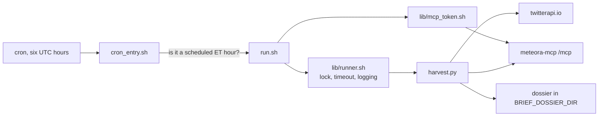

# meteora-scripts

## What it is

The scheduled jobs that run on the box and _consume_ the MCP server rather than
being part of it. One job today: the SPAC Twitter Brief harvest.

## Diagram



## How it works

### A harness plus one job

`lib/` is the reason this is a scripts repo rather than a single-job repo. It
carries env loading, Eastern-window detection, locking, timeouts, logging, the
exit-code contract, and MCP token acquisition. A second job inherits all of it
for free.

`briefs/<name>/` is one directory per job. Today that is `spac_twitter`, which
harvests tweets, positions and filings into a dossier for the SPAC Twitter
Brief, at 08:45, 11:45 and 15:45 Eastern on weekdays.

### The timezone problem, and how it is solved

The box runs `Etc/UTC` and its cron has no `CRON_TZ` - verified by execution,
not assumed. So the crontab lists **six UTC hours**, covering both DST offsets,
and `cron_entry.sh` is what cron actually runs. It compares the current Eastern
hour against the three scheduled ones and either hands off to `run.sh` or logs
that it did not.

No UTC offset is encoded anywhere, so nothing needs a seasonal edit, and a box
that loses `tzdata` fails loudly rather than silently skipping every window.
`tests/test_schedule.py` proves the schedule fires each window exactly once per
weekday across five years of real DST transitions.

Hand-runs call `run.sh` directly and are unaffected. It keeps broad window
ranges - a 10:00 ET run is still the 9am window - which is exactly why the
exact-hour gate lives outside it rather than inside.

### Exit codes

`0` is success. `124` or `137` mean the job timed out and was killed, so it did
**not** complete and the alert is real. Anything else is a failure. That
vocabulary is part of the harness, so every future job speaks it.

### Two accounts, deliberately

| | Account | Does |
| ------- | ------------- | ---------------------------------------------------------------- |
| Harvest | `mscr` | runs the cron job, reads the env file, writes the dossier and logs |
| Deploy | `mscr-deploy` | owns the checkout, runs the Actions runner |

These must not be the same account, and the reason is worth understanding before
touching any of it. The deploy runs this repo's own test suite on the box, so
landing a commit on `main` is code execution as whatever account runs it.
Meanwhile `mscr` ingests untrusted twitterapi.io and MCP content _and_ reads
production credentials. The runner account must be able to do neither.

So `mscr` has **no write access to the checkout at all**, not even group write.
Everything it writes at run time lives outside: the lock in `/run/lock`, the logs
in `/var/log/meteora-scripts`, the dossier in `BRIEF_DOSSIER_DIR`. `.venv` is
installed by the deploy and only ever read by the harvest, via `uv run
--no-sync`.

## Why it's this way

Comparing the Eastern hour inside the script rather than encoding an offset in
cron is the difference between a schedule that is correct twice a year and one
that is correct always. The six-UTC-hour crontab looks redundant and is the
cheap half of the trade.

Splitting the two accounts costs a second system user and a second deploy key.
It buys the property that a compromised harvest cannot rewrite the code that
runs on the next tick, and that a merge to `main` cannot read production
credentials.

The deploy taking the harvest lock before touching anything is the same
instinct. It would rather fail and change nothing than reset the working tree
underneath a running job.

## Traps

- **`BRIEF_DOSSIER_DIR` must not be inside `mscr`'s home.** Both `run.sh` and
  `harvest.py` refuse a dossier directory that is `$HOME` or under it and exit
  non-zero, where `$HOME` is whatever passwd says because that is where cron
  gets it. Point it inside that home and the harvest dies on every tick,
  forever, **while the deploy still reports success** - the deploy gates on the
  test suite, which cannot see the box's configuration. Check it with
  `getent passwd mscr | cut -d: -f6`, do not assume.
- **A deploy that cannot take the harvest lock within 420s fails and changes
  nothing.** Re-run the workflow once the harvest finishes.
- **A cron tick firing between the fast-forward and the end of the suite runs
  the new, not-yet-verified commit.** Inherent to deploying a cron job in place.
- **`bats` and `shellcheck` are not installed on the box by default.** The
  deploy preflights for them so a missing binary fails loudly rather than
  reading as a test failure and rolling back a good commit.
- **`/etc/meteora-scripts/env` must be readable by `mscr` and not by
  `mscr-deploy`.** It is owned by `meteora-secrets-render`, not by this deploy.
- **The harvest lock lives in `/run/lock`, which is a tmpfs wiped at boot.**
  systemd-tmpfiles recreates it with a fixed mode - `mscr` and `mscr-deploy`
  share no group, so whichever created the file first would otherwise decide by
  umask whether the other could open it.

## Where to start reading

| # | File | Why this rung |
| --- | ---------------------------------------- | -------------------------------------------------------------- |
| 1 | `README.md` | The whole operational picture: accounts, paths, exit codes, setup. |
| 2 | `briefs/spac_twitter/cron_entry.sh` | The Eastern-hour gate. Small, and the reason the schedule survives DST. |
| 3 | `briefs/spac_twitter/run.sh` | Preflights, then the harness. What a job actually is here. |
| 4 | `lib/runner.sh` | Locking, timeout and the exit-code contract every job inherits. |
| 5 | `briefs/spac_twitter/harvest.py` | The work itself: tweets, positions, filings into a dossier. |
| 6 | `lib/mcp_token.sh` | How a script authenticates to the MCP server. |

> **Read 1-3 to defend it. Add 4-6 before you change it.**

## Making changes

### The gate

Four checks, and a Python-only habit misses half of them:

```bash
uv sync --extra dev
uv run pytest -v
bats tests/
uv run ruff check .
git ls-files -z '*.sh' | xargs -0r shellcheck
```

`bats` and `shellcheck` are the two that catch shell regressions, and this repo
is substantially shell. On macOS install them with `brew install bats-core
shellcheck`; CI installs bats with `apt-get install -y bats` because the runner
image ships shellcheck but not bats.

The shellcheck file list is enumerated from git rather than a glob, so a shell
script added anywhere in the tree gets linted without anyone widening a pattern.

### Test structure

Two suites side by side in `tests/`. pytest covers the Python - the schedule
across five years of DST transitions, the harvest, the twitter client, the
grounding. bats covers the shell - `cron_entry`, `run`, `runner`, `mcp_token`,
`install`, and the deploy readability check.

### CI

`ci.yml` on PR and push. A blocking TruffleHog secret scan, then the same four
checks the local gate runs.

### Deploy

`deploy.yml` on merge to `main`, on a self-hosted runner on the box as
`mscr-deploy`. It waits on the harvest's lock, fast-forwards the checkout to
`origin/main`, installs dependencies, and re-runs the full suite against that
exact tree. Any failure rolls the tree back.

**There is no service to restart and no health endpoint** - the harvest is a
cron job, not a daemon. The success signal is the in-place suite passing, and
nothing about the harvest itself is confirmed until the next real tick.

### Manual QA

Watch the first real run after a deploy:

```bash
ls -t /var/log/meteora-scripts/harvest-*.log | head -1
```

To prove the box's configuration without running a harvest, force an off-hours
window so `run.sh` exits right after its preflights:

```bash
sudo -H -u mscr env HOUR_ET=03 DOW_ET=2 \
  /srv/meteora-scripts/briefs/spac_twitter/run.sh
```

Expect `off-hours (hour=03 ET) - skipping` and exit 0. Anything else is a
configuration fault. Use `-H` rather than a hardcoded `HOME`: cron takes `HOME`
from passwd, so anything else misses a dossier under the real home.

This preflight is what catches a bad `BRIEF_DOSSIER_DIR`, and it is the single
most valuable command in this note.

### Traps

- The preflight probe exits before `uv` by design, so it does not prove `mscr`
  can use the `.venv` the deploy built. That needs its own check, or the first
  live tick is the first check - with the deploy already green.

## Related

- [[meteora-mcp]] - the server these jobs authenticate to and call
- [[Glossary]]
