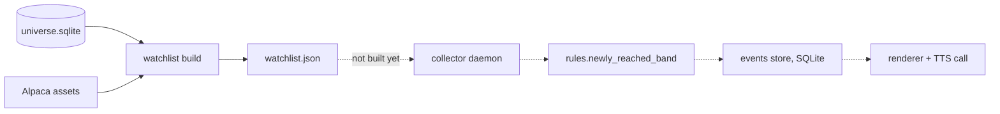

# meteora-tape

## What it is

A pager for the overnight tape. It watches the SPAC instruments the firm holds
from the close through the pre-market and calls the desk the moment one breaches
a threshold. One event, one call - not a digest.

**It is partly built.** The watchlist, rule engine and event store exist and are
tested. The collector, the renderer and the caller are planned and not written,
so nothing places a call today.

## Diagram



Dotted edges are designed and unimplemented.

## How it works

### The watchlist

The one command that runs today:

```bash
uv run meteora-tape --config config/meteora-tape.toml watchlist --dry-run
```

It reads the live SPAC universe out of `universe.sqlite` - the same mirror the
MCP server queries - filtered to `Searching` and `Announced`, and matches each
name's instruments against Alpaca's asset list. `--dry-run` reports coverage
without writing `watchlist.json`.

Symbols the workbook and Alpaca disagree about go in the config's `[aliases]`
table. It is deliberately empty: entries are added from what a real watchlist
build reports as unmatched, never guessed in advance.

### The session window

A session starts at 16:00 and runs to 09:30 the next morning. It is
**calendar-naive on purpose** - Friday 16:00 returns Saturday, and there is no
holiday table. A watch that runs on a day the market is closed costs nothing; a
holiday table that is wrong costs a missed morning.

### The rule engine

`rules.newly_reached_band` is the only filter in the system. Everything
downstream reports whatever it admits, which is why it is the one module to read
before changing anything.

Per-leg bands live in the TOML config, and the shape of them encodes the
instrument reality: shares and units sit near trust value around $10, so a 1%
band means something. A warrant at $0.30 prints 10% on a single retail order, so
its bands start at 10%. A dollar-volume floor sits under each leg to stop a
200-share print reaching the call.

Banding, not thresholding, is what bounds call volume. Without it a single
volatile warrant would dial the desk on every print past its threshold. The
comparison carries a `1e-9` tolerance for the same reason a price landing
exactly on a band can come back as `0.9999999999999963` from a division.

### The event store

Threshold breaches are written to SQLite, not held in memory, for one reason: a
collector that dies at 02:00 must not take the evening's events with it. It is
the durable record of what was called, what a caller marked dispatched, and
where coverage was lost - the only way to answer "why did nobody hear about
this" the next morning.

### Per-event dispatch, and what it replaced

The original design batched breaches overnight and placed a single briefing call
at 4am. That was superseded before implementation by **per-event dispatch**:
voice only, one call per breach, dialed the moment the rule engine admits it.

The config still carries `call_cutoff_et`, `debounce_seconds` and
`no_answer_retries` from the earlier design, marked as retained. Nothing
consumes them.

## Why it's this way

Tuning is an edit and a restart, never a deploy. Per-leg bands and dollar-volume
floors live in the TOML config on the box precisely so the desk can change what
wakes them at 3am without anyone opening a pull request.

Durable events over an in-memory queue is the same instinct as everywhere else
in the estate: the failure that matters is not the one you see, it is the one
that leaves no trace. A crashed collector with an empty memory queue is
indistinguishable from a quiet night.

Calling per event rather than briefing on a schedule is a decision about what
the tool is. A digest at 4am is a report. A call at 02:14 is a pager, and the
desk asked for a pager.

## Traps

- **No CI at all.** There is no `.github/`. The gate is whatever you run
  locally, and nothing stops a broken commit.
- **Local-only. There is no git remote.** Nothing is pushed anywhere, so the
  only copy of this repo is on the machine you are reading it from.
- **Blocked on Alpaca and Twilio accounts.** Neither is provisioned, so no part
  of this has ever run against a live provider. Every Alpaca response in the
  suite comes from a fixture.
- **A2P 10DLC registration is a carrier approval measured in days to weeks.**
  It gates the follow-up SMS path only, and it is the item most likely to be
  discovered late. Start it as soon as the Twilio account exists.
- **The README describes calling the desk in the present tense.** The caller
  does not exist yet.

## Where to start reading

| # | File | Why this rung |
| --- | ------------------------- | ------------------------------------------------------------------- |
| 1 | `README.md` | Run, test, where it deploys, and how tuning works. |
| 2 | `config/meteora-tape.toml` | The bands and volume floors, with the reasoning for their shape in comments. |
| 3 | `meteora_tape/rules.py` | The only filter in the system. Small, and everything downstream depends on it. |
| 4 | `meteora_tape/sessions.py` | The overnight window, and why it is calendar-naive. |
| 5 | `meteora_tape/events.py` | The durable record, and what "coverage was lost" means. |
| 6 | `meteora_tape/watchlist.py` | Universe to Alpaca symbol matching, and where aliases come from. |

> **Read 1-3 to defend it. Add 4-6 before you change it.**

## Making changes

### The gate

```bash
uv sync
uv run pytest
```

That is the whole gate. `testpaths = ["tests"]`, pytest pinned to 8.4.2, Python
3.14 or newer. The suite needs no credentials and no network.

### Test structure

One file per module, with Alpaca responses served from `tests/fixtures/`. The
rule engine, the session window, the event store and the symbol matching are all
covered directly.

### CI

None. Run the suite yourself.

### Deploy

`/srv/meteora-tape` on the production box as the `mtape` user, with
configuration at `/etc/meteora-tape/meteora-tape.toml` and credentials rendered
to `/etc/meteora-tape/env` by `meteora-secrets-render`.

That is the target, not the current state - the deployment plan exists and has
not been run, and it deliberately leaves the collector unit disabled when it is.

### Manual QA

**There is no way to exercise the rule engine end to end from the CLI today.**
The only subcommand is `watchlist`, and the collector that would feed the rule
engine live prices is unimplemented. Nothing can place a call, so there is also
nothing to place one by accident.

What you can do:

```bash
uv run meteora-tape --config config/meteora-tape.toml watchlist --dry-run
```

with `ALPACA_API_KEY_ID` and `ALPACA_API_SECRET_KEY` in the environment. It
reports coverage and writes nothing. Without Alpaca credentials, the rule engine
is exercised only through `tests/test_rules.py` and `tests/test_events.py`
against fixtures - which is honest testing, but it is not a live rehearsal, and
nobody should claim otherwise until the collector lands.

### Traps

- Changing a band in the TOML changes behaviour with no code change and no test
  covering the new value. The suite proves the engine is correct about the bands
  it is given, not that the bands are right.

## Related

- [[Glossary]] - the universe, trust
- [[meteora-mcp]] - owns `universe.sqlite`, which this reads directly off disk
